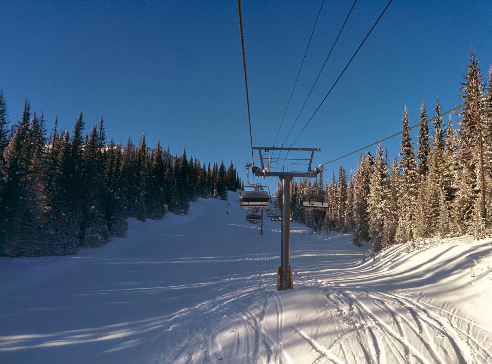
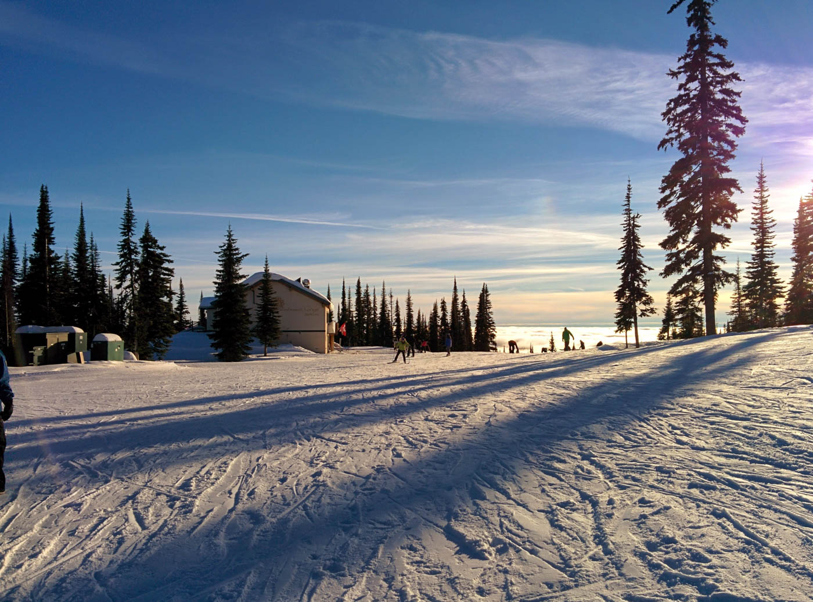
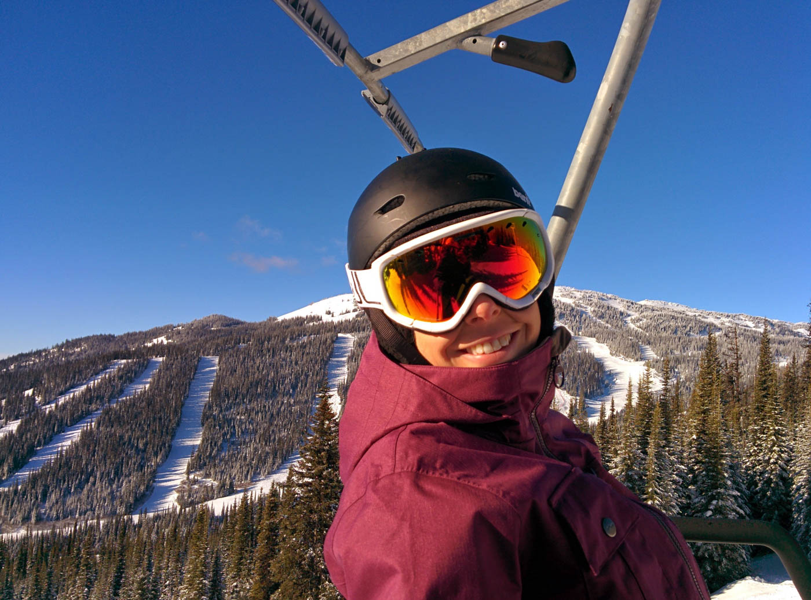
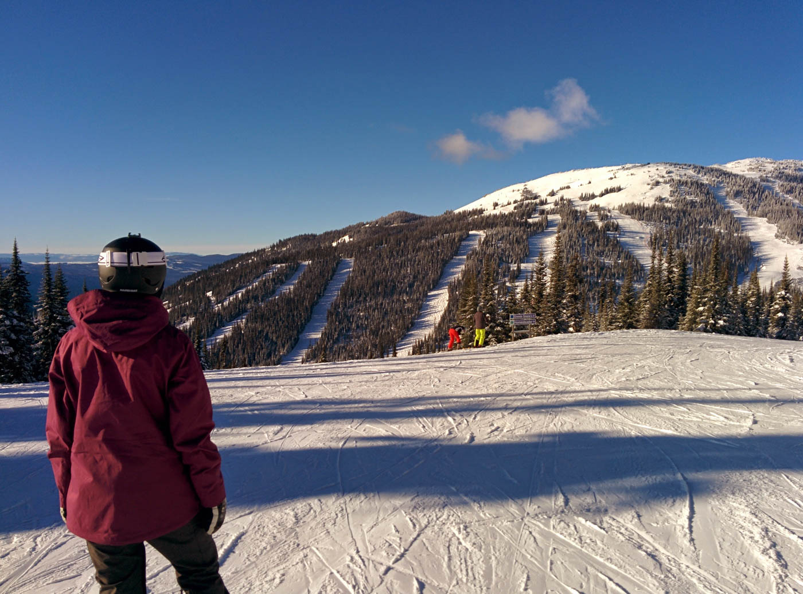
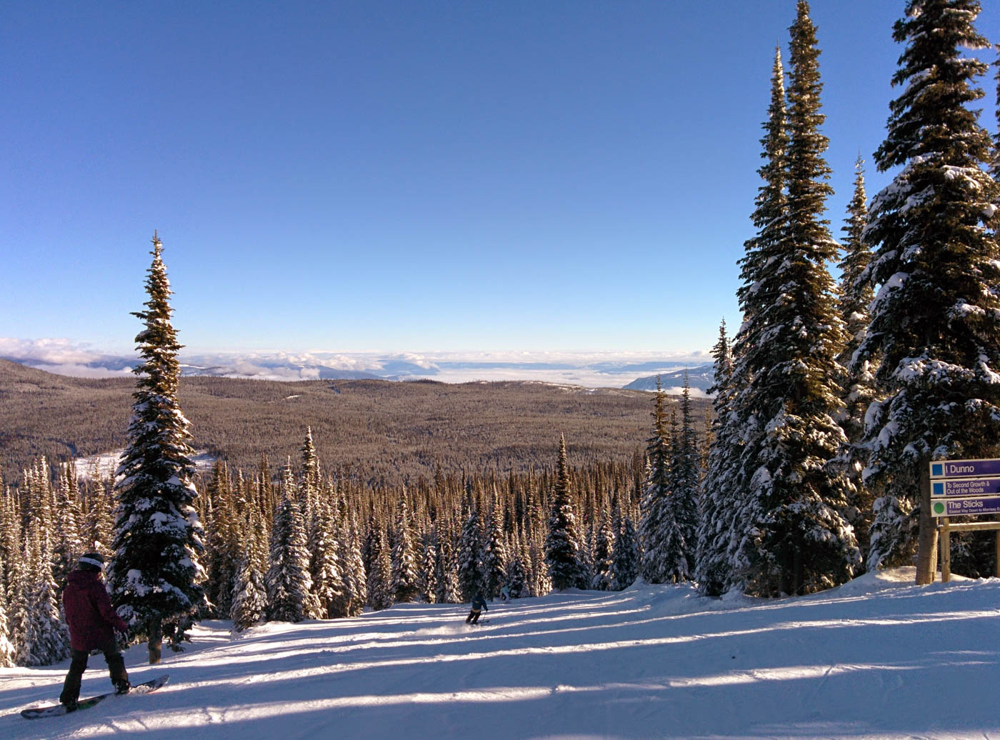

We timed our arrival to Sun Peaks two days too late. A 30 year record snowfall of 45cm fell in the space of a day and a half, but the snow has been great since then. With fresh snow falling every few days and we've been lucky to find many powder stashes in the trees for us to play between.

#### Bluebird days

#### Sunburst Lodge

#### <a href="http://en.wikipedia.org/wiki/Nancy_Greene" target="_blank">Grannie Greene's</a>

#### Mt Morrisey

#### Three bears
<iframe width="560" height="315" src="//youtu.be/RVBuH0WsDOE?modestbranding=1" frameborder="0" allowfullscreen> </iframe>