<figure>
	<a href="../images/IMG_4485.jpg">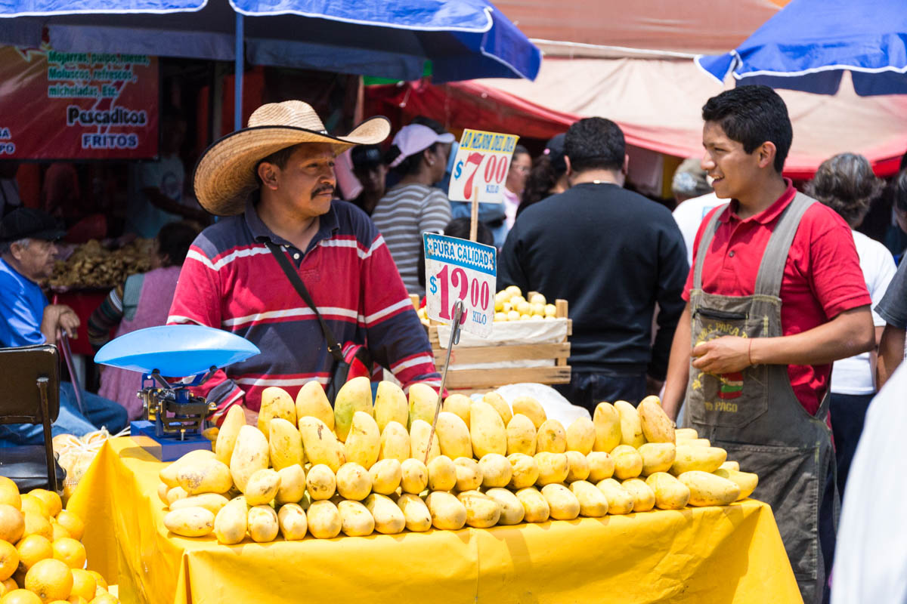</a>
</figure>

<figure>
	<a href="../images/IMG_4494.jpg">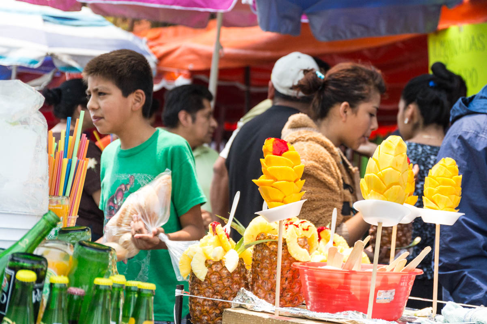</a>
</figure>

<figure>
	<a href="../images/IMG_4486.jpg">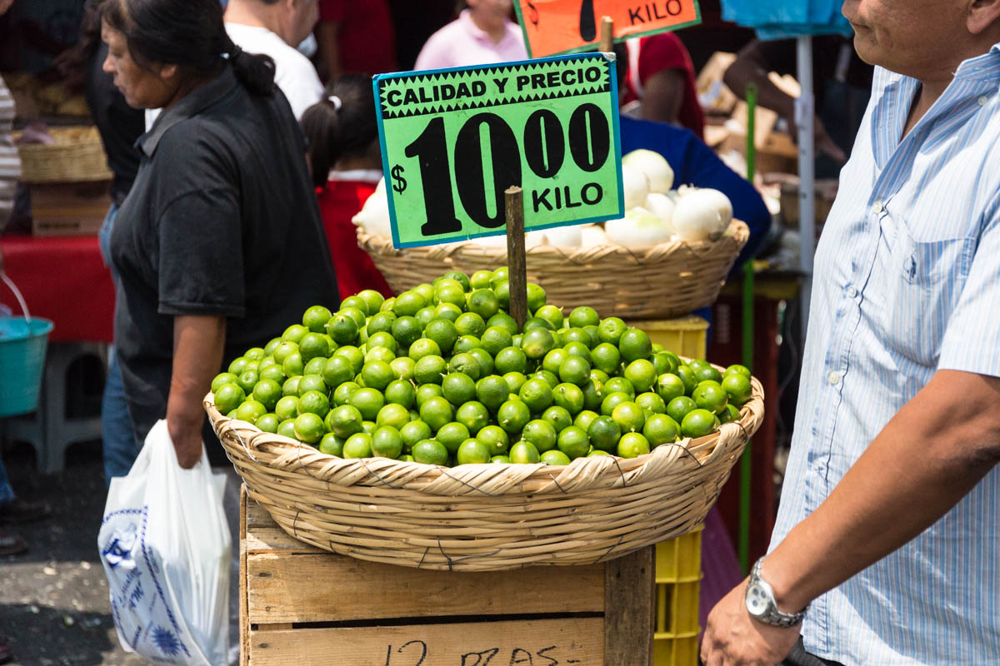</a>
</figure>

<figure>
	<a href="../images/IMG_4455.jpg">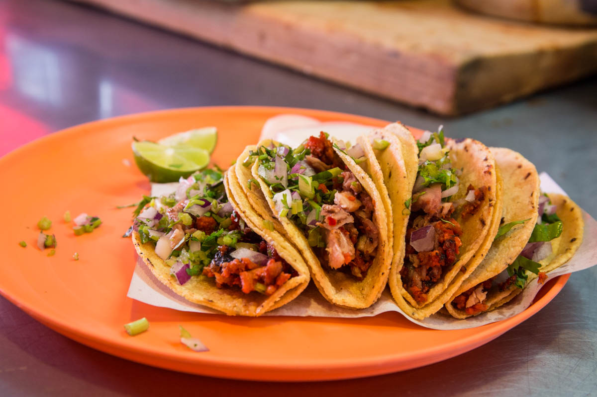</a>
	<figcaption>Taco al pastor. La comida de la Ciudad de México</figcaption>
</figure>

<figure>
	<a href="../images/IMG_4480.jpg">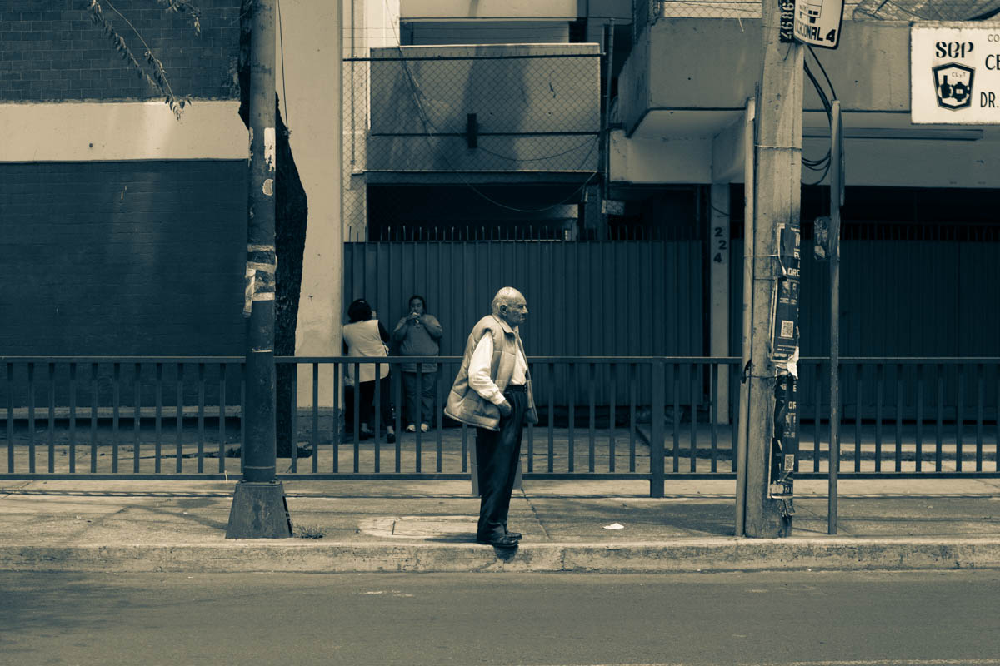</a>
</figure>

<figure>
	<a href="../images/IMG_4477.jpg">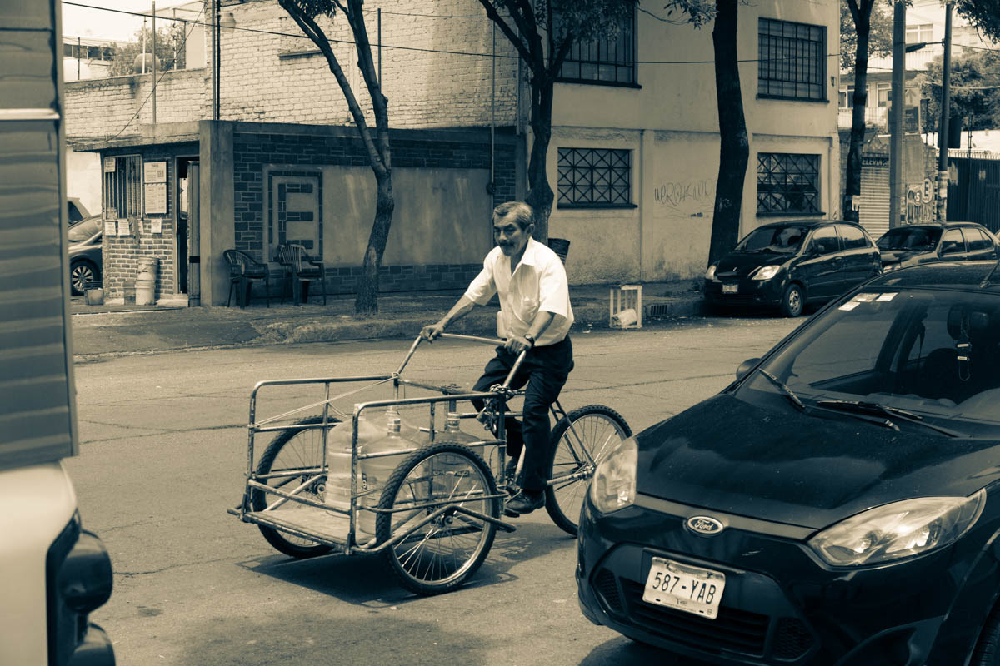</a>
</figure>

<figure>
	<a href="../images/IMG_4471.jpg">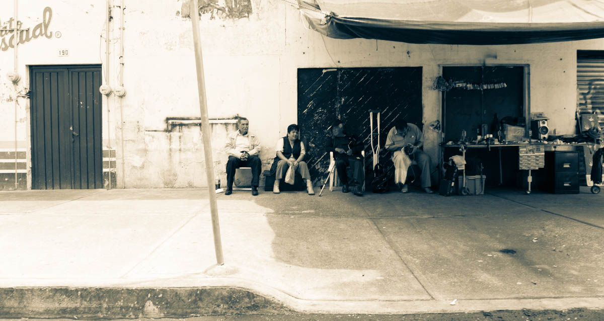</a>
</figure>

<figure>
	<a href="../images/IMG_4466.jpg">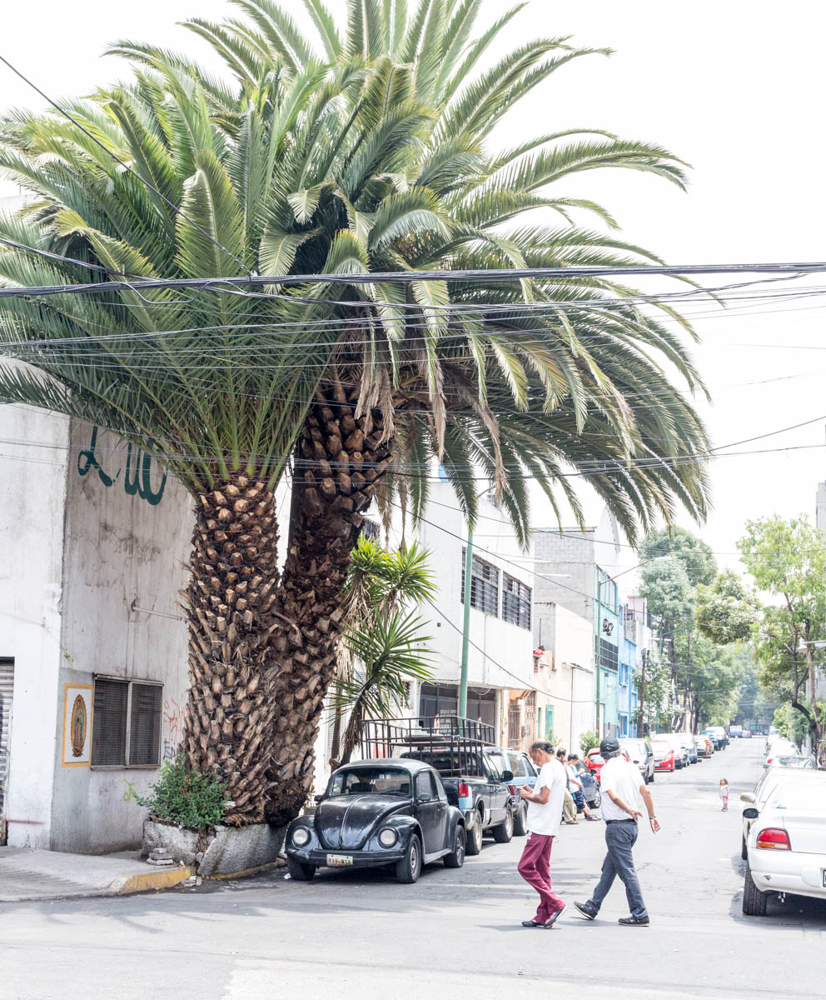</a>
</figure>

<figure>
	<a href="../images/IMG_4521.jpg">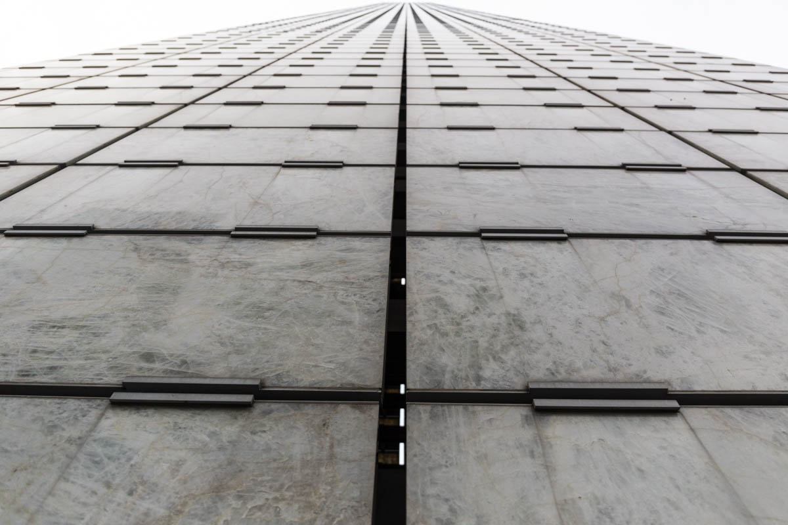</a>
	<figcaption>Museo de Arte Moderno</figcaption>
</figure>

<figure>
	<a href="../images/IMG_4434.jpg">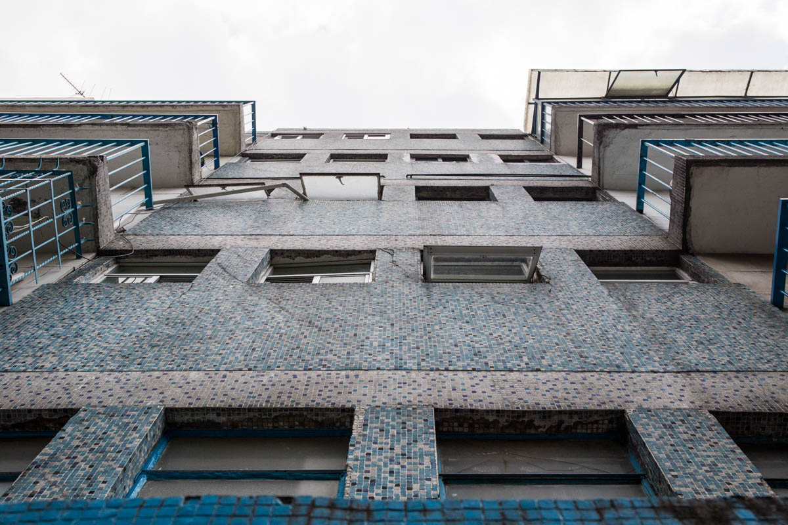</a>
</figure>

<figure>
	<a href="../images/IMG_4530.jpg">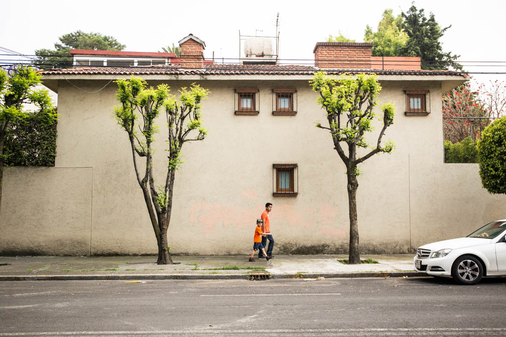</a>
</figure>

<figure>
	<a href="../images/IMG_4453.jpg">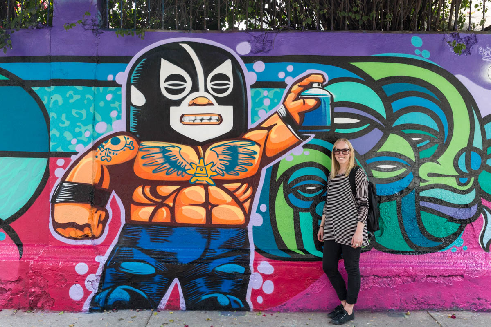</a>
</figure>
