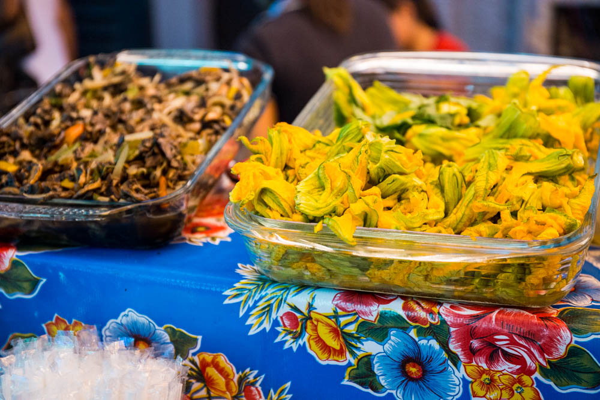
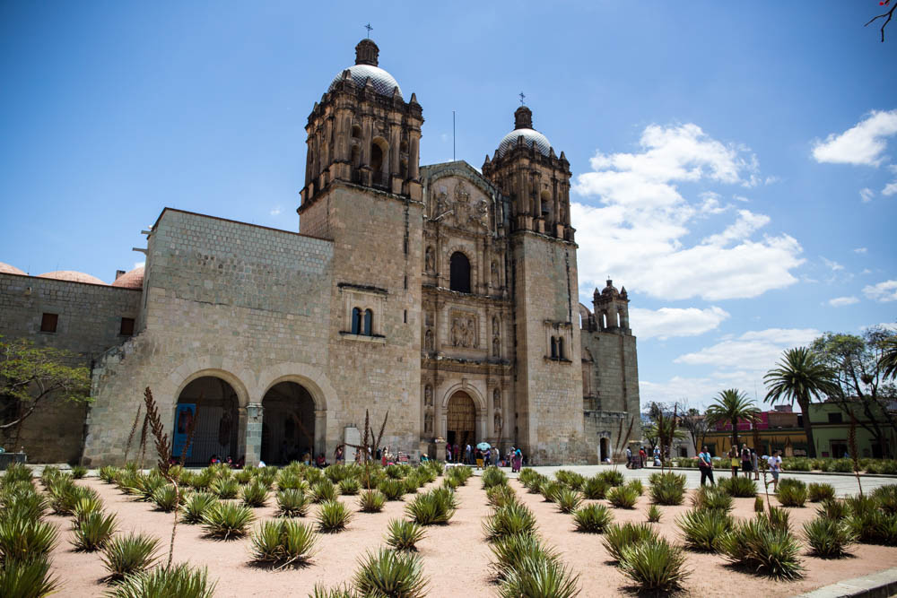
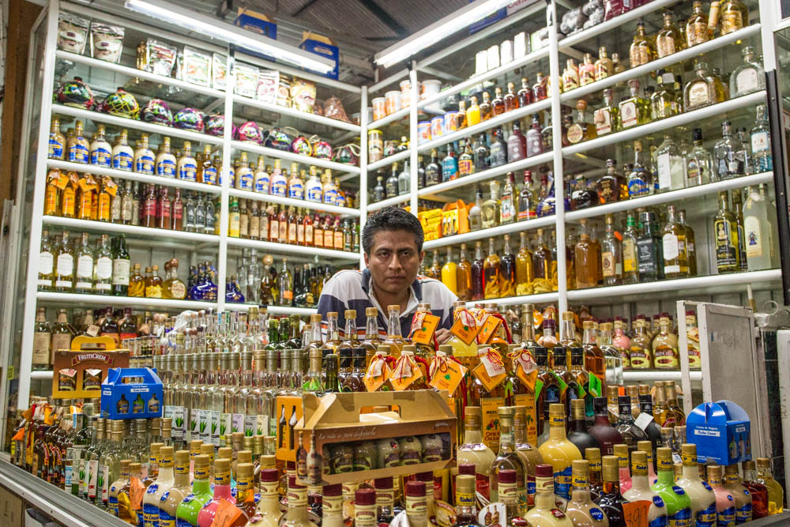
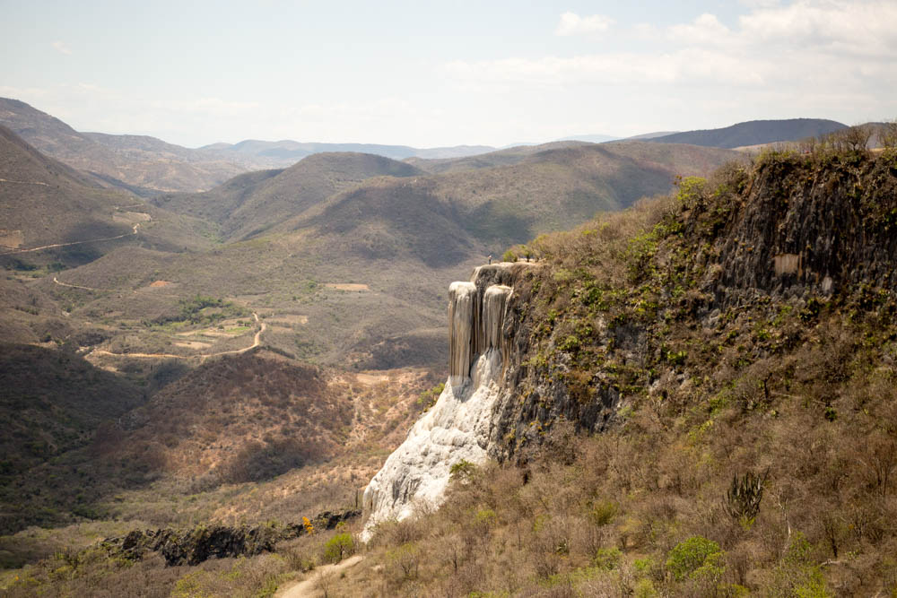

After being in Oacaxa, Mexico for 5 days we had fallen in love with this beautiful cultural centre of Mexico. The city has a very strong gastronomical background with many delicious Oaxacan specialties, which of course drew us here in the first place. But it also has so much more to offer. The city of Oaxaca is just beautiful. The colours of the buildings, the gardens, the people, and the art made our experiences in Oaxaca one to remember. 

We arrived in Oaxaca on Easter Saturday, with Easter in Mexico being a well celebrated holiday & important week (Holy Week/Semana Santa). Saturday night saw a massive fiesta in the zocalo of the city, with bands, music, artisan craft stalls, food & a large procession following. 

<figure>
	
	<figcaption>Happy Easter. Mole Negro con frijoles y Chocolate con leche</figcaption>
</figure>

We immersed ourselves in this city by walking everywhere. We explored the many different streets, the galleries (there are so many public galleries & art spaces), the many markets & restaurants that Oaxaca has to offer. 

<figure class="half">
	
	
	
	
	<figcaption>Grasshoppers. Zucchini flowers for quesadillas. Cathedral. Mezcal in the market.</figcaption>
</figure>

We also took a day tour to some of the surrounding sights a short bus ride from the city and visited:

<figure>
	
	<figcaption>Hierve el Agua. A grand petrified minerals waterfall.</figcaption>
</figure>

A big tree.

A weaving factory. 

Mezcal factory. 

Mitla. 

All of these experiences of Oaxaca were made even more memorable when we attended a traditional (in some ways...) Oaxacan cooking class. We have a blog post coming for that one! It was an extremely fun day. 