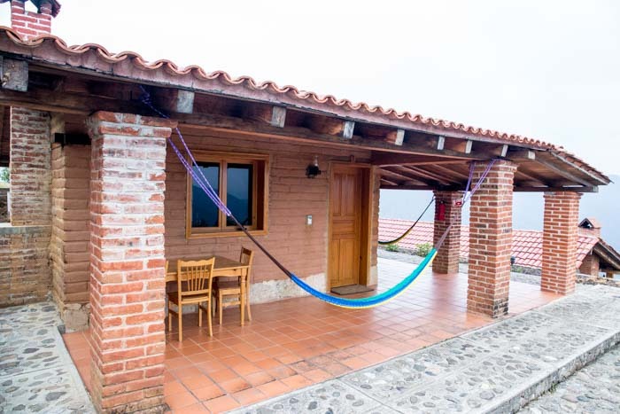

## Pueblos Mancomunados
## Sierra Norte

Before we headed to the pacific coast of Mexico for margaritas, seafood & snorkelling we wanted to see some of the remote villages in Oaxaca and do a bit of hiking. We had heard about a community of villages in the forests of Sierra Norte where you can hike from village to village with a guide each day, staying in cabanas or with local families. We arranged our 3 day tour through a non for profit ecotourism organisation called 'Expediciones Sierra Norte' with all proceeds going towards conservation in the local villages that we visit. 

### Day 1:

After taking the local 7am bus to Cuajimoloyas from Oaxaca we arrived at the eco tourism office and were shortly greeted by our local guide for the morning. In these remote villages no one speaks a word of English so it has been a test for Simon and I as to how we would get by with so little Spanish.

<figure>
	
	<figcaption>Village of Cuajimoloyas at 3180m</figcaption>
</figure>

<figure class="half">
	
	
	<figcaption>Maguey flowers, Goats are raised for meat around here.</figcaption>
</figure>

We we're given our packed lunches and headed on our way up to a peak where we would have a picnic and meet our next guide. 

<figure class="half">
	
	
	<figcaption>Maguey.</figcaption>
</figure>

Along the way our guide shared her knowledge of the local flora, explaining the many uses of the plants growing throughout the forest and villages.

<figure class="half">
	
	
	
	
	
	
</figure>

Many of these plants were used as medicinal methods to aide cholesterol, diarrhoea, stomach pains, heartburn, nasal congestion, chest pains etc. 

Others were used for insect repellant, to eat, to use in tea, for cleaning or as an aroma. 

It was a steady walk up to lunch taking roughly 2 hours and walking around 8.5km. After bidding farewell to our first guide we met our second who was casually having a siesta in the sunshine while waiting for us to arrive.

After a quick picnic meal (that was delicious!) to reenergise we headed off and almost straight back down the other side of the hill from where we came, navigating around rocks and watching not to slip on the many leaves and pine needles that covered the trail. This half of the walk was much more physically demanding, particularly on our knees and by this stage we were getting quite tired (which explains the lack of photos after lunch). We eventually reached a river that we meandered around until, we came across a tuchas fish farm.  

<figure class="half">
	
	
	
	
	<figcaption></figcaption>
</figure>

The last 2km slug was not easy, and it was getting very hot by this stage, but we kept on with very little resting time and water, eventually making it to the top and welcomed into Latuvi village with sounds of children running across the road to school, donkeys and chickens. Latuvi, a village of around 1120 residents, our destination for the night.

Today's walk was a total of 16km, spanning across 6hours leaving us at around 2200m in altitude. 

Our cabanas for the night were beautiful, very comfortable & quite new considering other in the village.  

We had an afternoon meal of local food, followed by a long siesta and then dinner at a resurgent across the road before a night of reading and resting. 

<figure class="half">
	
	
	
	
	<figcaption>A well earned meal. **Lunch:** Soup, rice & blue corn tortillas. **Dinner:** Quesadillas & chocolate con leche</figcaption>
</figure>
