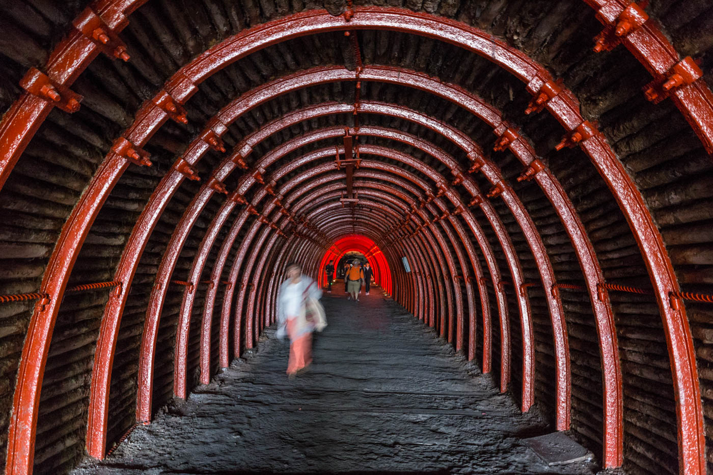
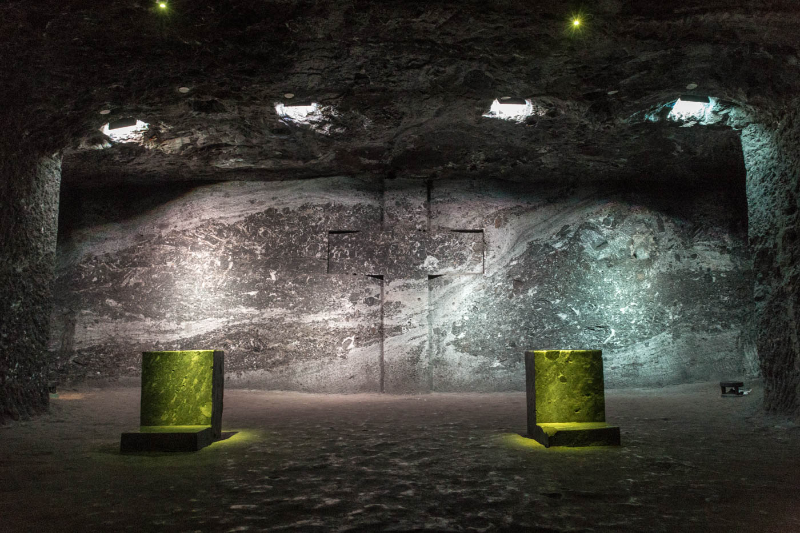
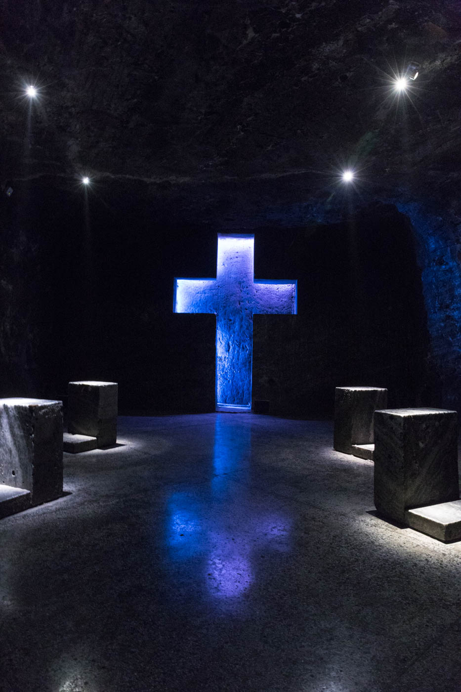
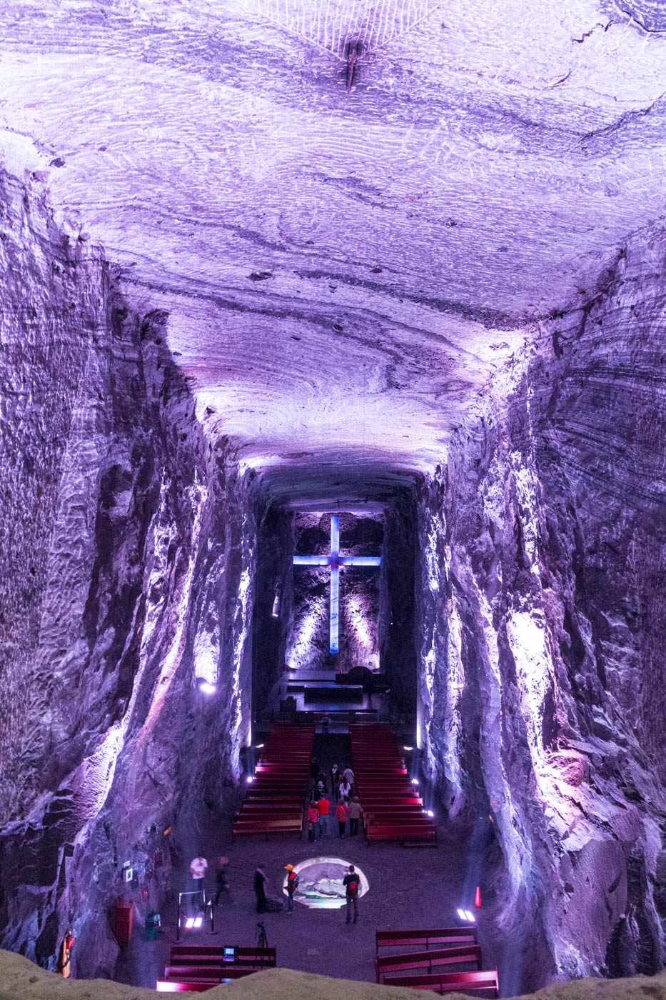
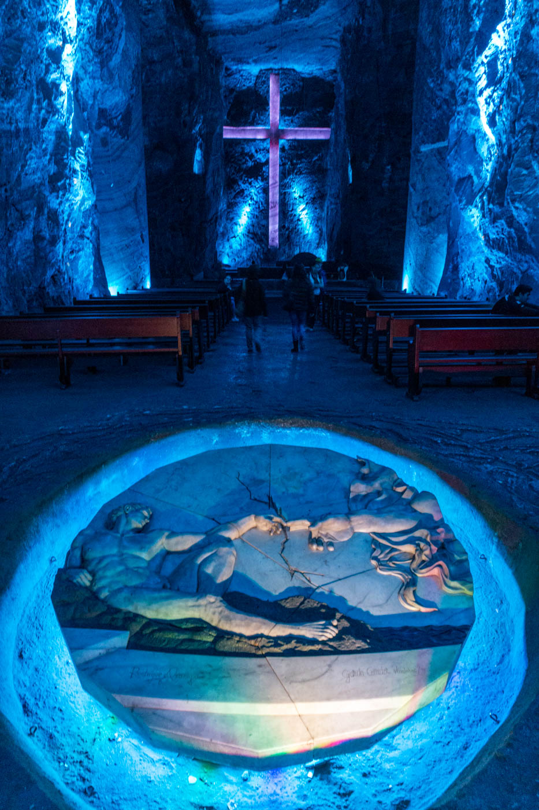
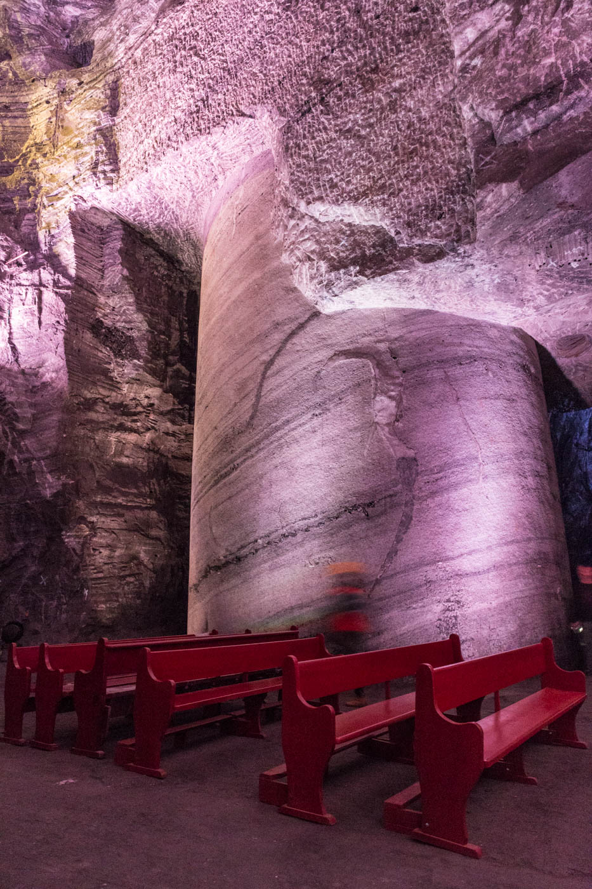
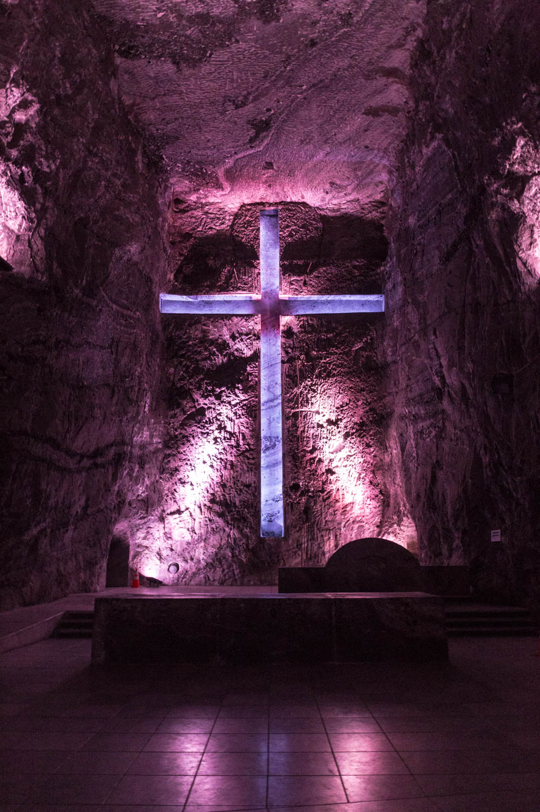

Just 30 minutes ouside of Bogotá in Colombia is the town of Zipaquirá, known for its salt mine within a hill next to the town. These mines were originally begun by the pre-Columbian Muisca people in the **5th century BC**. 

The hill has been continually mined since then, and in 1991 a new cathedral was begun to be carved out inside the mine.

<figure>
	
	<figcaption>The entrance</figcaption>
</figure>

### Stations of the cross (small chapels)

<figure>
	
	
		<figcaption></figcaption>
</figure>

### The three main naves

<figure>
	
	
	
	
</figure>
