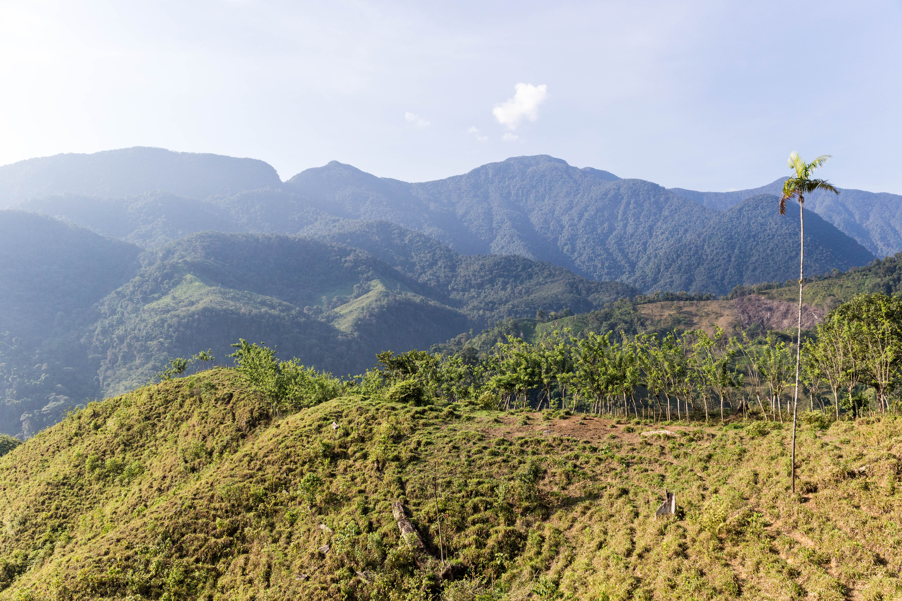
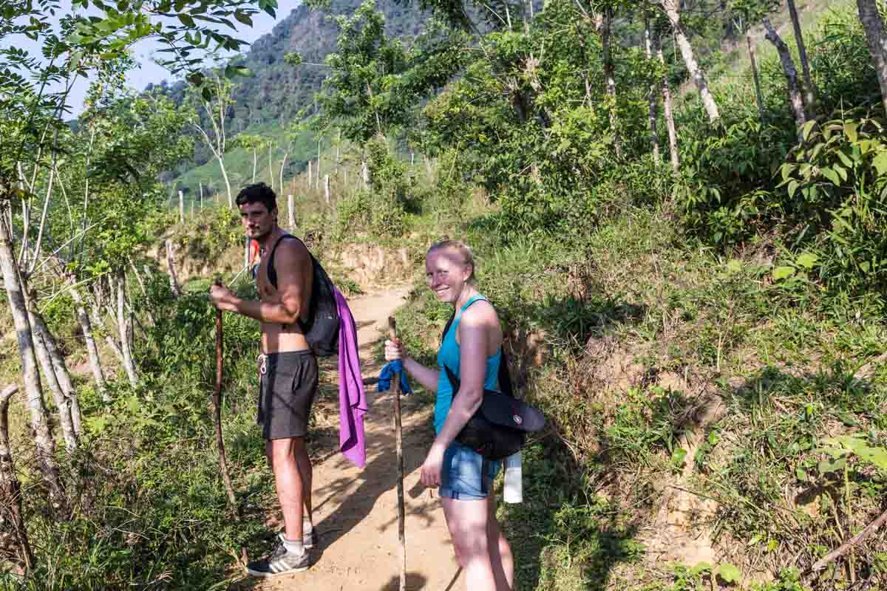
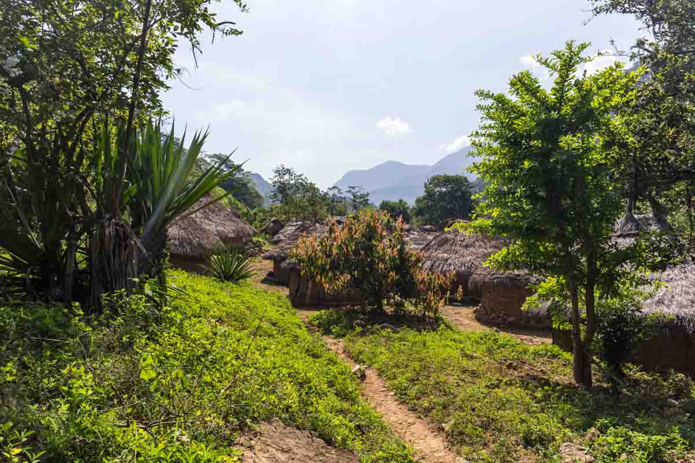
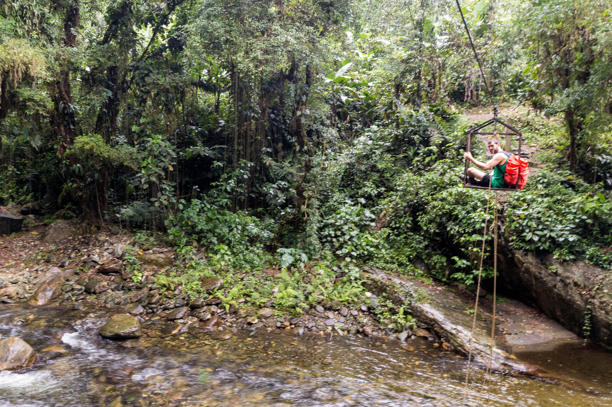
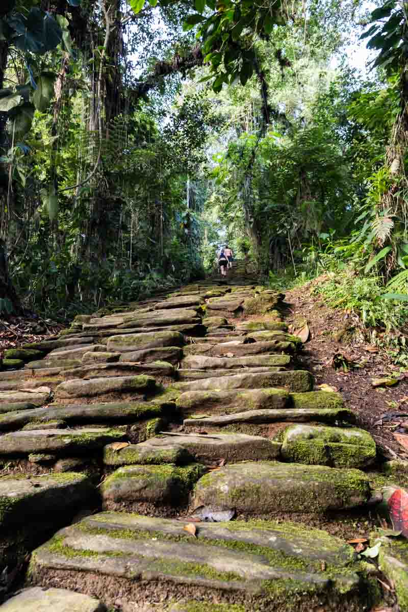
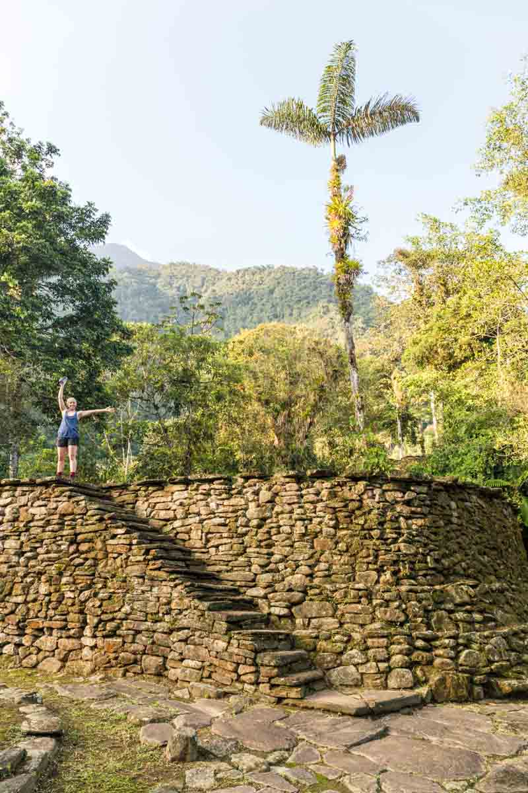
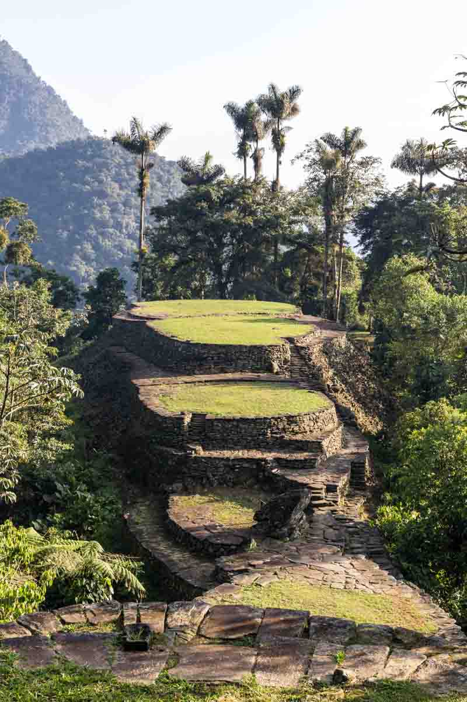
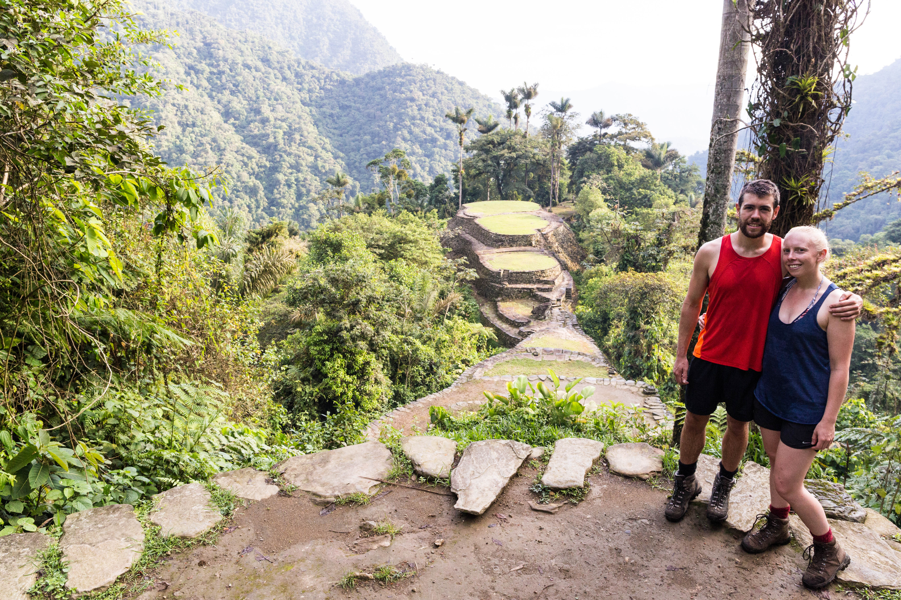
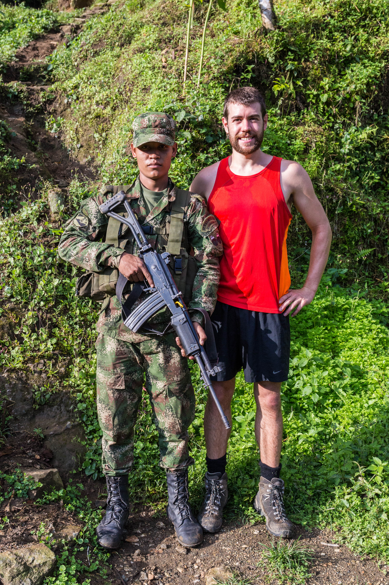

Ciudad Perdida (Spanish for "Lost City") is the archaeological site of an ancient city in Colombia's Sierra Nevada de Santa Marta. It is believed to have been founded about 800 AD, some 650 years earlier than Machu Picchu.

After selecting 1 of 4 tour companies for the trek we arrived at the office of Turcol tour office, pleasantly suprised that it would only be us and a German fella Hassan on our 4 day trip. This was great news as the other tour groups had up to 10 people, really slowing down the pace of the group and the time spent out walking in the extreme humid heat.

The 4 day trek saw us wandering through dense forest, former cocaine plantations, sandy desert like hills and steep river valleys.

### Day 1

Day 1 begun with a 2 hour drive from Santa Marta to El Mamey where the trek begins & ends. Once we arrived we were fed a large meal of meat, rice & salad. The first of many large and plentiful meals.

After eating lunch we began walking with our guide Edwin Rey. He has been a guide to Ciudad Perdida for 25 years, with over 800 visits to the city. His father Francisco “El Viejo” Rey was the original guide to Ciudad Perdida.

The walking for day 1 primarilly consisted of going UP. We walked up a hill of never ending switchbacks within a rain channel that had nearly become a small canyon itself that was 2m wide and nearly 2 deep.

<figure>
	
</figure>

After walking for about 4-5 hours we reached the first camp. It was situated down by a stream, which meant we had to descend a few hundrew metres to get to the camp after all the climbing uphill!

The camp consisted of several areas with undercover eating areas and individual bunk beds for the 4 different tour companies to use. 

After taking the opportunity to have a shower and wash our clothes we read books & played card games until dinner was served. Not long after dinner it was time to sleep as everyone was tired.

### Day 2

Day 2 began with a large breakfast of eggs, toast, fruit, hot sauce & coffee. Overnight our freshly washed clothes had, thanks to the humidity, gotten more damp than dry.

The walk for day 2 would take us from the open fields into the jungle and out of the direct sun that had been very hot the day before.

<figure>
	
	<figcaption>In the sun before reaching the jungle</figcaption>
</figure>

Along the route we passed an Indigenous village where each family had a round adobe house, and a hospital built by the Colombian government had been built to ensure the Indigenous were properly immunised.

<figure>
	
	<figcaption>Indigenous village</figcaption>
</figure>

At lunch we stopped at a camp which would be our sleeping place on night 3, we were once again overfed with lunch been soup of meat, plantane & meat with rice.

As we progressed deeper into the jungle the humidity and rain increased. We knew we were nearly at the second night's camp when we reached a river crossing. It was yet to start raining so there was two options for crossing - 1. Walk across the 20m stream or 2. sit in the cable car and pull yourself across. It was an obvious choice!

<figure>
	
	<figcaption>River crossing - the drier way</figcaption>
</figure>

After we crossed, the rain storm began. We had about 30 minutes of walking & scrambling remaining ahead of us to the reach the camp. Once we arrived we were sufficiently drenched in sweat & rain.

### Day 3

As our tour group was only 3 people, we were much faster than the other groups who occasionally had people who loved the slower, wandering in the jundle style of hiking. As a group we much preferred to power through the hikes & climbs, so we were adament to be the first group to reach the Ciudad Perdida on day 3.

After another good sleep in a bunk bed, some other tour groups were up earlier rustling their things waking everyone else up. We ate breakfast and then set off up the river towards the 1400 steps that took us up to the city.

<figure class="half">
	
	
</figure>

After a 20 minute walk and climb up all the stairs we reached the bottom of the city, and from there our hike was finally paying off. We spent the next few hours exploring the city and all the terraces and areas we could access.

<figure>
	
	<figcaption>Terraces</figcaption>
</figure>

<figure>
	
	
	
</figure>

