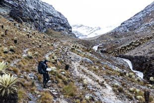
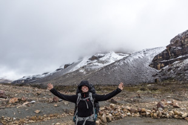
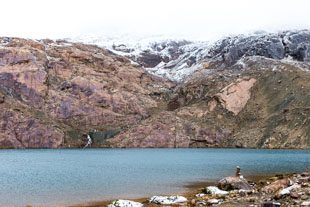
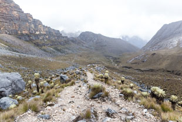

El Cocuy is one of those places that when you mention it to someone from Colombia (well after saying the word 3,4 times before they understand you) they instantly ooo and ahhh at how special and beautiful the place is, all the while never going to visit it. It is also one of the top places listed to visit in Lonely Planet as a very unique experience to have in Colombia. With the words snow peaked mountains, trekking and multi day camping written - we instantly agreed that this is where we needed to go!

We had been planning and eagerly awaiting this trek in the Sierra Nevada mountains of El Cocuy National Park since we arrived in Colombia but decided to visit all that this country has to offer before heading off on the trek, in order to get all the gear necessary before we begun. 

El Cocuy is located around 10 hours by bus from Bogota on very windy and unpredictable roads. We opted for the overnight bus option and buckled in for the ride that arrived at 6am in El Cocuy. We spent the following day in town getting our parks permit organised & finalising our packs and plans before catching a ride at 6am up to the beginning of our 6 day route. 

<iframe width='100%' height='650px' frameBorder='0' src='https://a.tiles.mapbox.com/v4/swarve.mh6iodpb/attribution,zoompan,zoomwheel.html?access_token=pk.eyJ1Ijoic3dhcnZlIiwiYSI6Indra1RSUTQifQ.eCLHjdJ74bBiyAKDeiclTA'></iframe>

Each day we have created a video post from the days adventure. We have written alot of content also, so if you have the time both the videos and written content make up the story of our 6 day trek. Enjoy!

### Day 1

All smiles, sunny weather and beautiful scenery surrounding us. We couldn't have asked for a more positive start to our 6 day trek.  

<figure class="half">
	
	
	
	
	
	
	
</figure>

<iframe width="560" height="315" src="https://www.youtube.com/embed/Wch03chmb8M?rel=0&showinfo=0&autohide=1&vq=large" frameborder="0" allowfullscreen></iframe>

### Day 2

Two passes to cross, lots of rain, no break in the weather to take photos along the trail.

At the top of pass B as we were walking through the fog & rain we saw what looked to be a man on a horse that freaked us both out, turned out to just be a <a href="https://en.wikipedia.org/wiki/Cairn" target="_blank">cairn</a>, actually helping guide us along the path.

After making our way down this pass we had to go around Laguna Grande to reach the campsite we were planning to stay at, but our map said one way and the sign at the beginning of the lake said to go the other way. We went with the sign, as we thought this way would be quicker but as we reached a rapidly flowing waterfall with the pass continuing on the other side we stood contemplating our options for far too long. In the end we decided it wouldn't be safe to cross,and even though we were already drenched in rain, we had no desire to wade into the waterfall and potentially be thrown over the edge.

After backtracking around the lake (which involved several rock scrambles) we attempted the other way, which was challenging to say the least. From the lake it was a steep slope straight up the scree covered mountain to the sky. We bush bashed up, down, scrambling over rocks and around to try and find the path we thought existed somewhere on that side of the lake. We found it briefly for a hundred metres here or there, but for the majority of the day we were cursing the goddam lake with no passable route!! 4 or so hours later, with only 1-2km of terrain covered we finally made it to a spot where we could call camp for the night. 

The photos below don't really tell the story of how bad our day was because as soon as we set up, dried, stopped shivering and defrosted - the sun came out revealing a beautiful and clear blue sky!
<figure class="half">
	
	
</figure><figure>
	
</figure>

<iframe width="560" height="315" src="https://www.youtube.com/embed/IlHyXwbSbqI?rel=0&showinfo=0&autohide=1&vq=large" frameborder="0" allowfullscreen></iframe>

**Please note the SUNBURN from Day 1, ironic. 

### Day 3

It rained all day. We had two passes to cross. We were cold, wet, hungry and ready to throw in the towel on the trek for most of the day. After stopping on the route up the second pass (Pass D) we stopped to try and rekindle our love of hiking, suck back the tears & reconfess our love for eachother (its amazing how close the shittiest of conditions can bring you together).. but all we managed to do was both begin to uncontrollably shake from the cold. Tip, never stop walking for a momentary break when you are beyond cold and miserable. 

The top of Pass D was covered in snow & ice, and the descent basically had no path. The only safe way down was to walk in what effectively was the stream of rain running down from the pass.

After reaching the flat ground at the bottom of the path we didn't have long to look for a campsite as we were both pretty sure we were beginning to get mild hyperthermia from the rain and wind. We found a site or two right on the lake front to camp but it was very windy at those sites so we kept walking and found another site half way along the lake about 10m above the surface level. We settled on this camp site, little to know what would lie ahead of us that night. 

<iframe width="560" height="315" src="https://www.youtube.com/embed/XqnETzpsfUs?rel=0&showinfo=0&autohide=1&vq=large" frameborder="0" allowfullscreen></iframe>

### Day 4

After the fun of the night before and the limited sleep we were slow to get going especially as the tent and all our clothes were soaking wet from the rain, ice and cold air. We would literally wake up, eat, power pack and then have to change into wet clothes for a day of walking. 

The walk itself on this day was quite enjoyable as we found the path quickly in the morning (a huge relief) and then managed to stick with it across the Valle de los Cojines until we had to cross the river.

After walking up and back a few hundred metres along the river we finally settled on a crossing that wasn't too deep to wade through. Well Simon did, with Jacqui stuck on the other side knee deep in brown slush, too scared to cross. After walking up and down the river counless times Jacqui finally found the adrenelin to 1, attempt to throw her bag across and 2, afterwards follow the bag accross herself. This did not happen. When she went to throw the bag across, she forgot to let go and plumeted across with it, JUST making it across (legs dangling in the river) with Simon pulling them both up the bank. Once on the other side we were right in a swamp and had to jump from cojines to cojines which was a fun change to scrambling up rocks.

A short day today led to a long afternoon of relaxing. 

<figure>
	
	<figcaption>Finally! An undercover camp site</figcaption>
	
	<figcaption>The previous nights camp site far off in the distance at the top of the waterfalls.</figcaption>
	
	<figcaption>Nothing beats hot ramen, sleeping bag & a book to warm up & feel happy</figcaption>
</figure>

<iframe width="560" height="315" src="https://www.youtube.com/embed/khGLjZC9q8M?rel=0&showinfo=0&autohide=1&vq=large" frameborder="0" allowfullscreen></iframe>

### Day 5

The highest crossing was to come on the morning of day 5. We could see the gigantic snow covered mountains looming in the distance the night before and had already worked ourselves up to what was ahead. 

The pass itself was a 350m climb up, putting us at 4650m in altitude.

We set off early full of energy after a great sleep and some chocolate for breakfast (the only way!) eagar to defeat de la Sierra. 

<figure class="half">
	
	
</figure><figure>
	
</figure><figure class="half">
	
	
	
	<figcaption>Cojines.</figcaption>
	
	
</figure><figure class="half">
	
	
	
	
	
	
</figure>

<iframe width="560" height="315" src="https://www.youtube.com/embed/ldnb2ZoixW0?rel=0&showinfo=0&autohide=1&vq=large" frameborder="0" allowfullscreen></iframe>

### Day 6

<figure>
	
	
</figure>

<iframe width="560" height="315" src="https://www.youtube.com/embed/-OY6nZhCX0c?rel=0&showinfo=0&autohide=1&vq=large" frameborder="0" allowfullscreen></iframe>

### Route map

