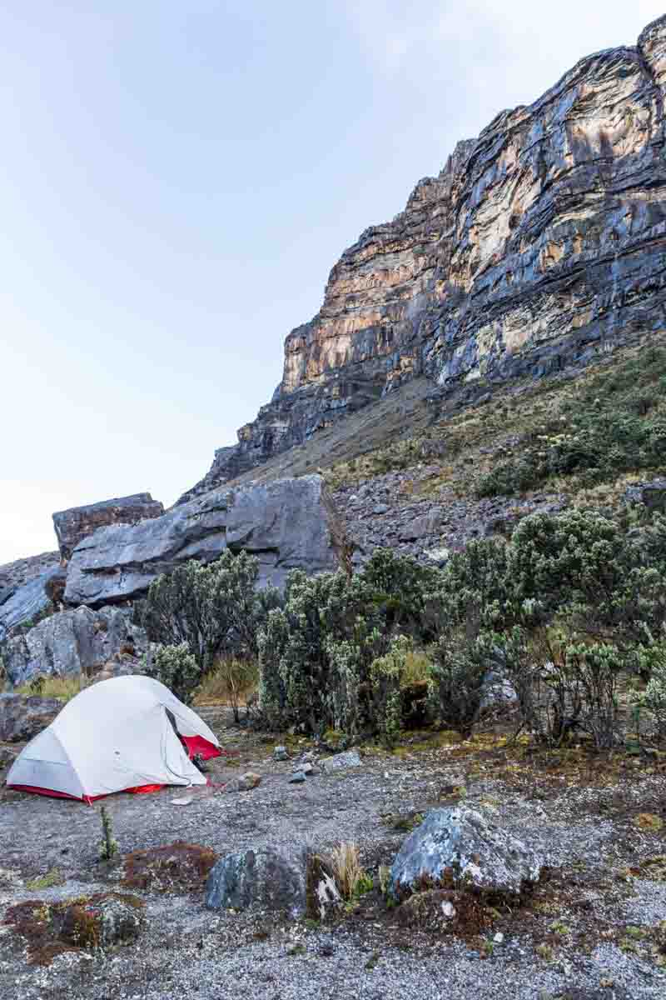
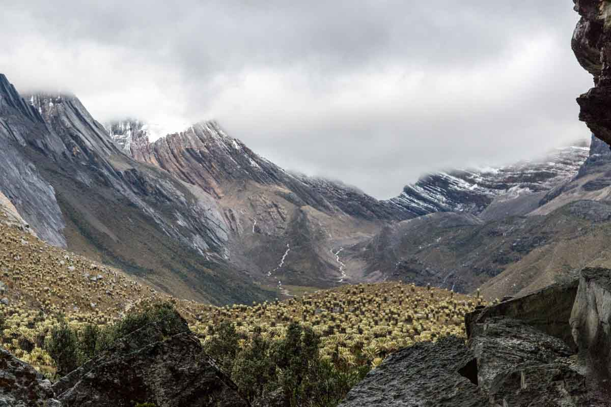

### Day 1

All smiles, sunny weather and beautiful scenery (that's visible).

<figure>
	
	
	
	
	
	
	
	
</figure>

<iframe width="560" height="315" src="https://www.youtube.com/embed/Wch03chmb8M?rel=0&showinfo=0&autohide=1&vq=large" frameborder="0" allowfullscreen></iframe>

### Day 2

Two passes to cross, lots of rain, no break in the weather to take photos along the trail.

At the top of pass B as we were walking through the fog & rain we saw what looked to be a man on a horse that freaked us both out, turned out to just be a <a href="https://en.wikipedia.org/wiki/Cairn" target="_blank">cairn</a>.

We had to go around Laguna Grande to reach the campsite we were planning to stay at, but our map said one way and the sign at the beginning of the lake said to go the other way. After following the sign we reached a waterfall that was inpassable as it had water a metre deep flowing over it. Even though we were drenched in rain, we had no desire to wade into the waterfall and potentially be thrown over the waterfall.

After backtracking around the lake we attempted the other way, which was challenging to say the least. From the lake it was a steep slope straight up to the sky. We bush bashed up, down, scrambling over rocks and around to try and find the path we thought existing somewhere on that side of the lake. We found it briefly for a hundred metres here or there, but for the majority of the day we were cursing the goddam lake with no passable route!!

<figure>
	
	
	
</figure>

<iframe width="560" height="315" src="https://www.youtube.com/embed/IlHyXwbSbqI?rel=0&showinfo=0&autohide=1&vq=large" frameborder="0" allowfullscreen></iframe>

### Day 3

It rained all day. We had two passes to cross. We were cold, wet, hungry and ready to throw in the towel on the trek for most of the day. After stopping on the route up the second pass (Pass D) we stopped to try and rekindle our love of hiking, all we managed to do was both begin to uncontrollably shake from the cold.

The top of Pass D was covered in snow & ice, and the descent basically had no path. The only safe way down was to walk in what effectively was the stream of rain running down from the pass.

After reaching the flat ground at the bottom of the path we didn't have long to look for a campsite as we were both pretty sure we were beginning to get mild hyperthermia from the rain and wind. We found a site or two right on the lake front to camp but it was very windy at those sites so we kept walking and found another site half way along the lake about 10m above the surface level.

<iframe width="560" height="315" src="https://www.youtube.com/embed/XqnETzpsfUs?rel=0&showinfo=0&autohide=1&vq=large" frameborder="0" allowfullscreen></iframe>

### Day 4

After the fun of the night before and the limited sleep we were slow to get going especially as the tent and all our clothes were soaking wet from the rain, ice and cold air.

<figure>
	
	<figcaption>Finally! An undercover camp site</figcaption>
	
	<figcaption>The previous nights camp site far off in the distance at the top of the waterfalls.</figcaption>
	
	<figcaption>Nothing beats hot ramen, sleeping bag & a book to warm up & feel happy</figcaption>
</figure>

<iframe width='100%' height='500px' frameBorder='0' src='https://a.tiles.mapbox.com/v4/swarve.mh6iodpb/attribution,zoompan,zoomwheel.html?access_token=pk.eyJ1Ijoic3dhcnZlIiwiYSI6Indra1RSUTQifQ.eCLHjdJ74bBiyAKDeiclTA'></iframe>