Well, 10 days has past since [El Cocuy](https://ayearlessordinary.com/el-cocuy/), so it was time to get back to the mountains. This time, in Peru.

Situated inland from the coast is the city Huaraz, a base for organising many different types of activities in and around the mountains. We arrived in the evening one night with the intention of heading off first thing the next morning to being the <a href="https://en.wikipedia.org/wiki/Alpamayo" target="_blank">Alpamayo</a> circuit trek. This is a trek that includes 75% of the Santa Cruz trek, and then proceeds off in a different direction to loop back around the valley on the other side of the <a href="https://en.wikipedia.org/wiki/Alpamayo" target="_blank">Alpamayo</a> peak.

The planned trek around Alpamayo had us walking 8-10 days at altitudes between 3000-4900m. 9-10 days worth of food meant our bags were heavy with food, weighing in at around 17-20kg each.

<!--<iframe width='100%' height='500px' frameBorder='0' src='https://a.tiles.mapbox.com/v4/swarve.mlj1ip93/attribution,zoompan,zoomwheel,geocoder,share.html?access_token=pk.eyJ1Ijoic3dhcnZlIiwiYSI6Indra1RSUTQifQ.eCLHjdJ74bBiyAKDeiclTA'></iframe>-->

## Day 1
<figure>
	<a href="../images/IMG_8229.jpg">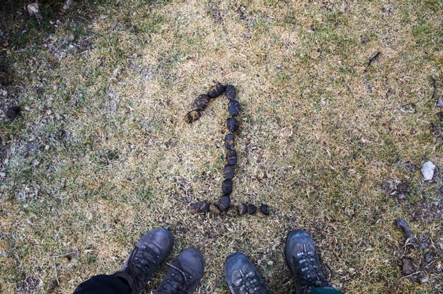</a>
</figure>

After organising almost everything after we arrived in Huaraz, we set off the next morning toward the trailhead in Cashapampa. We arrived at the trailhead about midday after catching 2 taxi's and one minibus from Huaraz and set off in the hot sun.

After many breaks for water as we were walking in the direct sun we settled on a camp spot right next to the river for the night. A few cows around on the trail, but none in the campsite itself or in the river.

<figure class="half">
	<a href="../images/IMG_8184.jpg">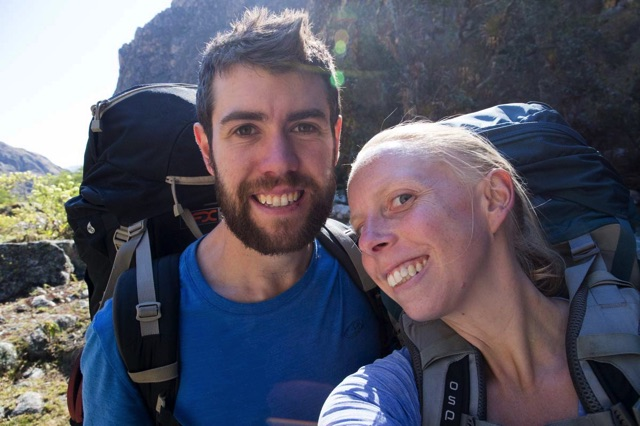</a>
	<a href="../images/IMG_8217.jpg">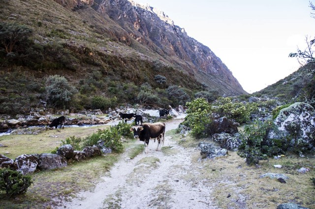</a>
	<a href="../images/IMG_8222.jpg">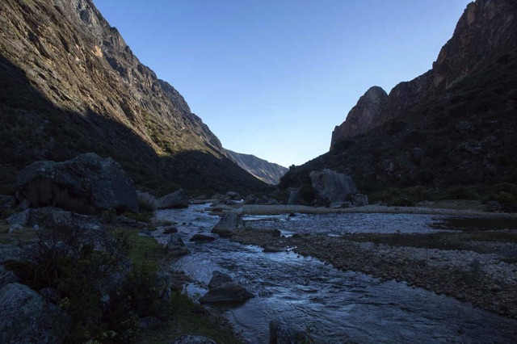</a>
	<a href="../images/IMG_8249.jpg">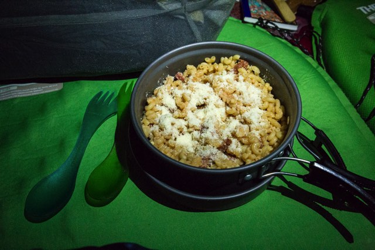</a>
</figure>

<figure>
	<a href="../images/IMG_8254.jpg">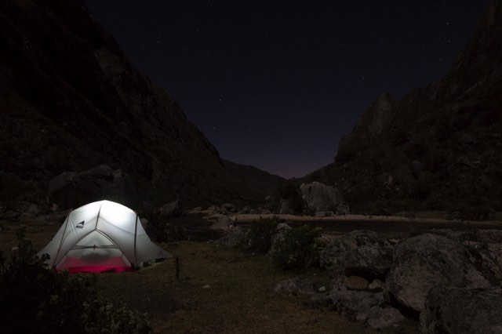</a>
</figure>

## Day 2

<figure>
	<a href="../images/IMG_8337.jpg">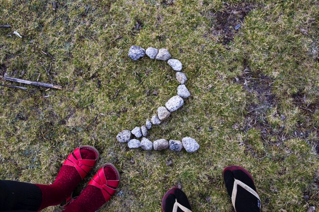</a>
	<a href="../images/IMG_8281.jpg">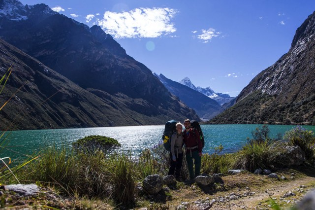</a>
</figure>

After awaking from a great sleep (at 6:30, sleep in!) we enjoyed one of the best trekking breakfast's of mashed potato with bacon bits. After packing up we set off further up the valley towards the snow covered peaks. Along the way we passed several trekking groups all going in the opposite direction which seems to be the more popular route for guided tours.

Shortly before lunch at the lake which was various forms of sugar, in one of the passing trekking groups we saw Gabriel, a German guy we'd been diving with in [Utila](https://ayearlessordinary.com/utila/), nearly 2 months ago. We also passed groups heading off to climb Alpamayo with all their mountaineering gear.

<figure class="half">
	<a href="../images/IMG_8263.jpg">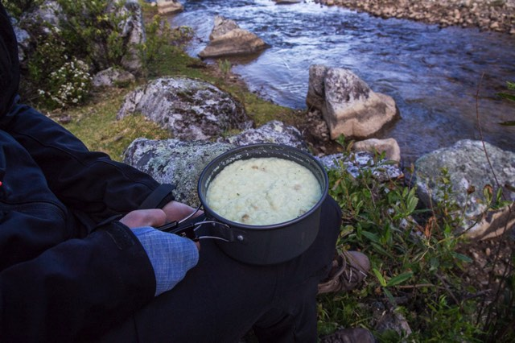</a>
	<a href="../images/IMG_8285.jpg">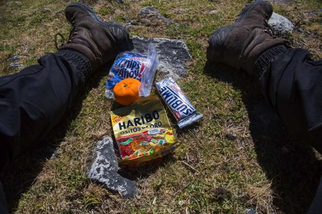</a>
	<a href="../images/IMG_8291.jpg">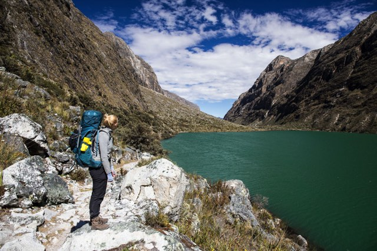</a>
	
	<a href="../images/IMG_8314.jpg">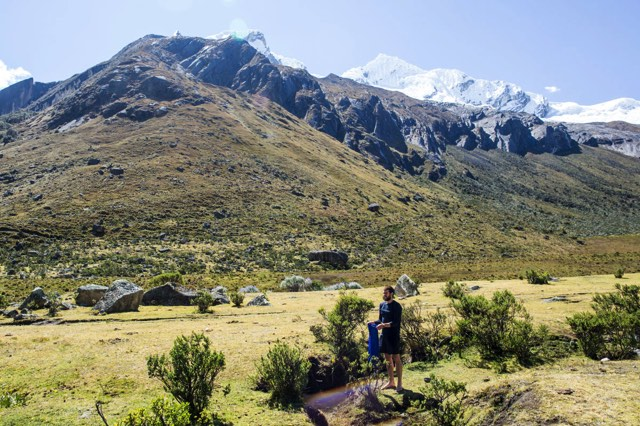</a>
	
</figure>

<figure>
	<a href="../images/IMG_8318.jpg">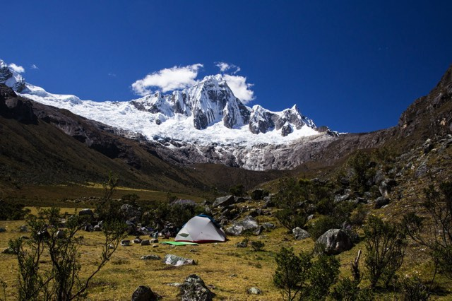</a>
	<a href="../images/IMG_8310.jpg">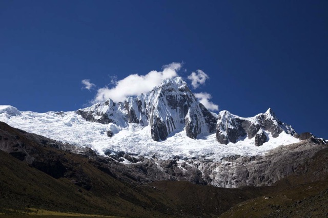</a>
</figure>

## Day 3

<figure>
	<a href="../images/IMG_8402.jpg">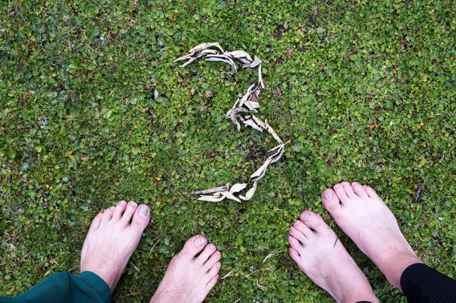</a>
</figure>

<figure class="half">	
	
	<a href="../images/IMG_8360.jpg">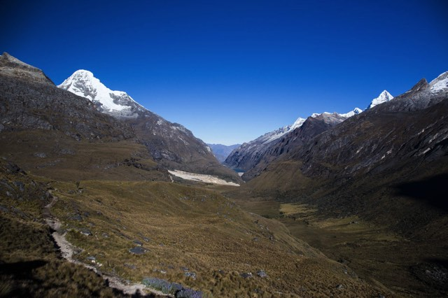</a>
	<a href="../images/IMG_8364.jpg">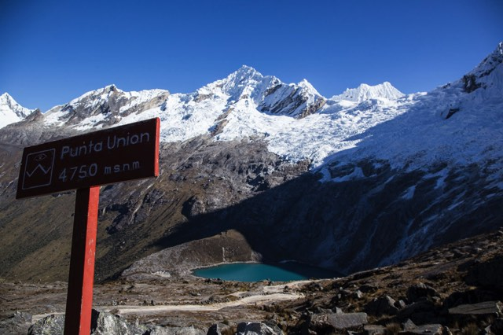</a>
	<a href="../images/IMG_8364.jpg">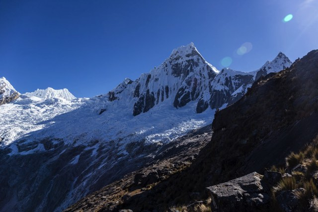</a>
</figure>

<figure>
	<a href="../images/IMG_8380.jpg">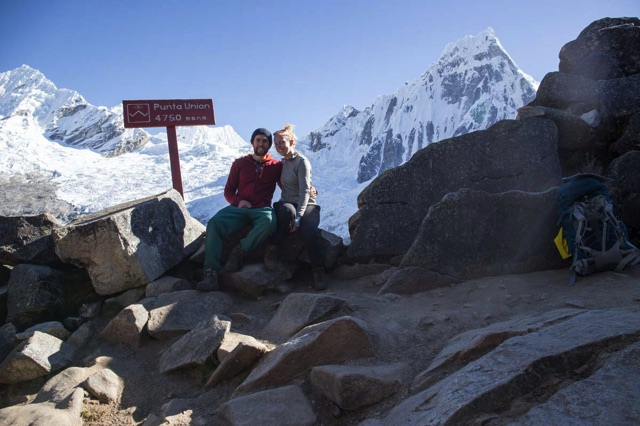</a>
</figure>

<figure class="half">	
	<a href="../images/IMG_8386.jpg">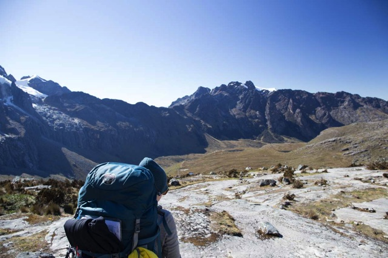</a>
	<a href="../images/IMG_8388.jpg">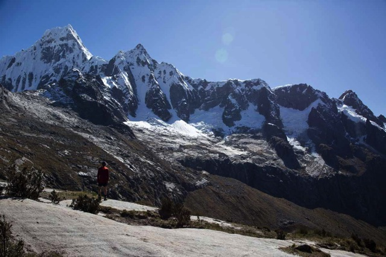</a>
	<a href="../images/IMG_8394.jpg">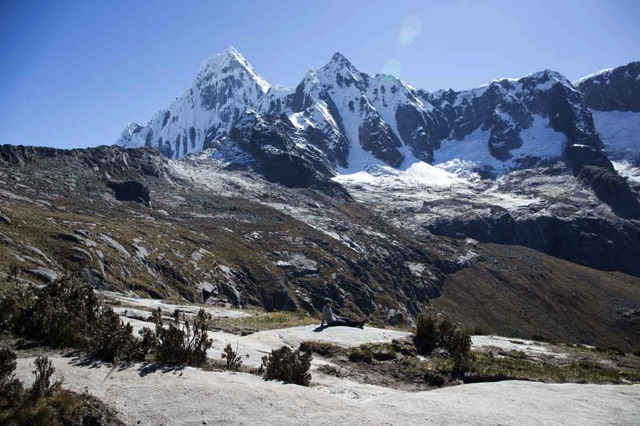</a>
	<a href="../images/IMG_8398.jpg">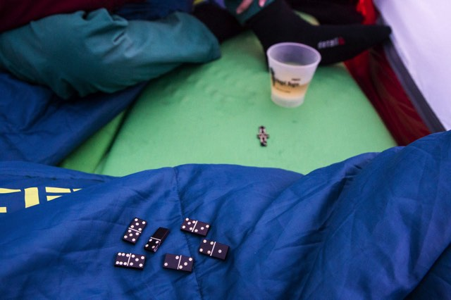</a>
</figure>
<figure>
	<a href="../images/IMG_8408.jpg">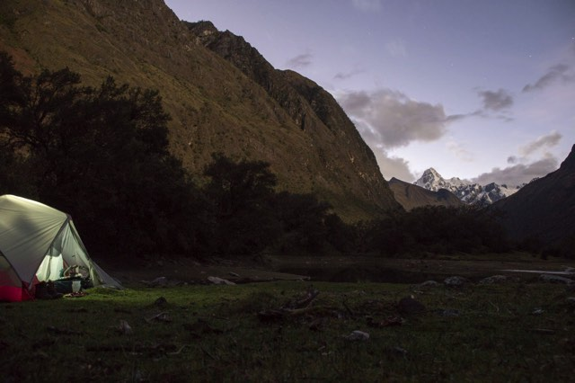</a>
</figure>

## Day 4

<figure>
	<a href="../images/IMG_8610.jpg">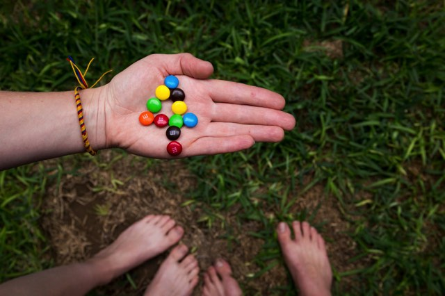</a>
</figure>

<figure class="half">	
	<a href="../images/IMG_8417.jpg">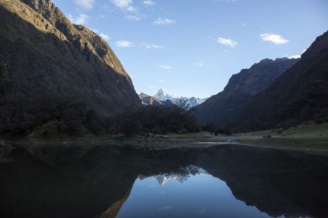</a>
	
</figure>