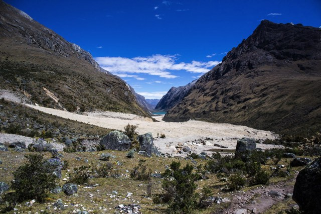
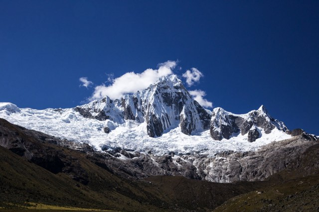
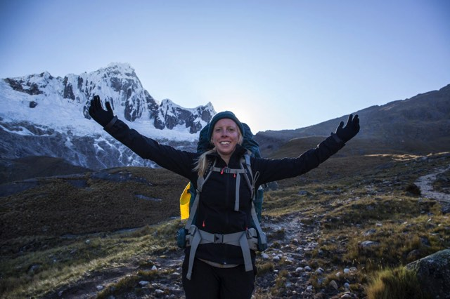
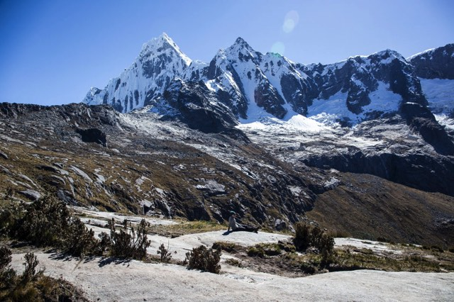
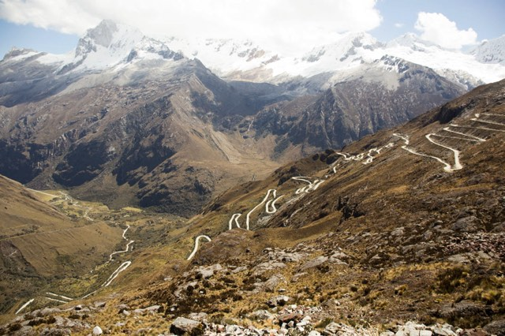

Well, 10 days has past since [El Cocuy](https://ayearlessordinary.com/el-cocuy/), so it was time to get back to the mountains. This time, in Peru.

Situated inland from the coast is the city Huaraz, a base for organising many different types of activities in and around the mountains. We arrived in the evening one night with the intention of heading off first thing the next morning to being the <a href="https://en.wikipedia.org/wiki/Alpamayo" target="_blank">Alpamayo</a> circuit trek. This is a trek that includes 75% of the Santa Cruz trek, and then proceeds off in a different direction to loop back around the valley on the other side of the <a href="https://en.wikipedia.org/wiki/Alpamayo" target="_blank">Alpamayo</a> peak.

<!--<iframe width='100%' height='500px' frameBorder='0' src='https://a.tiles.mapbox.com/v4/swarve.mlj1ip93/attribution,zoompan,zoomwheel,geocoder,share.html?access_token=pk.eyJ1Ijoic3dhcnZlIiwiYSI6Indra1RSUTQifQ.eCLHjdJ74bBiyAKDeiclTA'></iframe>-->

## Day 1
<figure>
	
</figure>

After organising almost everything after we arrived in Huaraz, we set off the next morning toward the trailhead in Cashapampa. We arrived at the trailhead about midday after catching 2 taxi's and one minibus from Huaraz.

<figure class="half">
	
	
</figure>

<figure>
	
	
</figure>

## Day 2

<figure>
	
	
</figure>

<figure class="half">	
	
	
	
	
</figure>

<figure>
	
	
</figure>

## Day 3

<figure>
	
</figure>

<figure class="half">	
	
	
	
	
</figure>

<figure>
	
</figure>

<figure class="half">	
	
	
	
	
</figure>
<figure>
	
</figure>

## Day 4

<figure>
	
</figure>

<figure class="half">	
	
	
</figure>