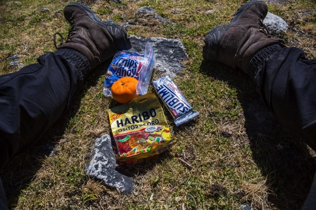
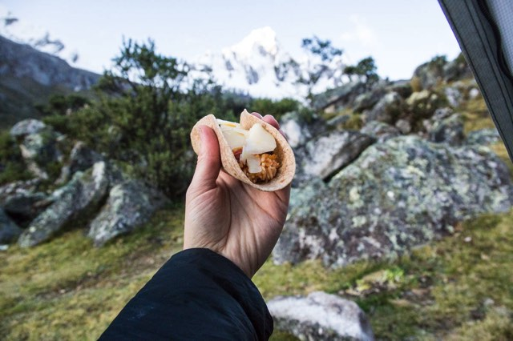
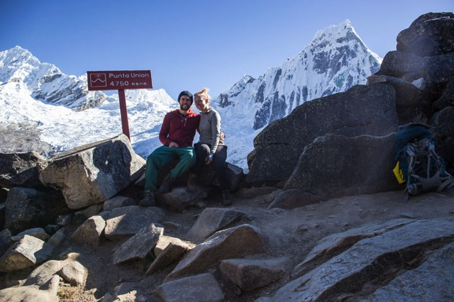
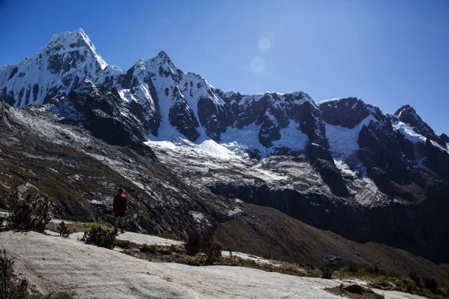

Only 8 days had past since our memorable adventure in [El Cocuy](https://ayearlessordinary.com/el-cocuy/) and already we were missing the mountains (surprising really after the ordeal we went through). So after a few days of eating incredible food (photo blog of FOOD coming up shortly!) and refuelling in Lima we headed back to the mountains, this time in Peru's famous Cordillera Blanca mountains.

Situated inland from the coast is the city Huaraz, a base for organising many different types of outdoor activities in and around the mountains. We arrived in the evening with all our clothes, food and maps ready to head off first thing the next morning to begin the <a href="https://en.wikipedia.org/wiki/Alpamayo" target="_blank">Alpamayo</a> circuit trek. This is a trek that includes 75% of the Santa Cruz trek, and then proceeds off in a different direction to loop back around the valley on the other side of the <a href="https://en.wikipedia.org/wiki/Alpamayo" target="_blank">Alpamayo</a> peak.

The planned trek around Alpamayo had us walking 8-10 days at altitudes between 3000-4900m. 9-10 days worth of food meant our bags were really heavy, weighing in at around 17-20kg each. A lot to be hauling up and over pretty big mountain passes.

By day 3 we were considerably tired of lugging around such large bags and after climbing our first mountain pass we both agreed without question to spontaneously change our route and only do the Santa Cruz trek which was 3 nights and 4 days, giving us time that we wouldn't have had to enjoy some of the other activities Huaraz had on offer. This also meant we could eat whatever we wanted on our final days, happily choosing the most delicious things we packed to eat.

<!--<iframe width='100%' height='500px' frameBorder='0' src='https://a.tiles.mapbox.com/v4/swarve.mlj1ip93/attribution,zoompan,zoomwheel,geocoder,share.html?access_token=pk.eyJ1Ijoic3dhcnZlIiwiYSI6Indra1RSUTQifQ.eCLHjdJ74bBiyAKDeiclTA'></iframe>-->

## Day 1

Reasonably early on day 1 we set off toward the trailhead in Cashapampa. We arrived at about midday after catching 2 taxi's and one minibus from Huaraz totalling around 4 hours of travel along bumpy and unsealed roads ready to start walking with the full force of the hot sun beaming directly down on us.

4 hours of walking with a gradual incline with the sun and heaving bags was enough for us to call it a day, settling on a camp spot right next to the river for the night. A few cows around on the trail, but none in the campsite itself or in the river.

<figure>
	
</figure>
<figure class="half">
	
	
	
	
</figure>
<figure>
	
</figure>

## Day 2

We planned on getting up early as we had around 15km of walking to cover and wanted to get most of it out of the way before the sun hit us hard, well that was the intention. After abruptly waking from a great sleep at 6:30am we realised our plan to leave early had failed, so we decided to just take our time, then enjoyed one of the best trekking breakfast's of mashed potato with bacon bits.. truly so good, you must try it! Oats just don't cut it for us anymore. 

Packing up on dry ground without the numbing cold biting down on us meant we were quite efficient packing up and got going an hour after waking up. Our day started by walking quite casually further up the valley towards the snow covered peaks. Along the way we passed several trekking groups with their mules carrying all of the food and equipment, leaving them happily walking along with a small day pack. You could defiantly see them  inquisitively looking at us, carrying such large bags wondering what we were doing or where we were going.

Shortly before lunch at the lake, in one of the passing trekking groups we saw Gabriel, a German guy we'd been diving with in [Utila](https://ayearlessordinary.com/utila/), nearly 2 months ago (small world!). We also passed groups heading off to climb Alpamayo with all their mountaineering gear- now that was impressive, made our bags look small and lights.

It was nice being able to take the time to stop and enjoy the incredibly awe-inspiring surroundings on this trek (unlike at El Cocuy thanks to the weather), taking as many breaks as we wished, the most impressive of the day being our lunch spot. Sitting by a beautiful aqua blue lake eating chocolate, candy & a little fruit (balance people, balance!).

We actually arrived at our camp spot for the night a couple of hours ahead of schedule (lucky we didn't wake up any earlier!) and questioned making our first pass that afternoon, opting for an afternoon of reading in the sunshine after seeing how beautiful the camp site really was. It was the most spectacular valley surrounded on all sides by snow capped mountains. The valley itself was full of cows and mules freely wandering around, eager to find any bits of left behind food. We managed to get a bit sunburnt even after putting on sunblock.

During the night we were woken by a cow at the fly of the tent licking where we had been cooking the previous night. I'd much prefer to be woken by a cow than a bear or jaguar or coyote.

<figure>
	
	
</figure>
<figure class="half">
	
	
	
	
	
	
</figure>

<figure>
	
	<figcaption>Tawllirahu (5830m)</figcaption>
</figure>

## Day 3

<figure>
	
</figure>

As we were still planning to do the Alpamayo trek we were doing our best to try and conserve our gas to last us the 10 days. This meant heating food until it was just warm enough to eat, pre-soaking as much food as possible to reduce cooking time. The other way was sending Jacqui the blonde gringa off to 'borrow' hot water from the guided trekking companies with their 20 mules to carry the kitchen tent & equipment. 

The chefs were so generous from the other groups that they were more than happy to give us some hot water for tea or coffee. On the morning of the third day however, Jacqui came back to our tent with the chef carrying two of the fluffiest pancakes we've ever eaten for us! Just what we need for the climbs through two passes for the day.

<figure class="half">	
	
	
	
	
</figure>

<figure>
	
</figure>

After making our way up through the never ending switchbacks to the Punta Union pass we'd made up the first and larger pass for the day. The first glimpses of the second pass we had planned looked extremely steep from Punta Union, and the path to cross wasn't visible. As we started descending, we were in the sun and really enjoying the weather after El Cocuy. 

I'm not sure what we were talking about but we both stopped at the same time said we'd actually prefer to head back to Huaraz and do some other activities like climbing. We were in Huaraz for 12 days and 10 of those were devoted to just trekking. With our bags so heavy I think we'd underestimated our tolerance for the weight of 10 days food over so many mountain passes. So with this decision made, we continued on along the Santa Cruz trail but this now cut our trek to 4 days so we were nearly done. Also, the trek was now downhill all the way to the end, and as we walked further down from Punta Union we looked over at the pass we had been planning to do. It was a very steep scramble to the top with a switchback path leading up.

<figure class="half">	
	
	
	
	
</figure>
<figure>
	
</figure>

## Day 4

<figure>
	
</figure>

After a cold night we awoke to a very wet tent thanks to the condensation. 

<figure class="half">
	
	
	<figcaption>Our new friends, interested in our quesadillas</figcaption>
	
	<figcaption>The view in the morning</figcaption>
	
	<figcaption>The road back to Huaraz</figcaption>
</figure>