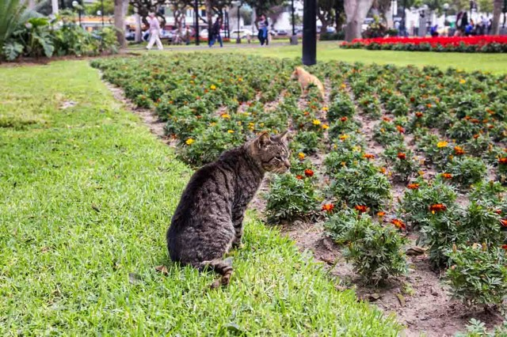
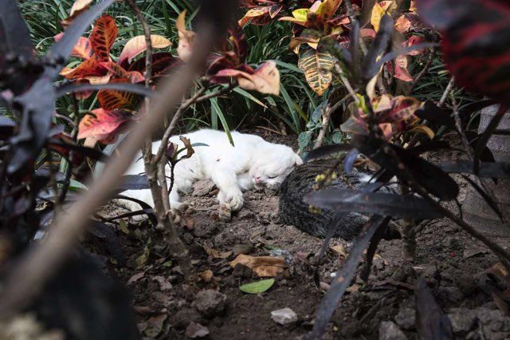
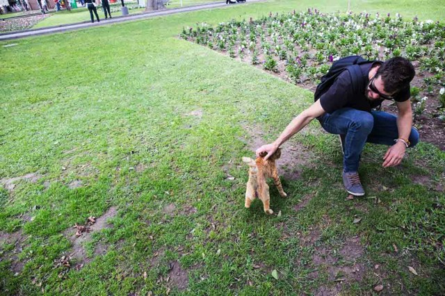
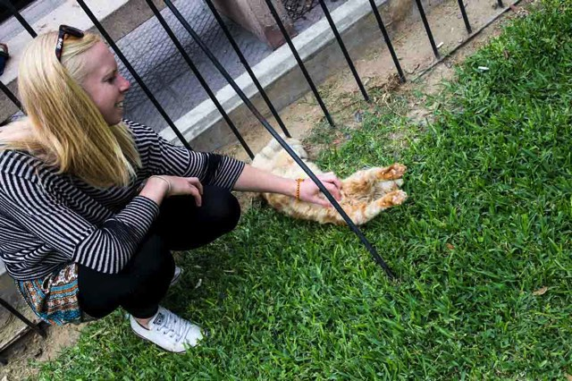
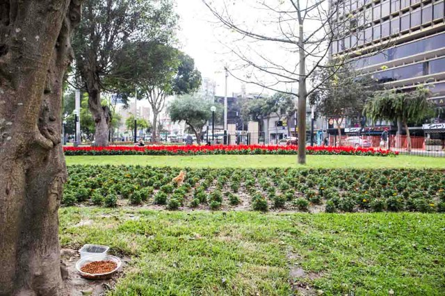
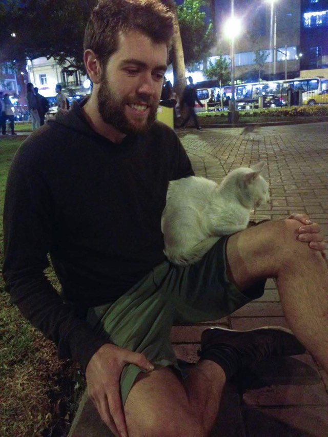

Kennedy Park in Lima is a truly amazing, yet unusual but still joyful park in the middle of Miraflores, a bustling part of Lima. It's fairly quiet, easy to get to and even has free Wi-Fi. But the reason everyone goes to Parque Kennedy is to see all the cats that live throughout this garden in the middle of the city.

<figure>

	
</figure>

<figure class="half">
	
	
</figure>

It's not known how the cat's became to be in the park, but theres lots of stories or tales of how it all began. Cat food & water is left throughout the park, and most if not all of them have been neutered. 

<figure>

</figure>

<figure class="half">
	
	
</figure>