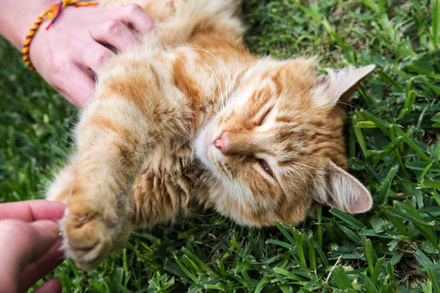
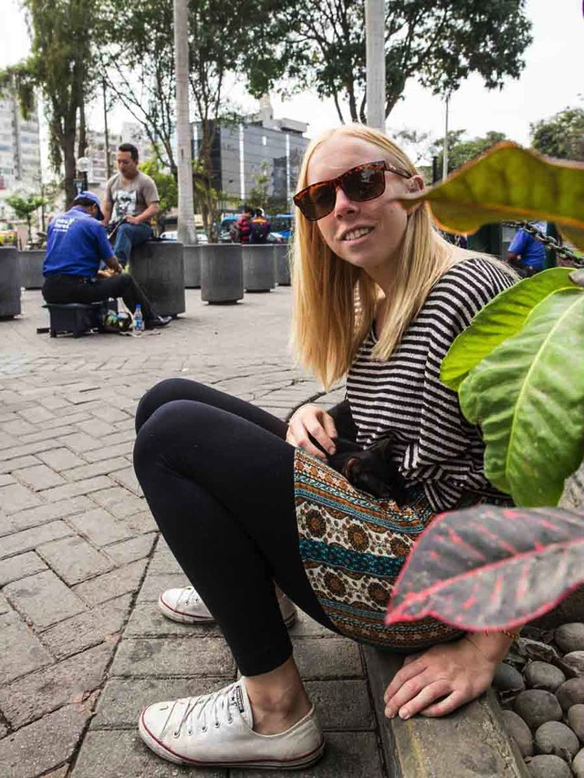

Kennedy Park in Lima is a beautiful, well manicured and maintained park in the middle of Miraflores, a bustling and trendy suburb in Lima. It's easy to get to with public transport options surrounding it, endless restaurants and cafes, and even has free Wi-Fi. But what is so unique about this park is the cats. A park full of around 100 cats that happily live here in the middle of the city.

<figure>

	
</figure>

<figure class="half">
	
	
</figure>

It's not known how the cat's became to be in the park, but theres lots of stories or tales of how it all began. Cat food & water is left throughout the park, and most if not all of the cats have been neutered. 

<figure>

	
	
	
</figure>

<figure class="half">
	
	
</figure>

A suprisingly popular and happy place in the middle of the city for the people of Lima, but in particular for Jacqui and I.  