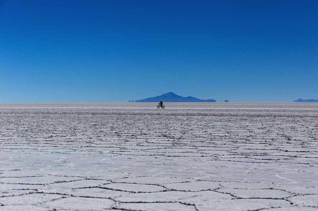

After spending a little too long in Colombia and Peru (for good reason!), we found ourselves with only a month left in South America to visit both Argentina and Brazil. Given the sheer size of Brazil and the variety of cuts of meat & wine available to discover in Argentina we knew our time in these two countries would be a taster, a teaser almost, of what there would be left to explore the next time we grace South America in the future. Another year less ordinary maybe? Round 2.

Our number 1 must see in Argentina, Patagonia, was sadly crossed off our list before we arrived due to the season being winter and therefore meaning areas were either closed to visitors or inaccessible due to snow. This definitely meant there would be a next time back to Argentina for us. 

We gave ourselves roughly 2 weeks in both Argentina and Brazil, limiting us to visiting 2 or 3 places in each.. But after days of drinking and eating two weeks was enough for us in Argentina and well, I could eat Açai and live in Rio de Janeiro anyway but Europe was calling...

### San Pedro de Atacama, Chile
Our 3 day tour of the [Uyuni salt flats](https://ayearlessordinary.com/salt-ice-dessert-sunshine/) in Bolivia finished and we had 2 days to spend in Chile before catching a bus to Argentina.

We didn't do much for the day and half we had, except eat great food (empanadas!), try some excellent Chilean wine and explore the desert that surrounds the town. The Atacama desert is the driest desert in the world, with a total of 1mm of rainfall per year!

We explored on bikes the canyon of Quebrada del Diablo and had a great picnic lunch.

<figure class="half">
	
	
<figcaption>San Pedro de Atacama, Chile</figcaption>
</figure>

### Salta, Argentina.

When stepped off the bus in Salta it felt as though we had arrived in Europe. The people, the culture, the architecture and the modern comforts of Argentina were instantly visible and it was a complete contrast to where we had been previously. Salta is a sophisticated and romantic city with cafes lining the streets and music being played in the many plazas throughout the city. For us, as with many, our first priority in Argentina was to eat some of the well renown steaks of Argentina. 

<figure>

<figcaption></figcaption></figure>

<b>Cafayate, Argentina.</b>

<b>Córdoba, Argentina.</b>

<b>Buenos Aires, Argentina.</b> 

<b>Iguazu falls, Argentina.</b> 

<b>Florinapolis, Brazil.</b> 

<b>Rio de Janeiro, Brazil.</b> 
