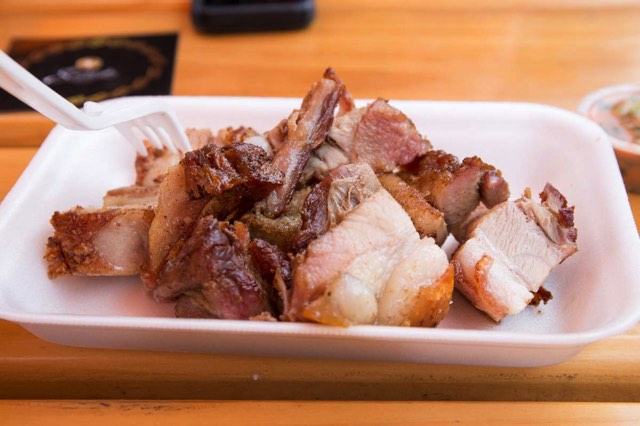

Lima, the capital of Peru is known throughout the world for its food and for us that's what our visit was all about. After travelling through Colombia we had been told by countless amounts of people that Lima is a foodies heaven. Well they weren't wrong. Not only did it have delicious local cuisine, you could also find amazing international food that suited both Simon and my desires.

After trekking for a week or so, Lima was an excuse to (over) indulge, and that is exactly what we did.

After scrolling through our photos we took from Lima it was clear that instead of taking photos of the delicious food, we just ate it. What we did take the time to photograph before devouring is featured below.

<figure class="half">
	
		
<figcaption>Chicharrón and sweet potato roll. Mind blowing. Ceviche, a Peruvian classic is done to perfection in Lima.</figcaption></figure>

It's the simplicity of freshness and flavour that makes Peruvian food so delicious and unique.
	
The after school special, and go to for these boys was the Ceviche on the corner sold by a man from his little street stall. It was around $1 and delicious! Nothing like this is available back home, as most after school food tends to be junk food in Australia.
	
<figure class="half">
	
	
</figure>

<figure>

<figcaption> Chicharrón from the Lima food festival.</figcaption></figure>

What a lot of people don't know is that Peru was one of the first country to cultivate potatoes as they are from the Andes. They now have over 1000 varieties of potatoes, all with different tastes and uses for cooking.

<figure class="half">
	
	
</figure>

I fell in love with how cheap and available incredible superfoods (as we know them) such as chia, quinoa, corn, maca and amaranth are in Peru. These are used in everyday cooking for Peruvians and are simply their local and regular produce.  You can find them everywhere as the wholegrain or as flours at markets or in the supermarket. Surely going to miss these!

<figure class="half">
	
	
	
	
</figure>

<figure>
</figure>
 
If any of this tempts you, we will be more than happy to have you over and feed you when we are home!