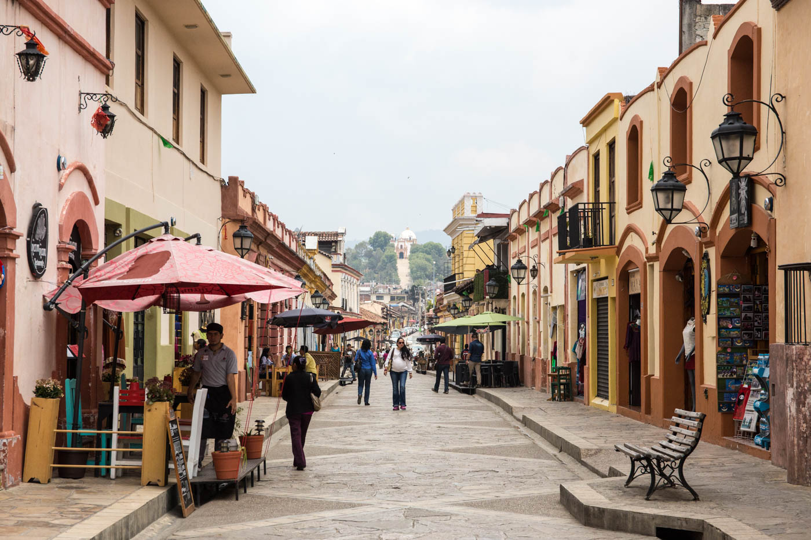
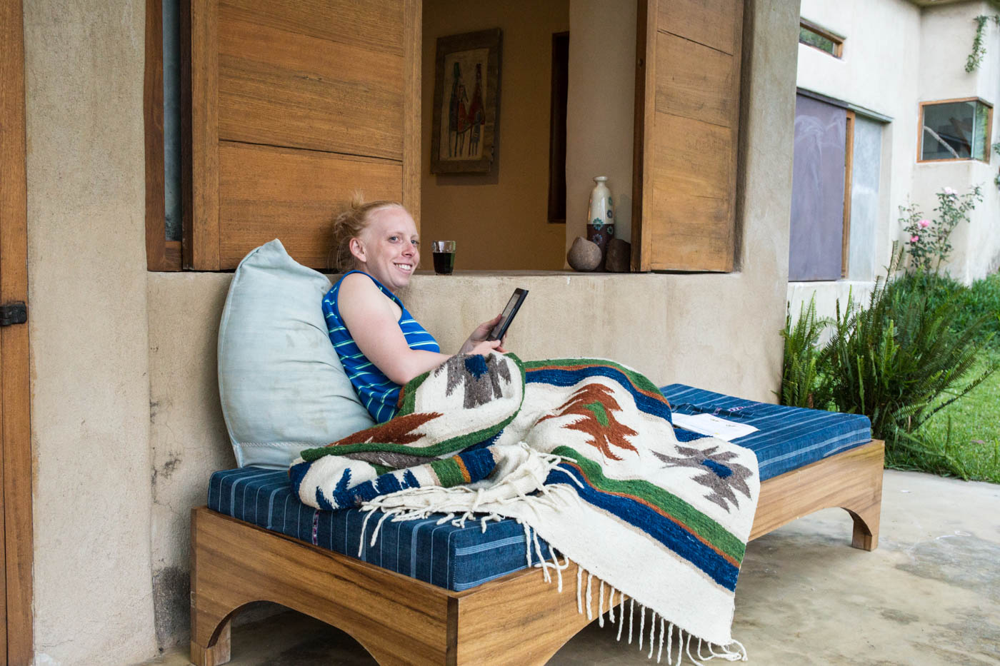
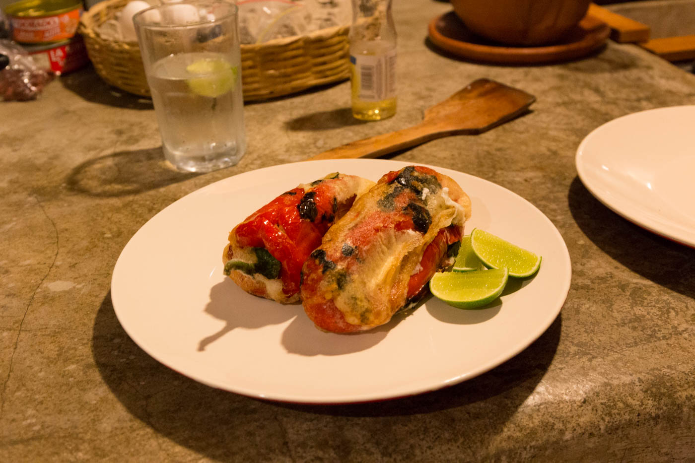

It's been awhile since we last posted, so long that we have already checked off another two countries since Mexico. I know, I know.. being on holiday and enjoying every moment without thinking about documenting the experiences.. how could we. 

So.. here we go! 

## San Cristobal Las Casas

From Puerto Escondido we went to San Cristobal Las Casas, which we loved. The moment we arrived we knew this would be a great experience for us. San Cristobal was a beautiful colonial city sprawling with cute cafes, fresh coffee roasters & tapas bars. We enjoyed a relaxing 3-4 days sipping coffee, vino & walking through the town. 

<figure class="half">
	
	
	<figcaption> San Cristobal Las Casas.</figcaption>
</figure>

## San Marcos, Lake Atitlan

From San Cristobal we embarked on a 13 hour shuttle journey crossing the border into Guatemala where we eventaully arrived (after a <a href="http://en.wikipedia.org/wiki/Launch_%28boat%29" target"_blank">lancha boat</a> across the lake) at San Marcos la Laguna on Lago Atitlan where we stayed for a relaxing 5 days. 

We stayed away for the crowds up on a hill with a view of the lake, amongst avocado trees and local Mayan families.

<figure class="half">
	
	
		<figcaption>La cocina en la casa. Volcano views.</figcaption>
	</figure>

For the first few days we barely left our beautiful house, making the most of the large and beautiful space to ourselves where we enjoyed the time to read, cook, relax & drink.

<figure class="half">

	
	<figcaption>Relaxing. More Relaxing.</figcaption>
</figure>

<figure class="half">

	
	<figcaption>Market haul. Chili Rellenos.</figcaption>
</figure>

We did take the time to walk down to the lake a couple of times to jump from the 6m platform into the refreshing lake and to hire some Kayaks and leisurely explore the little villages around San Marcos. 

<figure class="half">

	
</figure>

## Antigua

After our 5 days off blissing out were over we headed on short shuttle to Antigua where we stayed for over a week learning Spanish and climbing Volcan Acatenango (more in next blog post about the climb).

<figure class="half">

	
	<figcaption>On our way to class. Volcano Agua in the background.</figcaption>
</figure>

