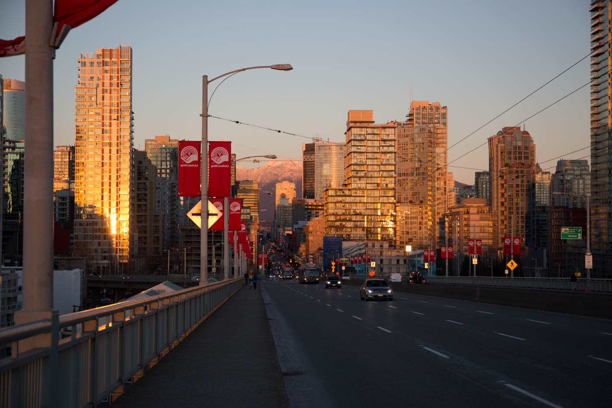
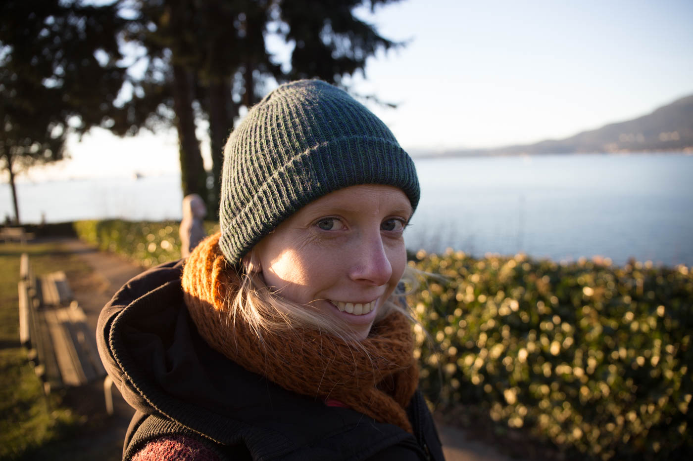
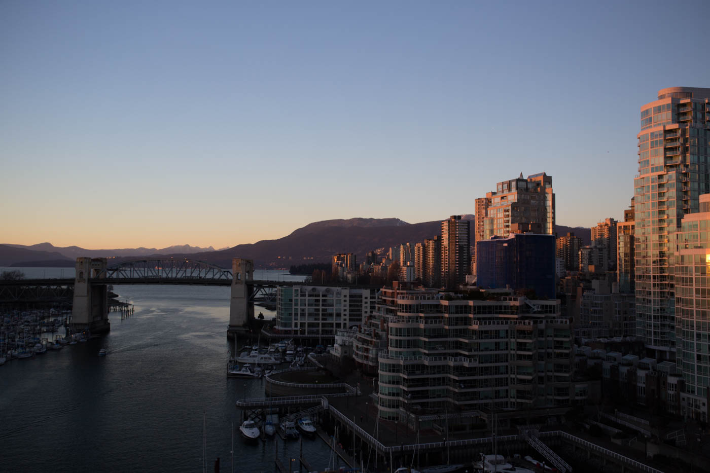
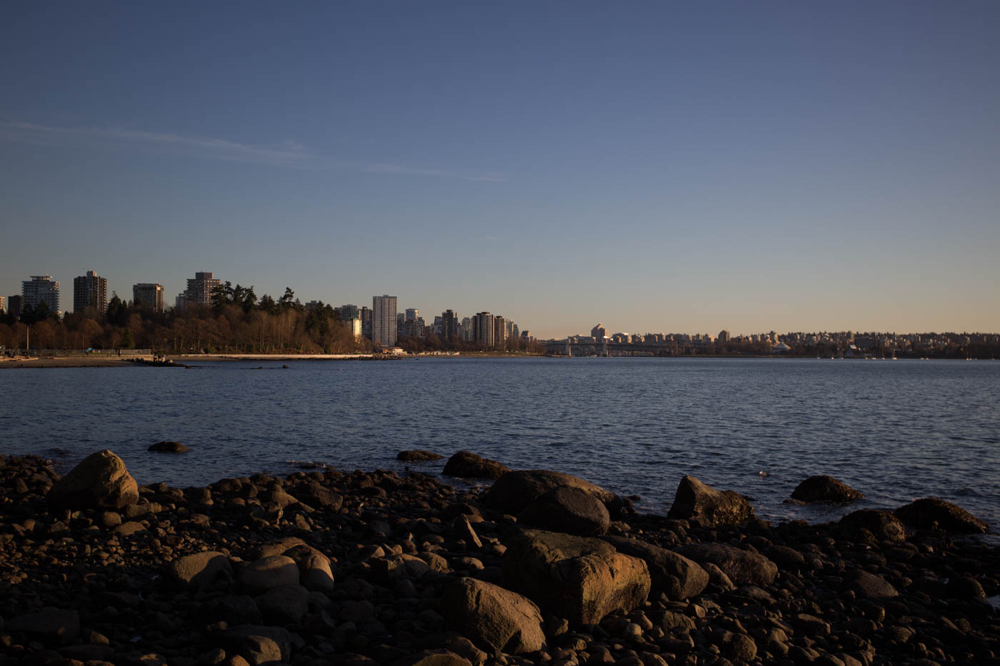
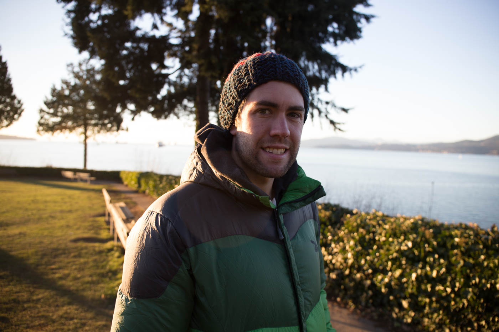

## Vancouver, Canada.

After a 16 hour trip from Melbourne-Auckland-Vancouver we touched down on Monday 29th of December, almost 24 hours back in time from when we left Melbourne. The temperature drop was the first thing to hit us with temps between **2 and - 4**, and is still something we are adjusting to (slowly!). This was not helped by the fact we both forgot to bring gloves that weren't huge snowboarding mitts. 

Vancouver is known for its grey drizzly weather so we were pretty lucky to be welcomed to clear bluebird days with stunning views out to the surrounding snow peaked mountains the entire time we were in Van. 

