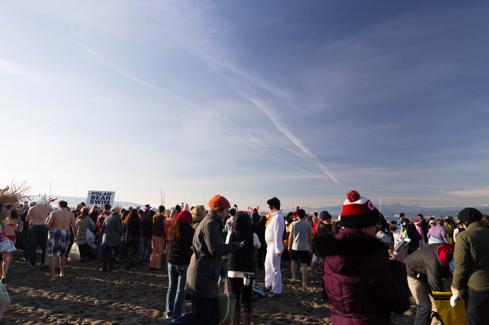
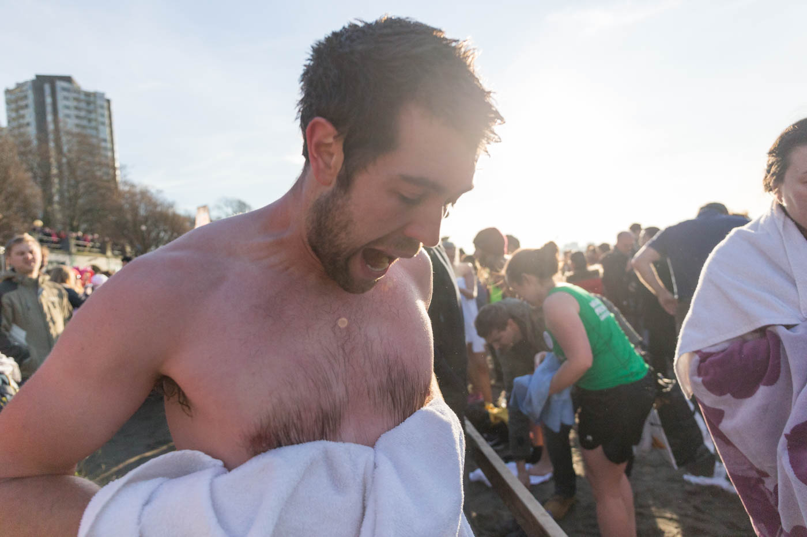
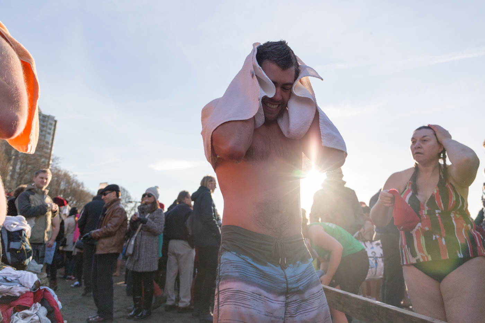

It's New Year's day, your hungover and it's really cold outside, what's the best way to spend you day? Well, swimming in the ocean with hundreds of other idiots was pretty high on my list...

The Polar Bear Swim is a yearly ritual, it's 100 yard race out to a man in a row boat. Everyone comes dressed in their costumes, as Elvis, or simply with a beer box on their head. Once people get out there the madness of the cold really sinks in, everyone fights to try and hang on to the side of the row boat.

Air temperature: **4° celsius**
Water temperature: **3° celsius**

The process of getting dry while your whole body is numb and standing on freezing sand is fun too.

<iframe width="560" height="315" src="//www.youtube.com/embed/wsVommb48IQ" frameborder="0" allowfullscreen></iframe>