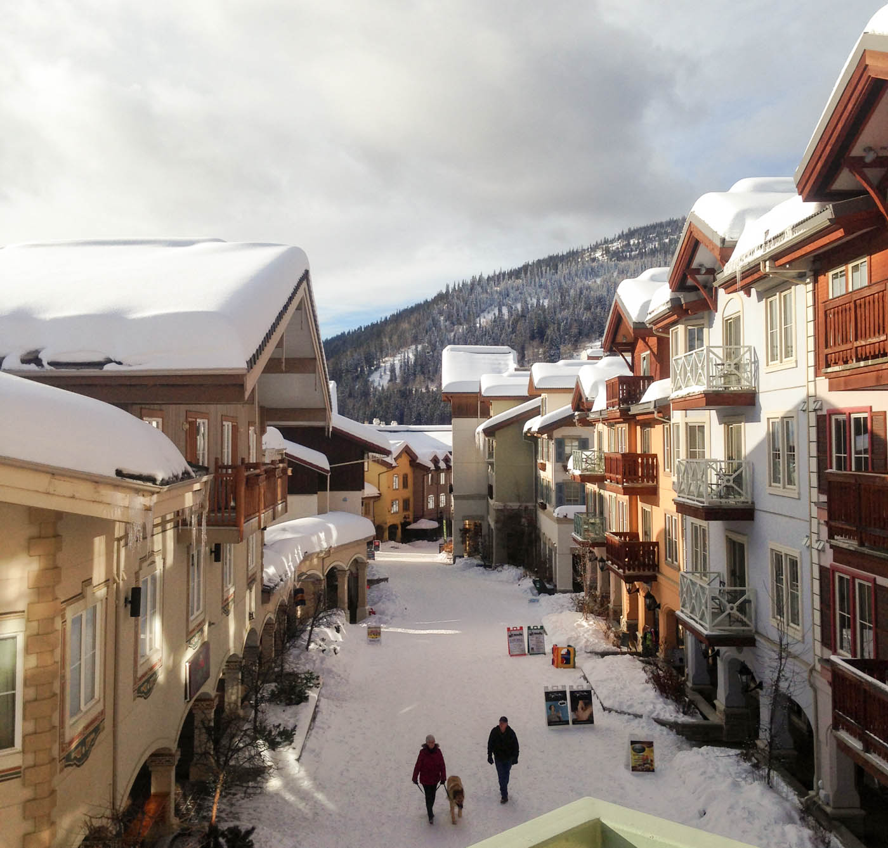
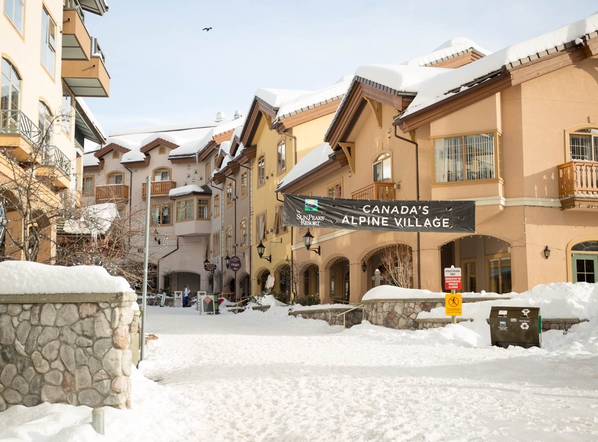
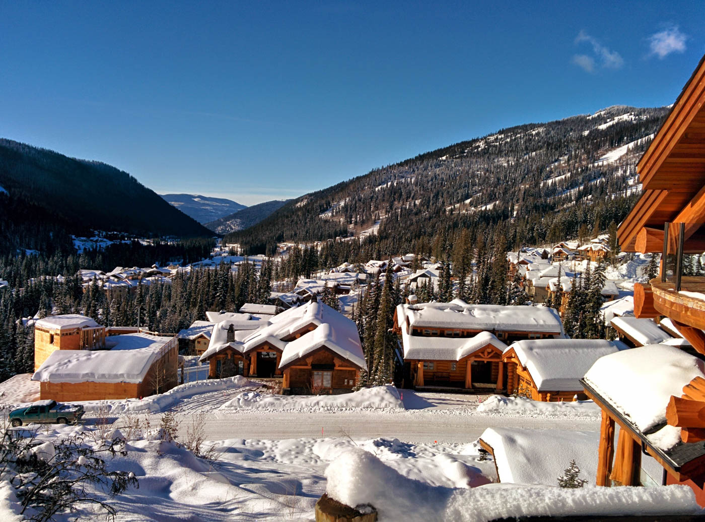
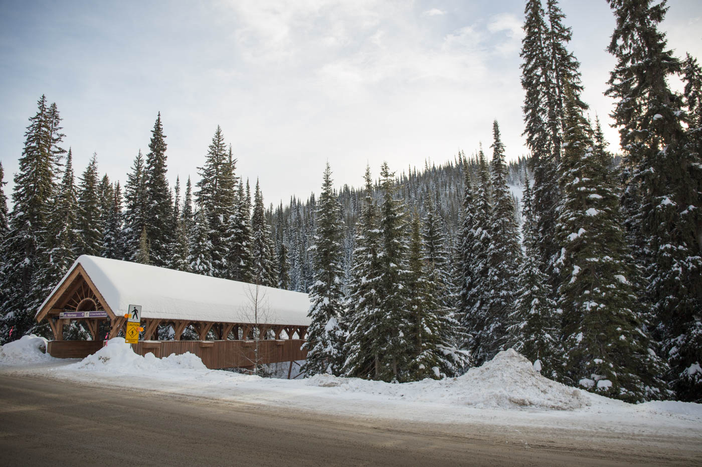
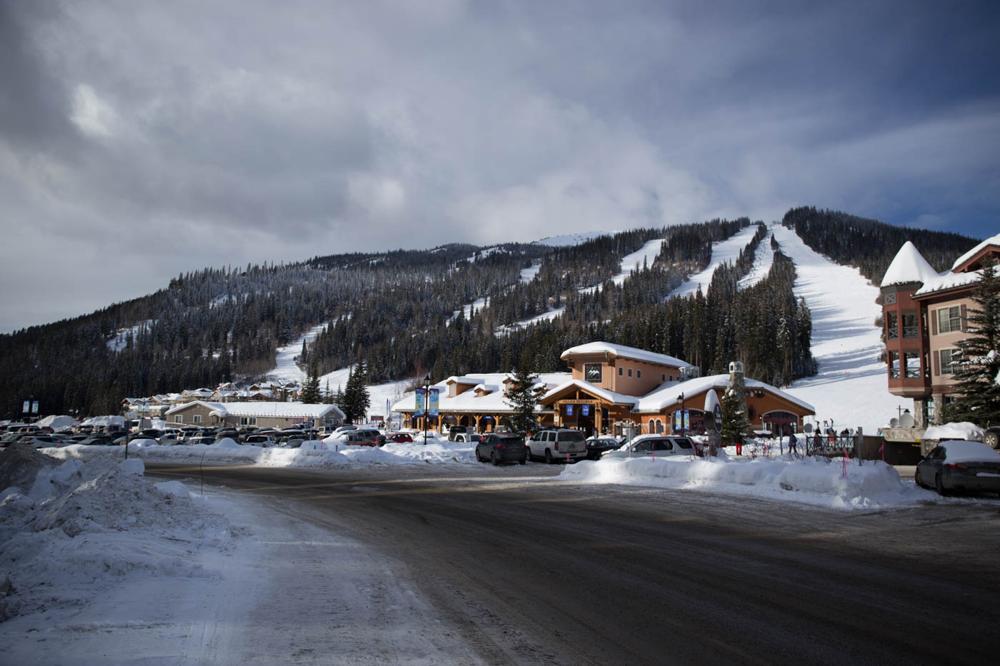
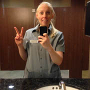

Imagine a little village at the base of a mountain surrounded by snow covered trees, fairy lights, and ski chalets. That's where we are living.

We have been in beautiful Sun Peaks for a little over 2 weeks now and it’s our plan to be here until mid March. It's been a busy two weeks working, snowboarding, partying and trying to find somewhere to live, but we’ve definitely enjoyed the ride and been able to meet a lot of great people. 

For a mountain that thrives on people coming to work through the winter for minimum wage it is amazing how little housing opportunities there are. Particularly for us (and a lot of others) arriving after the season has started. After harassing locals, putting up posters, writing on FB etc… we’ve managed to sort some things out and are living at The Grand Hotel (where I work) for another 2 weeks and then move into a little ski in/ski out studio right in the village. 

It’s a pretty sweet lifestyle we are living here.. most people are working 40 hrs+ a week and only have two days off to enjoy the mountain, but Simon and I have both managed to get Part-Time work for 20-30 hrs a week. I’m working as a housekeeper for the hotel and a housekeeper for a family run rental business which sounds as luxurious as it is, cleaning peoples rooms, no really I don’t mind it… yet. Simon is working at the local grocery store and has the best hours so he can snowboard all day and then work in the afternoon/evening, plus we get cheap food... winning!

***House keeping***
