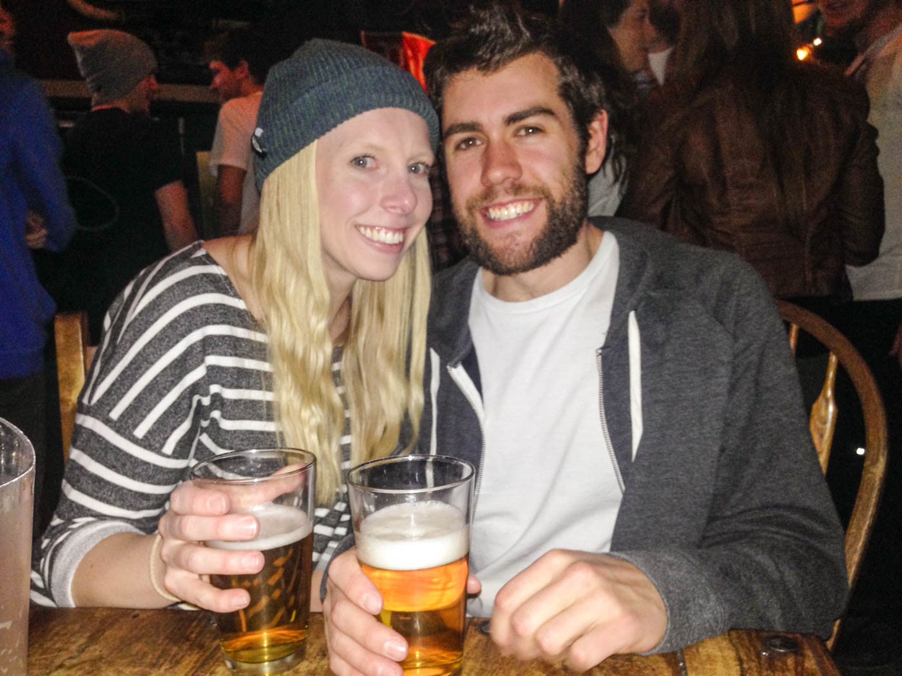
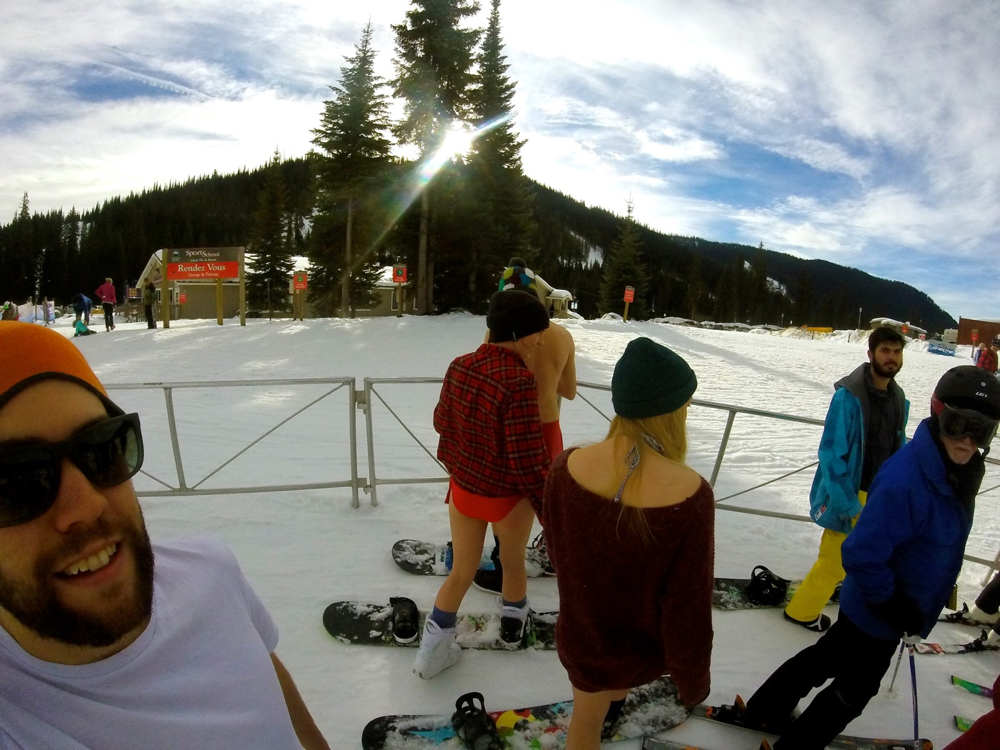
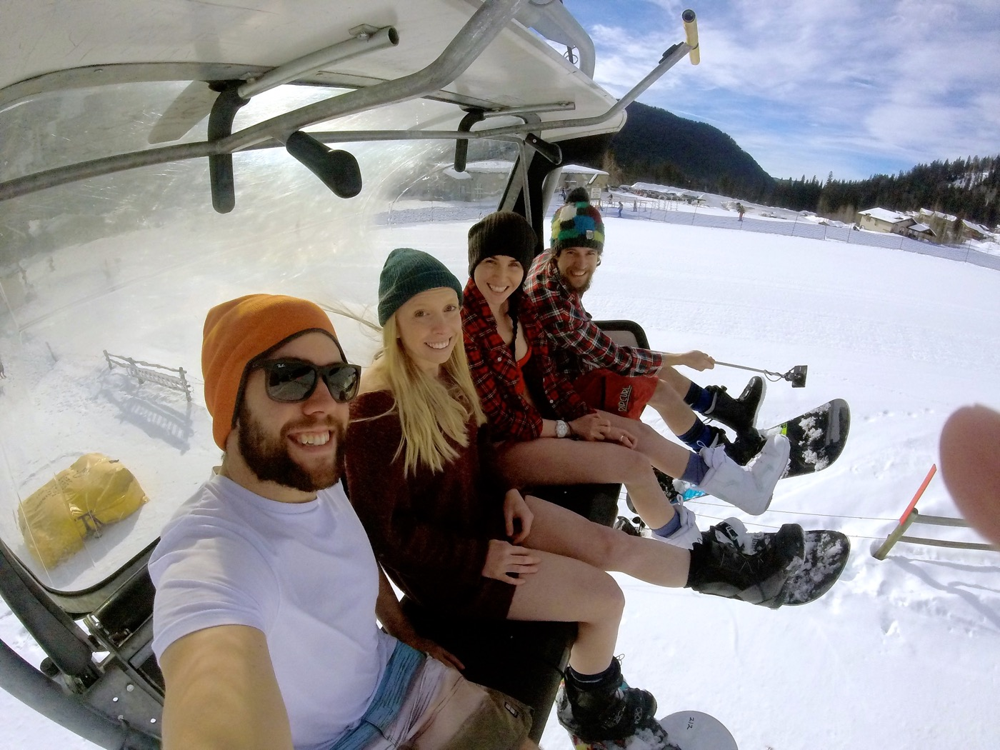
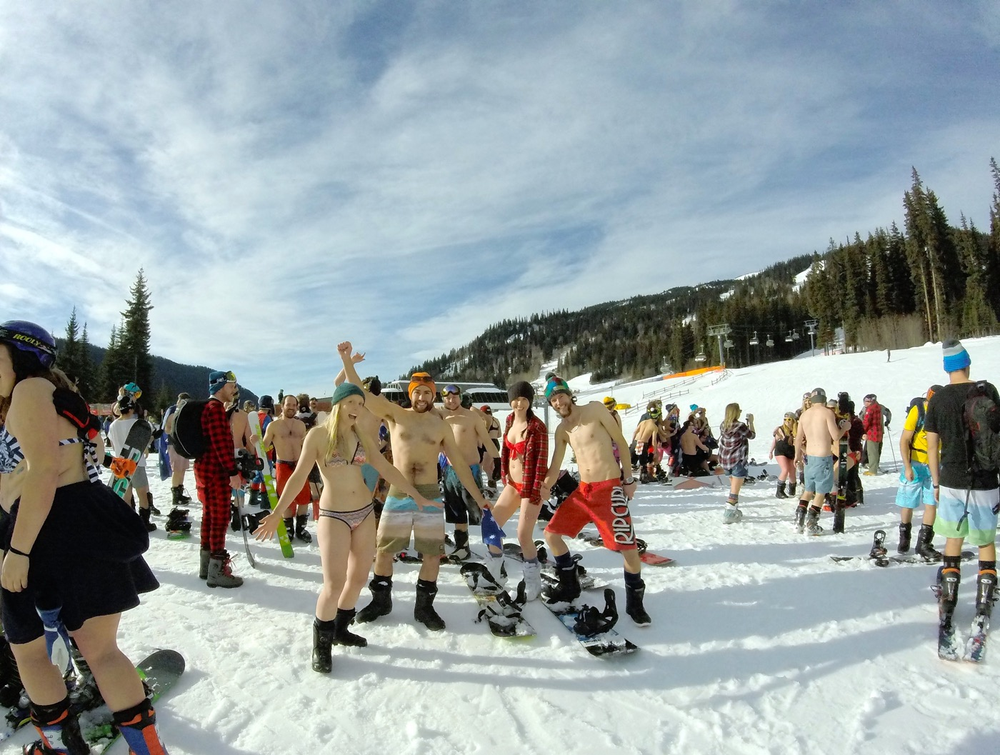
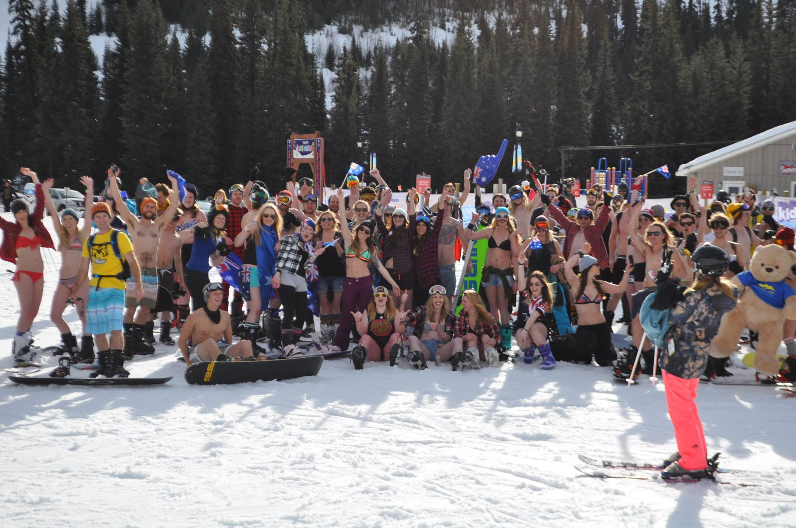

No words can properly describe how much fun we have had over the past few days at Sun Peaks celebrating Australia Day.

It started on Aussie Day Eve here where we found ourselves at the local pub alongside 100s of other Australian's listening to the Hottest 100 as it streamed live. While you couldn't actually hear the countdown above all of the noise of drinking beer and playing pool it was a great atomsphere to be in. The countdown finished after 1am here, well after the pub closed, but this didn't stop us and the night continued well into the early hours of Australia Day.

After a few hours sleep we woke to find a stunning blue sky and mild temperatures, the perfect conditions for a bikinis & boardies ride down the 5 mile trail.

**HAPPY AUSTRALIA DAY!**

#### 5 Mile
<iframe width="560" height="315" src="https://www.youtube.com/embed/pIj8LVlaI-w?modestbranding=1&rel=0&showinfo=0&autohide=1" frameborder="0" allowfullscreen></iframe>

