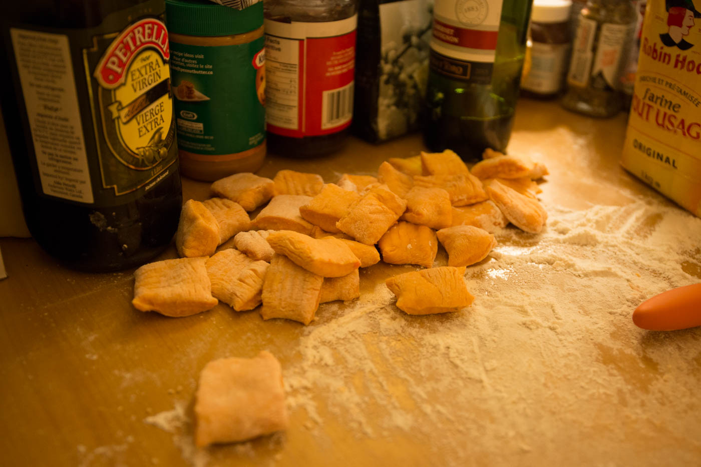
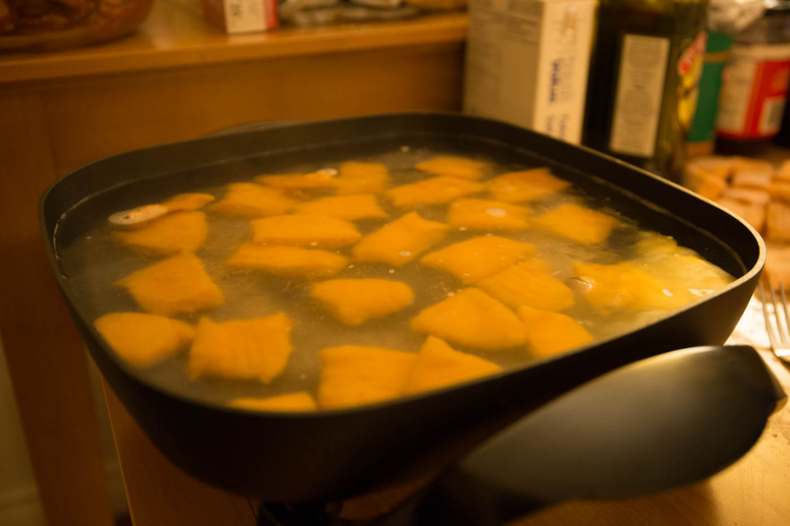
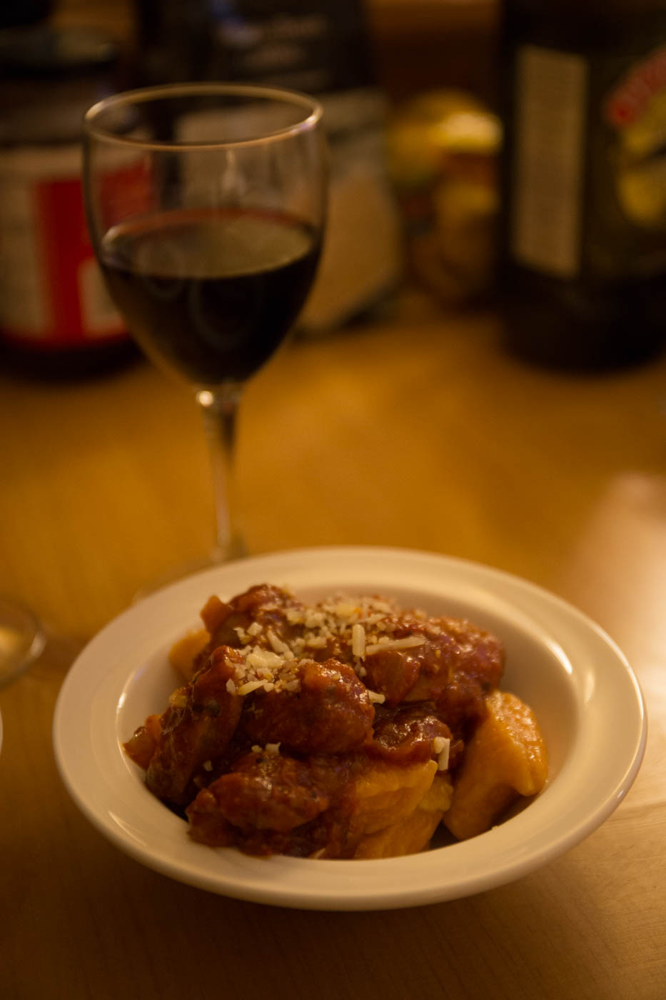
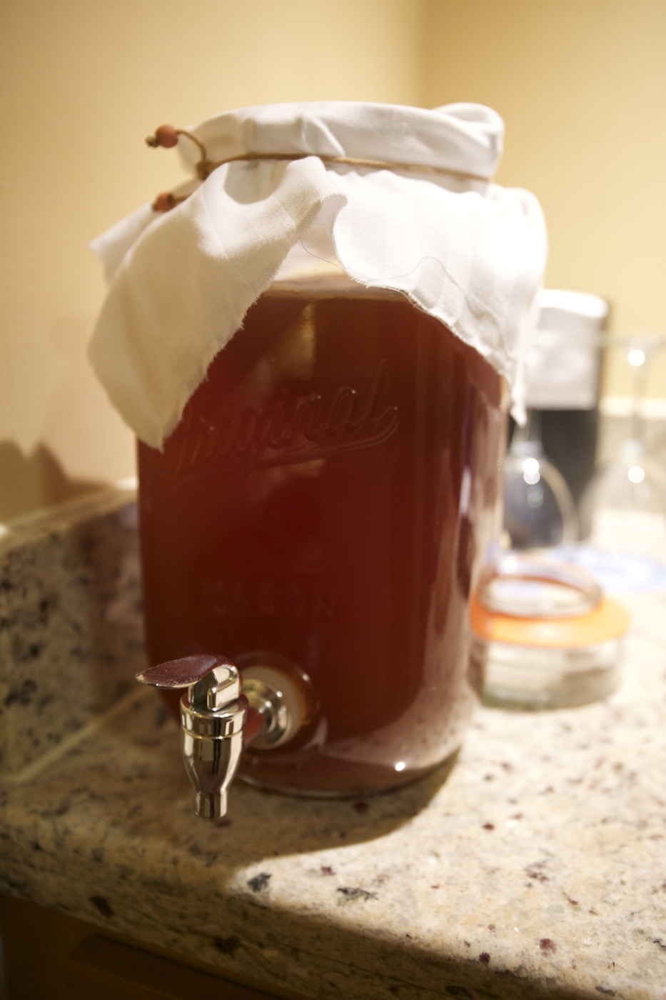
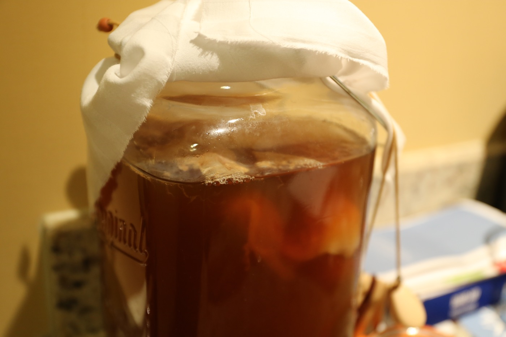
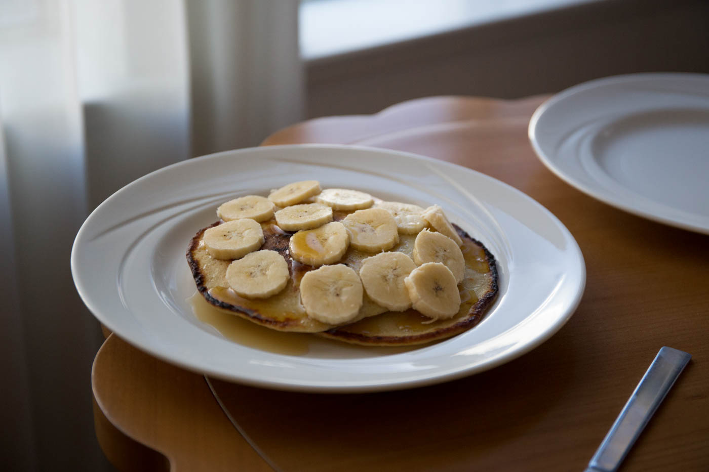
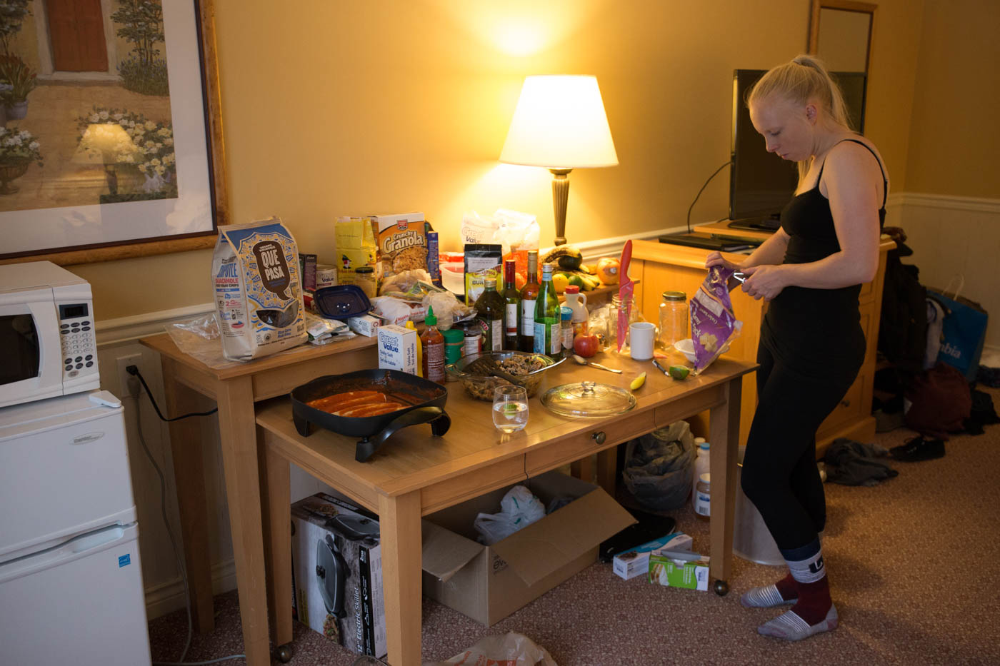

As you know Simon and I are quite the foodies.. we live and breath food, and living in a hotel room for the past 3 weeks hasn't stopped us going out of our way to make something delicious. Yes it has posed many challenges, but it has certainly made us think about how we can manage to cook what we want with only a microwave, electric frying pan, kettle and fridge. 

Here are some of what we have created so far.. Sweet potato gnocchi being our proudest, most time consuming, yet satisfying achievement yet. 

We have also started making our first Kombucha which is a tangy health drink made from fermenting sweetened tea. We have met some people who make their own up here who gave us a 'scoby' (symbiotic colony of bacteria and yeast) and a glass jar to begin the process of brewing kombucha. It's growing and changing and also tasting delicious after only a week. 

Banana pancakes were a hit. So was a japanese curry we made and took around to our friends place. Oh and the brownies we managed to make in the fry pan!

Our hotel room set up. The main town outside of the snow village is a bit of a drive so we try and avoid going grocery shopping frequently and have a nice little stock pile of food set up.

More creative food adventures to come.
