Last weekend we completed our AST-1 avalanche course in Canmore & the field day in Kananaskis. This course is designed to provide an introduction to understanding the numerous factors that can cause avalanches. Being an AST1 level course, it's designed for people [like us] without much backcountry touring experience. 

The two day course begun with an inside theory day to learn about the many different types of snow that fall, the weather phenomena that affects snow & what we can do to avoid triggering avalanches. From cornices and facets to deep hoars, we learnt all the lingo to understand the different issues that weather can cause after snow has fallen.

When backcountry touring the minimum equipment you travel with is a avalanche transceiver, shovel & probe. More high tech gear for serious travel in avalanche terrain can include avalung backpacks (to increase the accessible oxygen once buried), and airbag backpacks (to increase your floatation (inverse segregation) and hopefully bring you closer to the surface once caught in an avalanche). A surprising insight during the theory day was that 25% of avalanche deaths in Canada were due to trauma caused by being carried through wooded areas by the avalanche rather than asphyxia due to being burried. 

<figure>
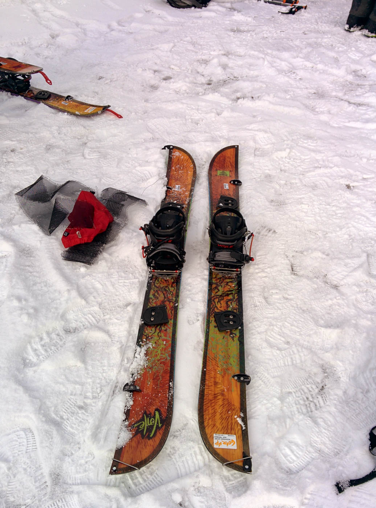
<figcaption>Splitboard split into touring mode</figcaption>
</figure>

The second day gave us the opportunity to head out of town into the backcountry to test our new skills in a practical sense. First off was just setting up our splitboards into the tour mode. Removing the bindings, splitting the two halves into separate skis, fitting the bindings into the tour mode and sticking on the skins to allow the skis to travel uphill.

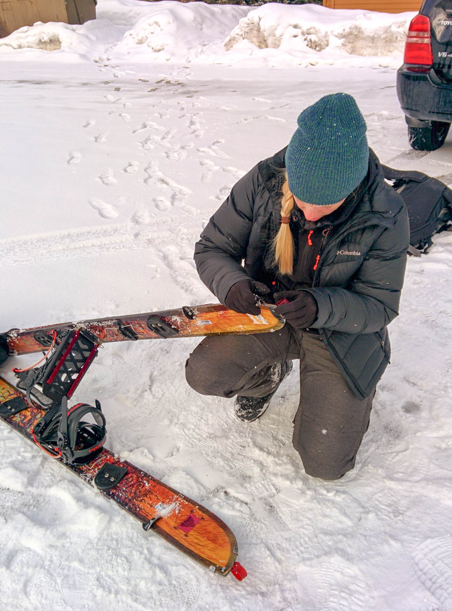

Prior to venturing out into the backcountry, the avalanche [bulletin](http://avalanche.ca/) is one of the several pieces of information required to understand what & where the risks are. Combine this with the [weather](http://weather.gc.ca/), [ATES rating](https://www.google.ca/search?q=ates+ratings) and [recent mountain conditions reports](http://acmg.ca/mcr/) and you've got a fairly good understanding of the broader scale conditions.

<figure class="half">
	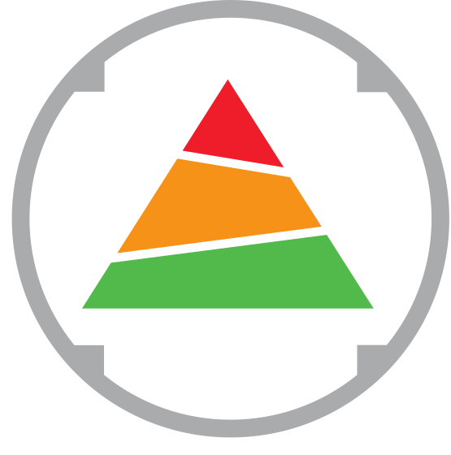
	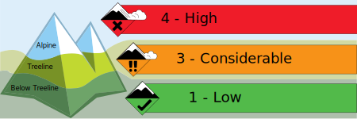
	<figcaption>Avalanche bulletin ratings.</figcaption>
</figure>

Once the group was setup and moving around, we ventured off to an area to practice using our transcievers, probes & shovels to locate avalanche victims. 

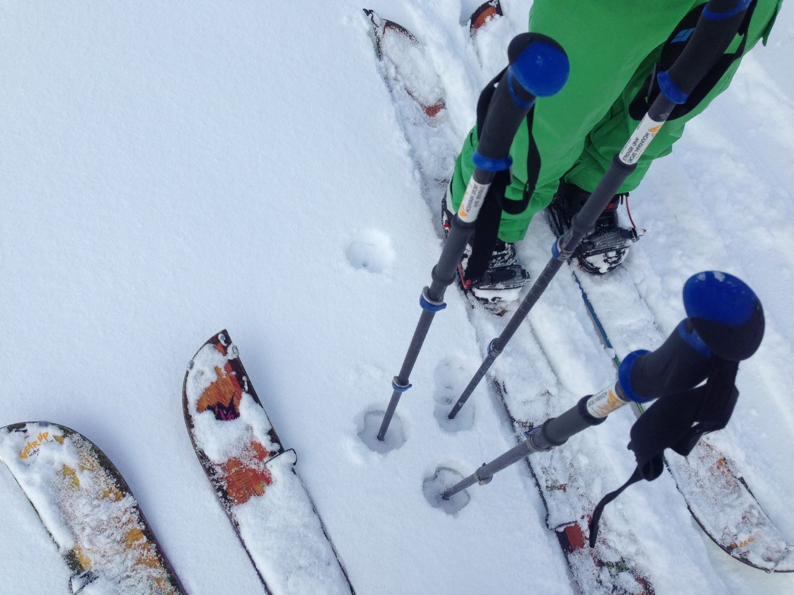

We did this in pairs by burying backpacks with our transceivers inside to simulate an avalanche burial and sent someone off with their transceiver to locate the backpacks. As with most of winter in Canada, it was pretty warm and the snow was pretty soft - digging pits to bury packs meant mainly sinking to your waist as soon as you step off your skis.

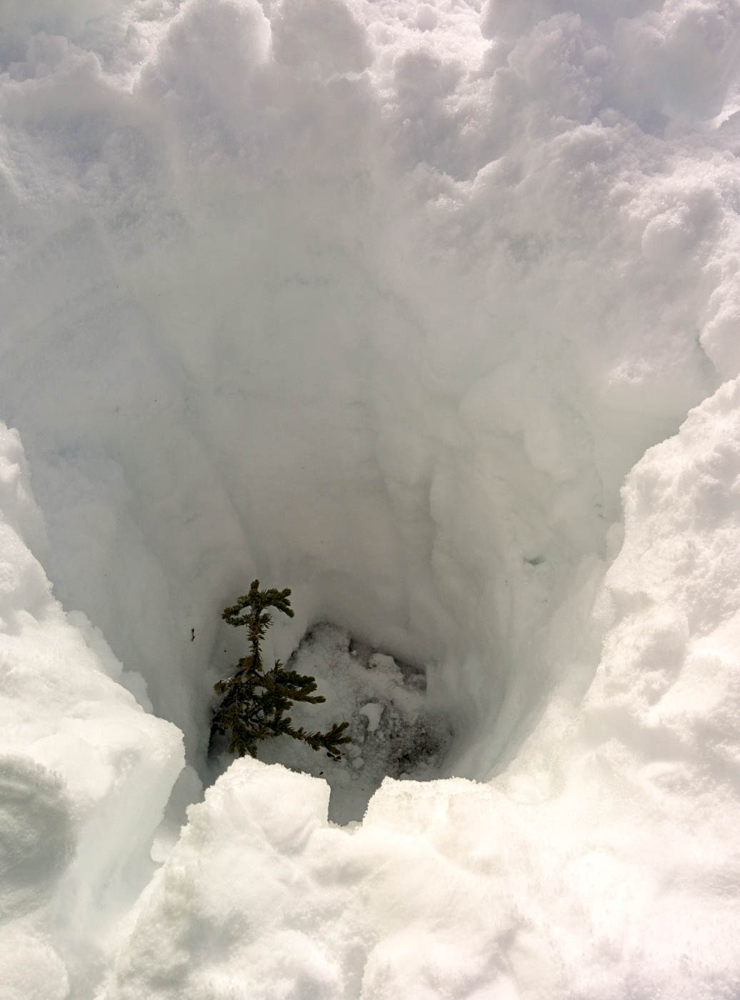

After countless pits were dug and bags buried and successfully rescued, we begun our tour uphill on our skis. After easily skinning uphill with an end goal at the forefront of your mind (shredding it downhill!), cross country skiing on flat ground seems like a meaningless effort. 

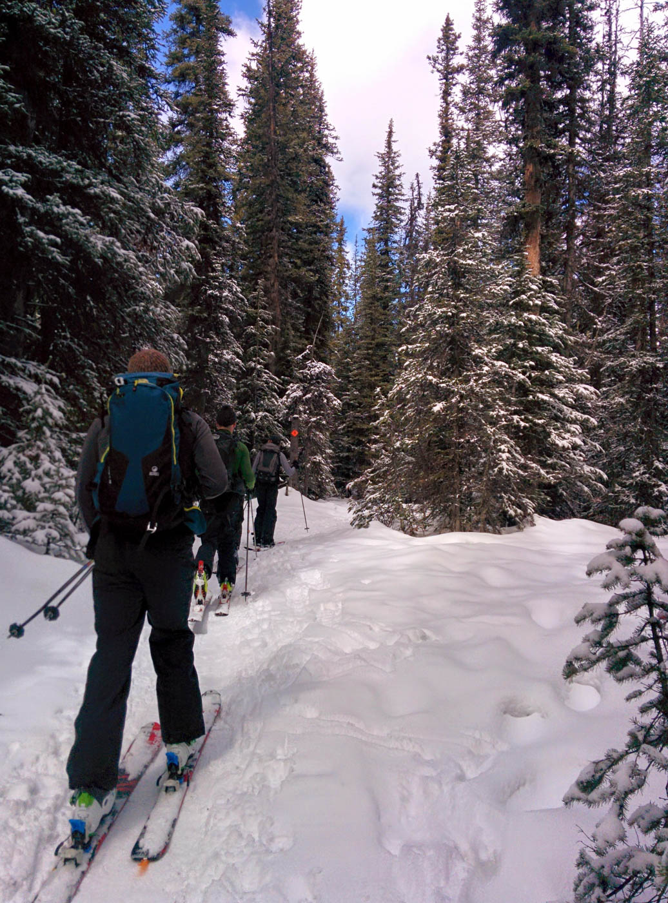

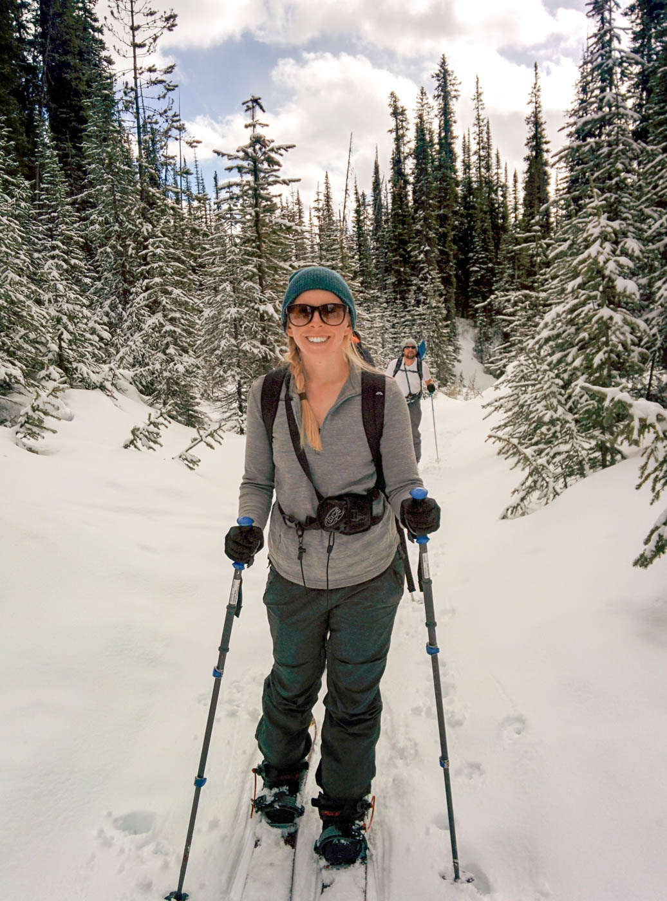

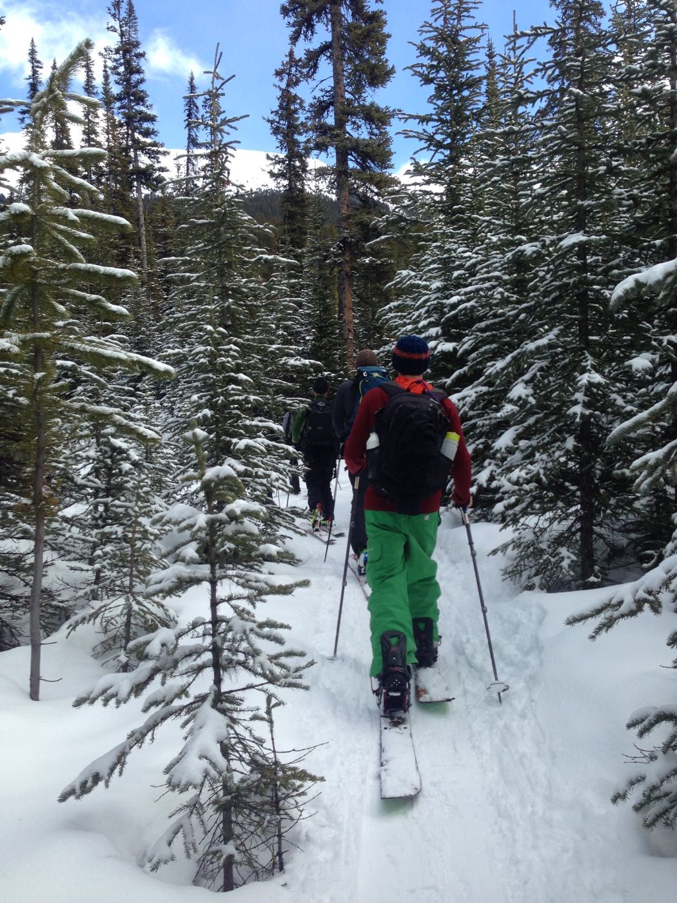

Once we climbed up the highest we were going to venture in our course, which was well into a dense forest we stopped to test the snowpack. This typically involves digging a snow pit to understanding the different layers in the snow and to hopefully correlate the warnings found in the avalanche bulletin.

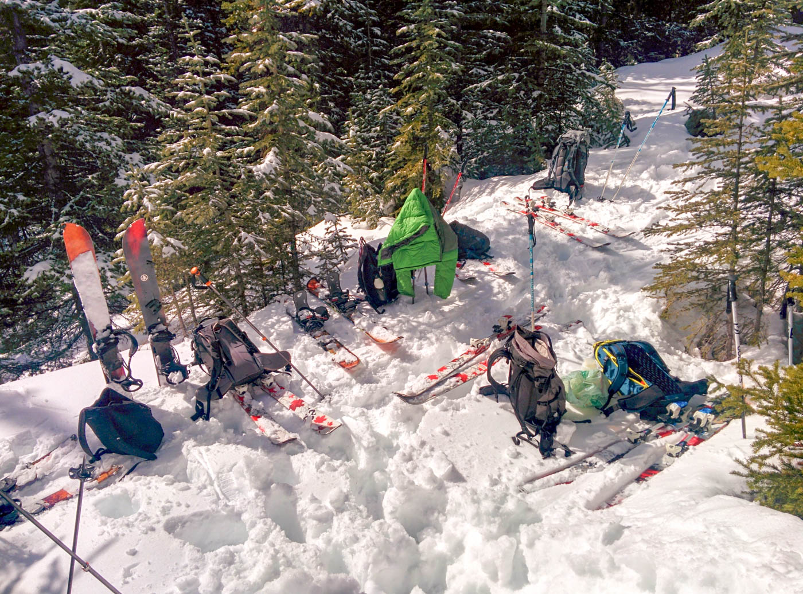

This involves digging a snow pit to understand the layering that has occurred as the snow has fallen and been affected by the weather and additional snow that has fallen on top of previous layers. Once dug, some layers are clearly visible, while others can be detected only by dragging your hand from surface to the bottom of the pit through the different layers. 

The main test to carry out is the compression test on a 30x30x100 cm block of snow in the snowpit. It's a rather strange to see hear about but it's relevance once seen is really relevant to riding or skiing on the various layers in the snowpack. The test involves putting your shovel on the block of snow and progressively hitting the shovel harder with your hand to see what the effects are on the snowpack layers.

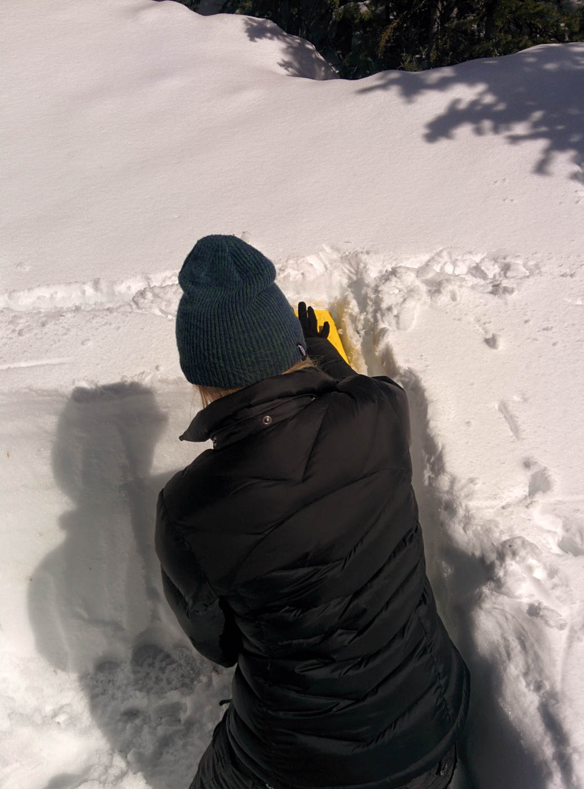

After our snow pit testing was over, we were ready to ride down the hill on our boards back in one piece.

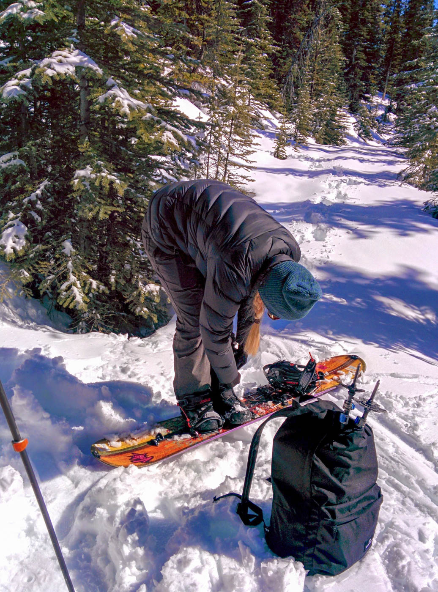 

By the time we finished for the day the snow was soft and [isothermal](http://www.fsavalanche.org/isothermal/), meaning it was soft & wet throughout the entire snowpack. All this means as you sunk straight to waist deep as soon as you tried to go anywhere not on a board or skis.

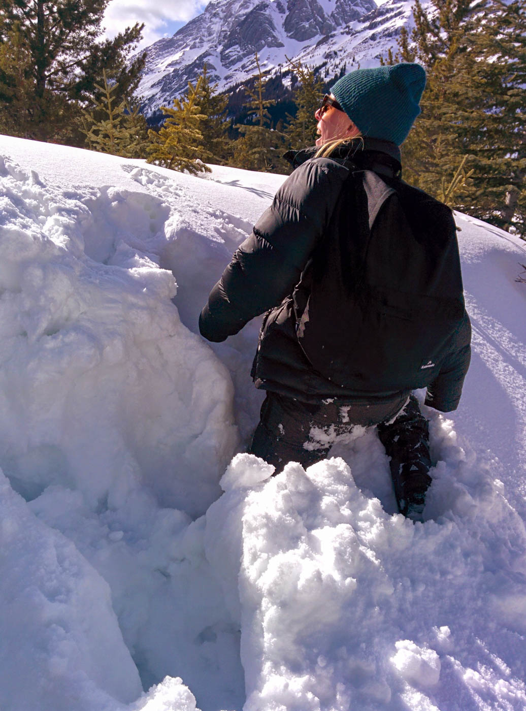

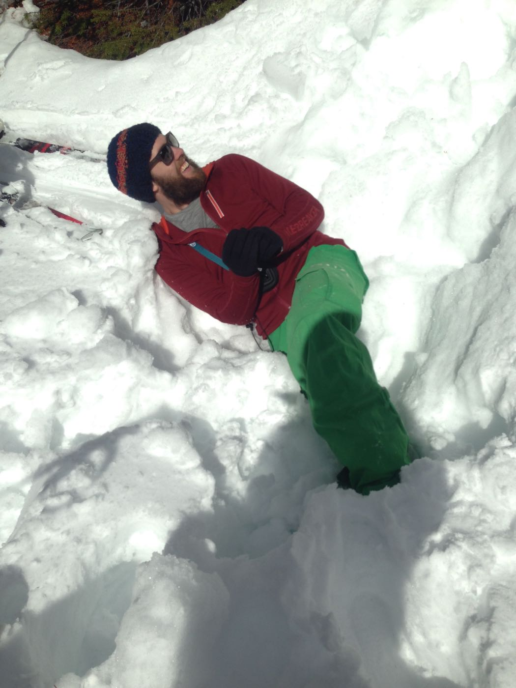

A really fun weekend and great introduction to backcountry riding.

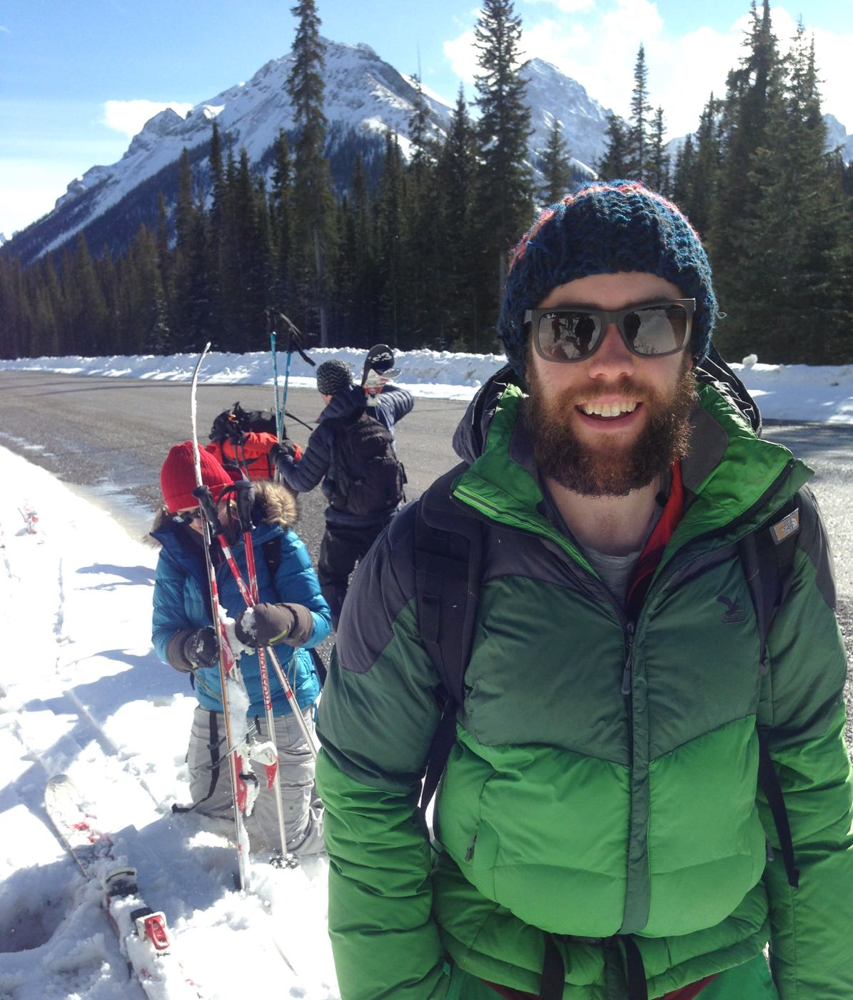

