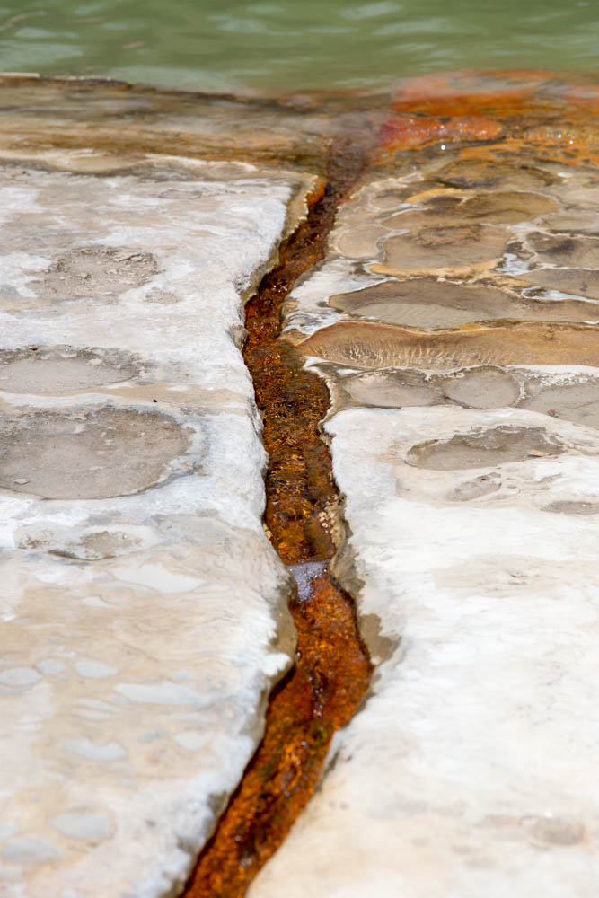
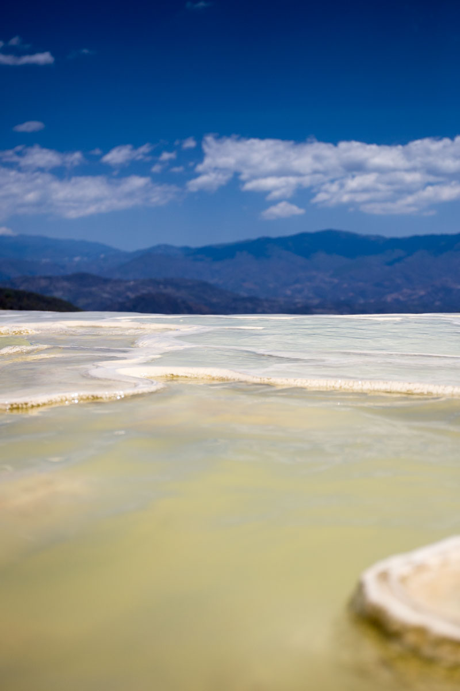

After experiencing how good Oaxacan cuisine was to eat we decided we had to learn some more about the background to the food we enjoyed and also how to cook some. Our course was run by a local chef, restaurateur & bleacher of all types of produce (to kill the nasties on the outside of the food & a little bit of your insides).

First part of the day was spent touring one of the central produce markets of Oaxaca to decide on the menu & buy some ingredients. We settled on:

* Salsa
* Guacamole
* Quesadillas
* Mole Negro
* Mole rojo
* Chile rellenos

Touring the market gave us a good opportunity to once again explore the variety of produce available in Oaxaca and ask questions about what certain things were called, their use and to taste fresh things.

<figure class="half">
	
	
	
	
	<figcaption>Hierve el Agua. A grand petrified minerals waterfall.</figcaption>
</figure>

