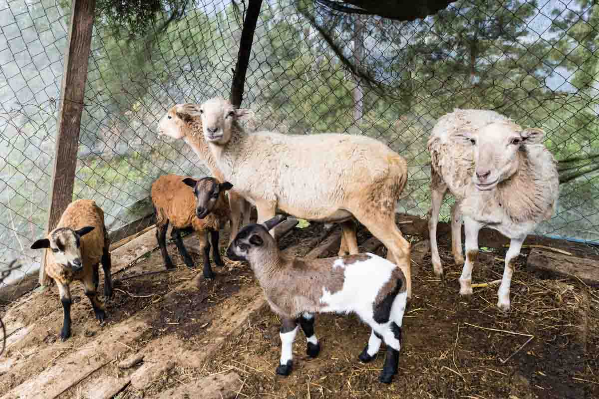
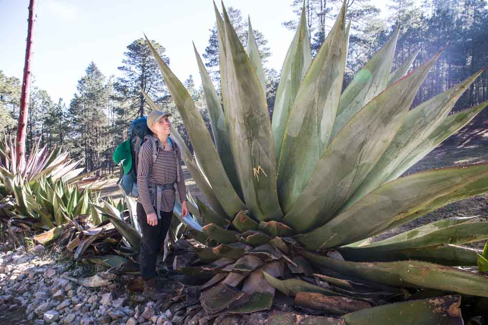

### Day 2:

The second day started with hot showers (the hot water we asked to be turned on for the morning). The mountains surrounding Natuvi were masked in a thin wispy fog. A country side was awakening with donkeys hooting & roosters crowing.

Breakfast was served at the same local restaurant we ate at the night before. At dinner we saw garlic & tomato being roasted on the clay comal. Hot coffee, bread and a tomato garlic & cheese soup with tortillas was devoured for breakfast.

We set off not long after on the 4 hour journey to La Neveria with our guide from the afternoon before. Walking out of Natuvi we passed many households with their animals living just outside their houses. Horses, donkeys, goats, chickens or dogs were to be seen. Drying corn (maize) was seen at most houses, sometimes just under the eve of the roof or sometimes in special drying lofts. Once again our guide was attempting to explain some of the medicinal flora we were passing and its uses. He also asked us if we were a little sore from the previous day's hike - to which I thought I understood "*Are you a little cold in just shorts?*". Of course, no I wasn't cold I answered, "*I have pants!*". Somehow he managed not to laugh?

<figure>
	
	
	
	<figcaption>Drying maize. La familia</figcaption>
</figure>

Part of our journey was along the Zapotec Camino Real across Oaxaca. Along the way we saw again many medicinal plants & again attempted to interpret the condition they were for & the method of consumption.

<figure class="half">
	
	
	
	<figcaption>Camino Real</figcaption>
</figure>

We arrived in La Neveria after walking uphill through pine forests mainly & on the vehicle road into town. After we arrived we ate a delicious local meal of vegetable soup, fried potato, a fried green omelette & frijoles with fresh queso. Many glasses of Jamaica (hibiscus) infused water were had.

<figure>
	
	<figcaption>Lunch</figcaption>
</figure>

Another guide appeared after lunch to take us to the local family we were to be staying with that night. 

Mangolia welcomed us with a hug & a very warm 'mucho gusto'. She showed us around her house & yard. An impressive maize drying loft with at least 5 cubic metres of corn inside. A small garden where she grows her corn, beans & some other small greens. She has 6 chickens, a rooster, a dog & 2 bulls.

<figure class="half">
	
	
	
	
	<figcaption>Magnolia's house. Maize drying loft, toro</figcaption>
</figure>

Once we had settled in to the room we ventured out again to discover La Neveria. Around the village we saw lots of things being dried, from melons, to shingles and fish. Waste in Mexico (and Guatemala, maybe elsewhere?) is seperated into organic and inorganic waste.

<figure class="half">
	
	
	<figcaption>La Neveria</figcaption>
</figure>

While we were having a well earned siesta, Magnolia was busy preparing dinner for us in her kitchen. She had a really authentic kitchen with a wood burning comal stove, maize gristmill.

<figure class="half">
	
	
	
	
	
	
	
	<figcaption>Magnolia's kitchen. Comal, maize, gristmill</figcaption>
</figure>

Magnolia was very interested in us, our families and our belongings. She told us she has guests from Expediciones Sierra Norte every 2 two days. She was curious about our ages, siblings, our parents ages, how much Jacqui's leggings cost (which she loved!), her sandals, my phone & the dictionary it contained (google translate) and  of course how much that cost also. *"Mucho gusto su pantalones. ¿Dónde usted comprar? ¿Cuanto cuesta?"* she would ask about everything we had - was she a thief looking to steal our most valuable possesions? No! Just a lovely old lady who lived more than 2 hours from the nearest store that sold more than the basic neccessities!

For dinner, Magnolia served up a stew of vegetables and bull, served of course with tortillas. 

<figure class="half">
	
	
	<figcaption>Magnolia's house</figcaption>
</figure>

### Day 3:

Once again we awoke to the misty fog that had greated us the day before and to the sad news our stocking above the bed hadn't been filled with gifts from Santa. Breakfast the was coffee, potato & capsicum soup and delicious pasta with garlic and chili. 

<figure class="half">
	
	
	<figcaption>Breakfast</figcaption>
</figure>

As we ate, Magnolia appeared with 100 pesos and asked if she could buy the leggings. Jacqui had already decided she wanted to give them to Magnolia because she loved them a lot and wouldn't stop asking about where they were from, so with our little Spanish we explained that they would be a gift to her. We would have loved to see her wearing them, we can just see her rolling around the village with leopard print leggings selling her maize and flowers to the locals.

She also gave us a care package of food to take with us on the walk to Benito Juárez. We thanked Magnolia for her lovely hospitality and bid her farewell and begun our journey to Benito Juárez.

<figure class="half">
	
	
	<figcaption>Magnolia</figcaption>
</figure>

<figure>
	
</figure>
<figure class="half">
	
	
	<figcaption>Benito Juárez in the distance. Looking back to La Neveria.</figcaption>
</figure>

Along the trail to Benito Juárez we once again walked through forrests of pine tree and saw many clearings with maize being grown. At this time of year the fields contained either new sprouted maize, or the remains of the previous crop being eaten & cleared by the horses, donkeys or cows. We also saw local villagers heading out with horses and donkeys to cultivate or tend to their plots out in the countryside.

<figure class="half">
	
	
	
	
	<figcaption>Along the trail.</figcaption>
</figure>

<figure>
	
	
	<figcaption>With the maguey.</figcaption>
</figure>

"Mucho gusto su pantalones. ¿Dónde usted comprar? ¿Cuantos?
"Costa por su Camera, su zapateros?"
"¿Cuantos años su mama?