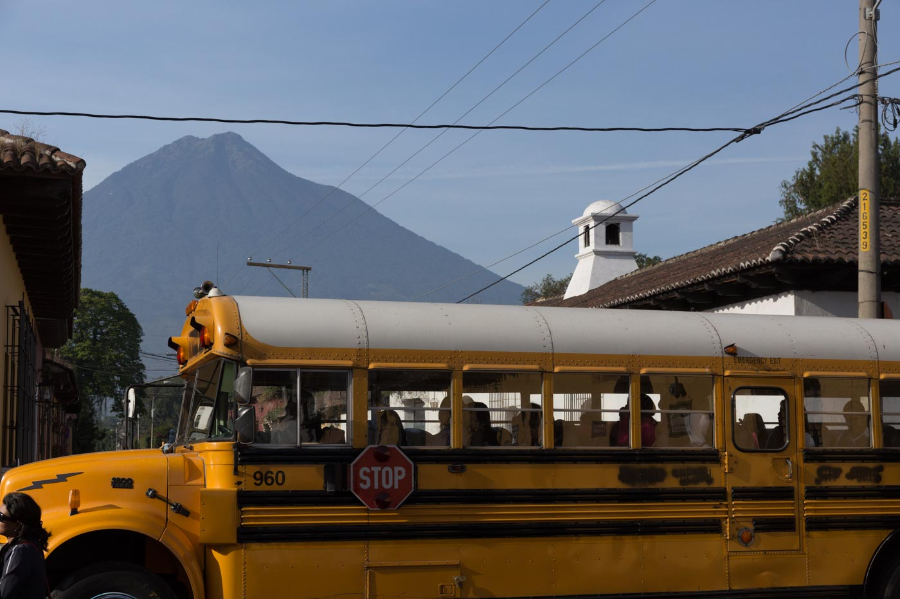
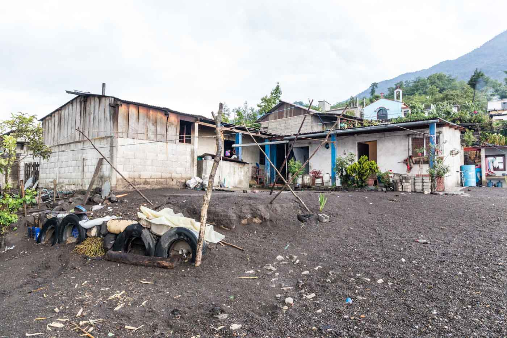
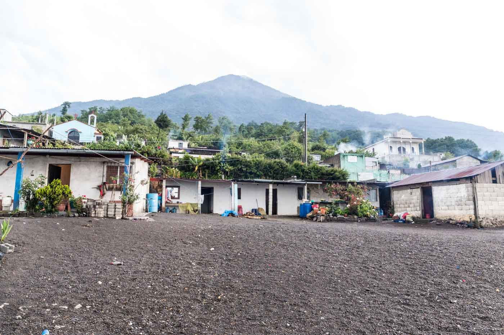
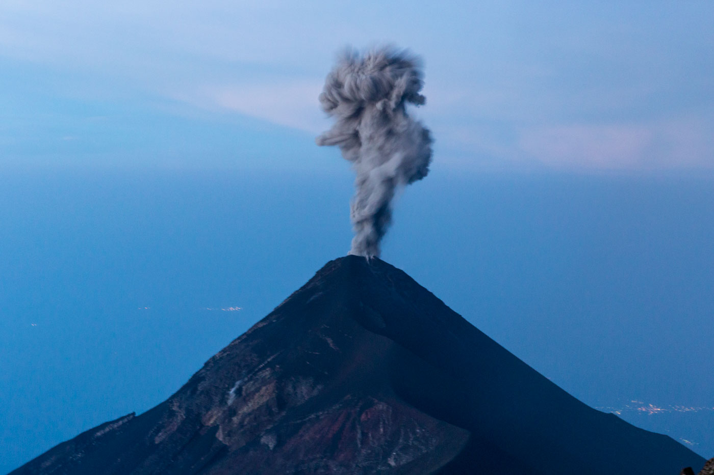
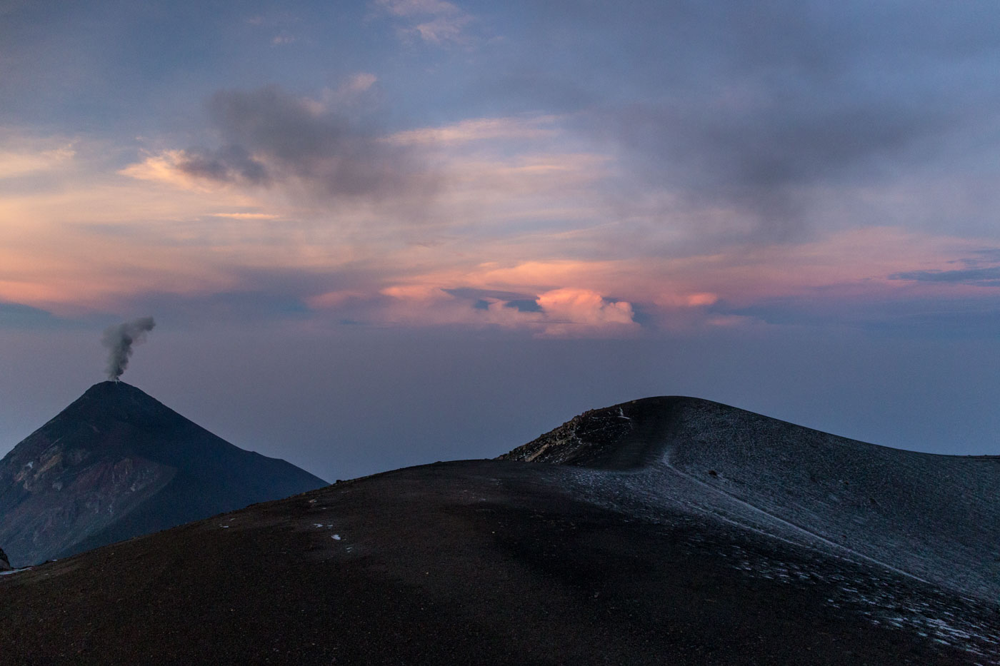
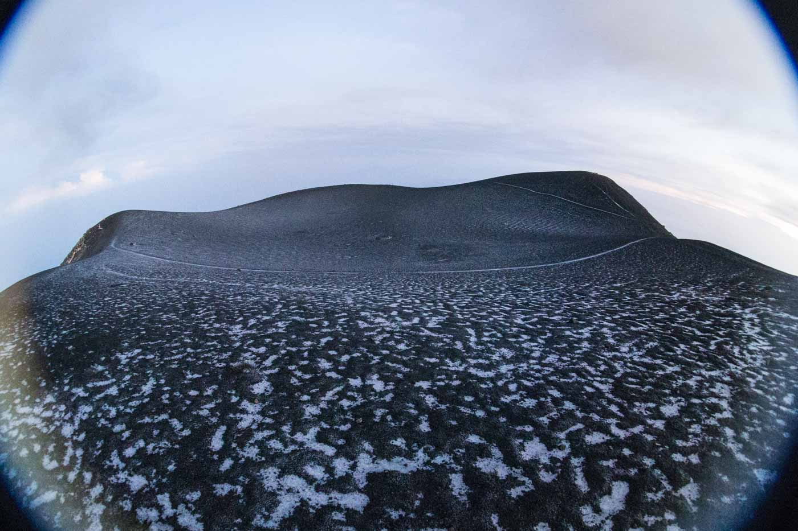
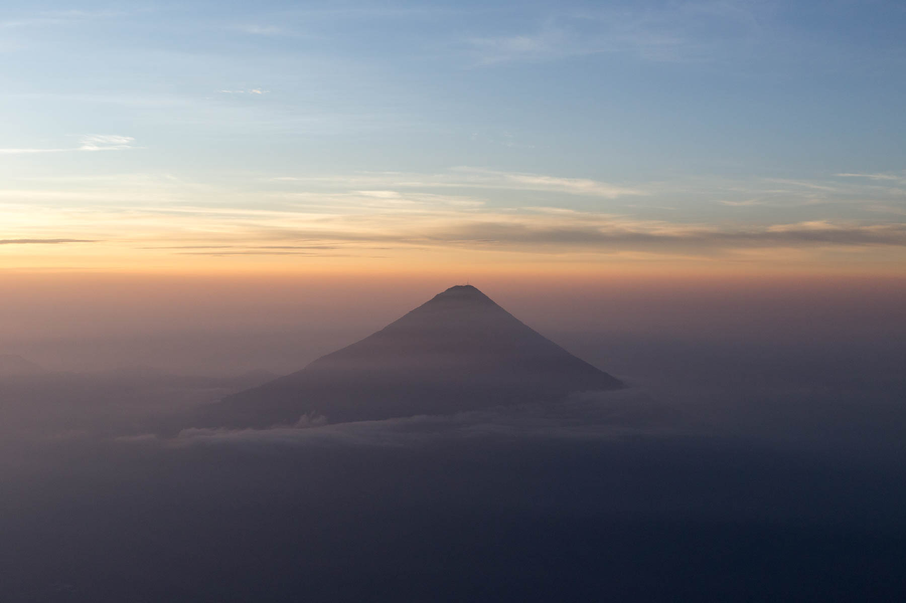
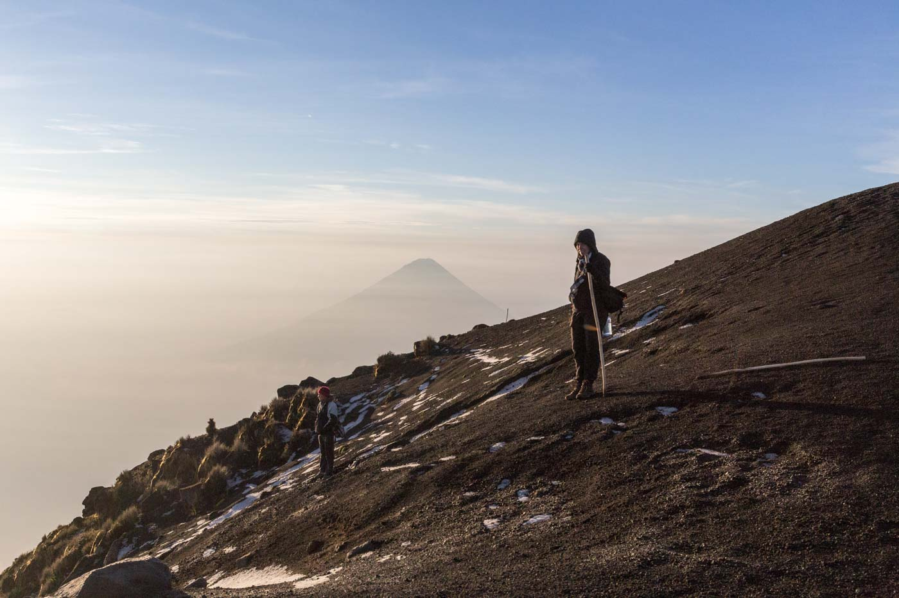
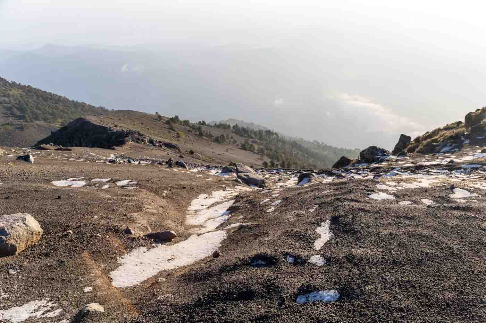
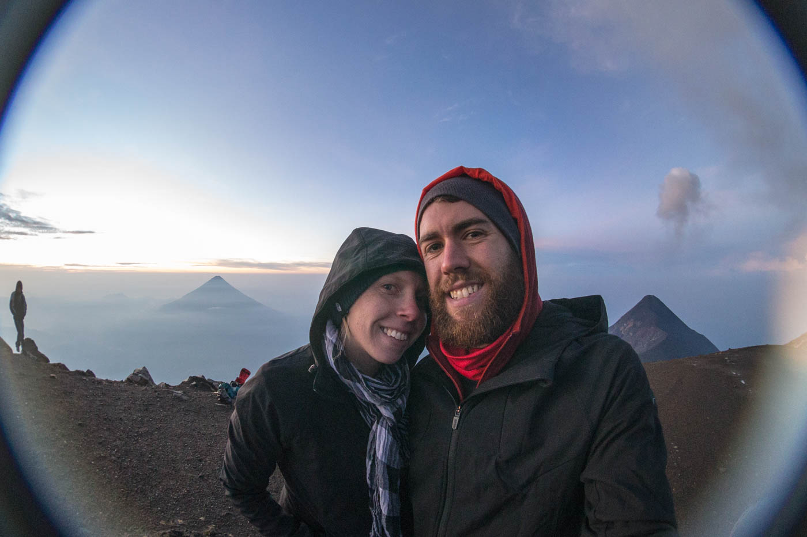

Volcano Acatenango (3976m)

We wanted to climb a Volcano while in Guatemala and had heard that Acatenango was the way to go. Volcano Acatenango can be seen from Antigua and it's ajoining neighbour Volcano Fuego can also be seen, often letting off puffs of smoke that can be seen from the town... creating a cloud of ash above the Volcanos.

The skies had been quite overcast and cloudy while we were in Antigua so we rarely saw this sight and were unsure on what the view would be like from the summit. We really wanted to make the climb so risked the possibility of not being able to see the surrounding views and decided to go for it. Options for the hike were a 1 day hike during the day (with basically no chance of seeing anything other than clouds) or an overnight hike camping near the top.

We went with the overnight/1 day sunrise option which is only available if you use a local guide in the village, La Solidad close to Acatenango and make your way to there independently. We arranged our hike through Mario Jaime, a local in La Solidad who was able to arrange his brother Nelson to take us up the Volcano at the wee hours of the morning. This option was also a fifth of the cost of a guided overnight camping tour!!

<figure>
	
	<figcaption>Chicken bus with Volcán Agua in the background</figcaption>
</figure>

We made our way to La Solidad on the local '<a href="http://en.wikipedia.org/wiki/Chicken_bus" target="_blank">chicken bus</a>' (a brightly painted & decked out old American school bus) where we met Mario and his very welcoming family right outside the bus stop.

<figure class="half">
	
	
	<figcaption>Mario's house with the second peak of Acatenango (Yepocapa) in the background</figcaption>
</figure>

He explained the hike to us and that we would be having dinner at 5pm before an early nights rest in their house... as we would have to be up at 1am to begin our hike up to the summit for sunrise. We scoffed a meal of eggs, tortillas & beans for dinner and eagerly got a little rest before meeting Nelson outside our room at 1am.

We began the accent of Volcán Acatenango with the light of our torches and the surrounding dark starry skies guiding us up... and I mean UP! There is no easing yourself into this hike, no opportunity to properly wake up and get your bearings... it is straight up. The entire way. So it was probably a good thing we were half asleep and just hauled ourselves up this beast, with little to no breaks.  

The higher we climbed, the colder it became, while we were sweating on the inside, we were shivering on the outside.. an interesting sensation. The higher we walked we began to notice the footholes in volcanic scree had ice in them from the previous day's storm. As we were approaching the final push to the summit it appeared to begin snowing. Numb from the cold and with our bodies protected except for our eyes we couldn't really tell what it was at the time. After reaching the summit & the sun started to rise we realised it was ash falling from Fuego!

We reached its' chilly 3976m summit at 4:50am for the sunrise at 5:30am. It is said that this climb can take anywhere from 4 - 8 hours, so we were pretty happy with our efforts!  

<figure>
	
	<figcaption>Volcán de Fuego spewing smoke</figcaption>
</figure>

Once at the top, with little time to catch our breath & refuel with some food.. we were welcomed with a SPECTACULAR lightshow from Volcán de Fuego as it spewed lava & ash while letting out a great roar. We didn't even have a change to get our camera out, it was that amazing we couldn't take our eyes off it. We thought this size eruption was a regular occourance and we might see it again in the hour we would be up there, but of course we didn't. A once in a lifetime viewing of an active erupting volcano! Into the memory bank it goes.

As I mentioned earlier we were a little worried about the overcast skies but it turns out at 1am is the perfect time to start this climb. The skies are clear, you can see stars and also the surrounding villages and cities. From around 5:30-6am as the sun rose is when it became overcast and difficult to see, so we are very grateful we decided to go with the overnight/1day option.

<figure>

	<figcaption>Acatenango & Fuego</figcaption>

	<figcaption>Ice on top of Acatenango</figcaption>

	<figcaption>Fog enshrouding Agua</figcaption>
</figure>

After just over an hour at the summit, the cold became too much for me and I was ready to get right back down this volcano and regain some body warrmth. The hike back down only took 2 hours, so we were back at Mario's house for the first bus back to Antigua at 9am. 

<figure class="half">
	
	<figcaption>About to descend</figcaption>

	<figcaption>Long way down.</figcaption>
</figure>

<figure>

	<figcaption>Acatenango with Agua & Fuego in the background</figcaption>
</figure>

<iframe src='https://connect.garmin.com/activity/embed/762322374?charts=all' width='460' height='500' frameborder='0'></iframe>