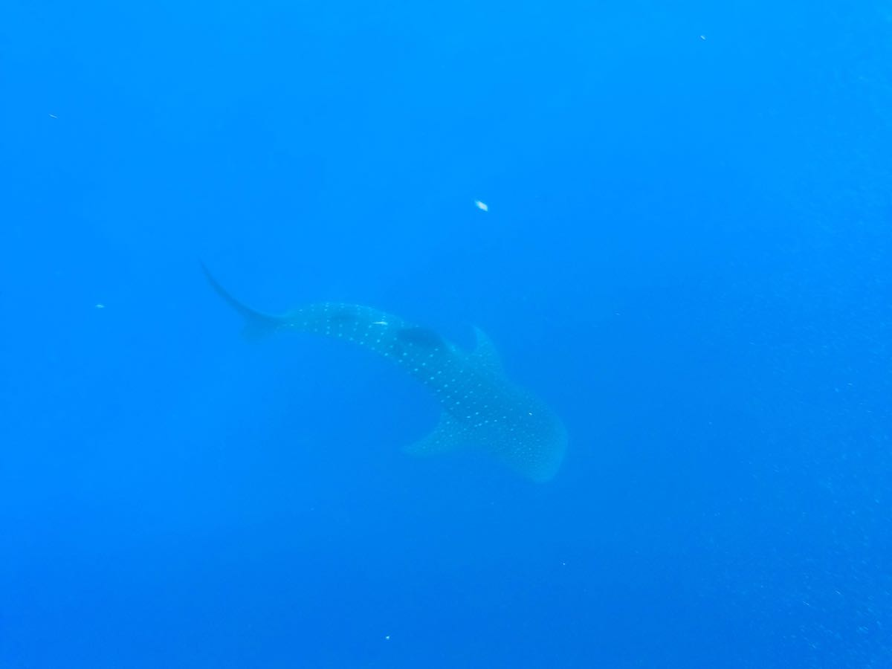
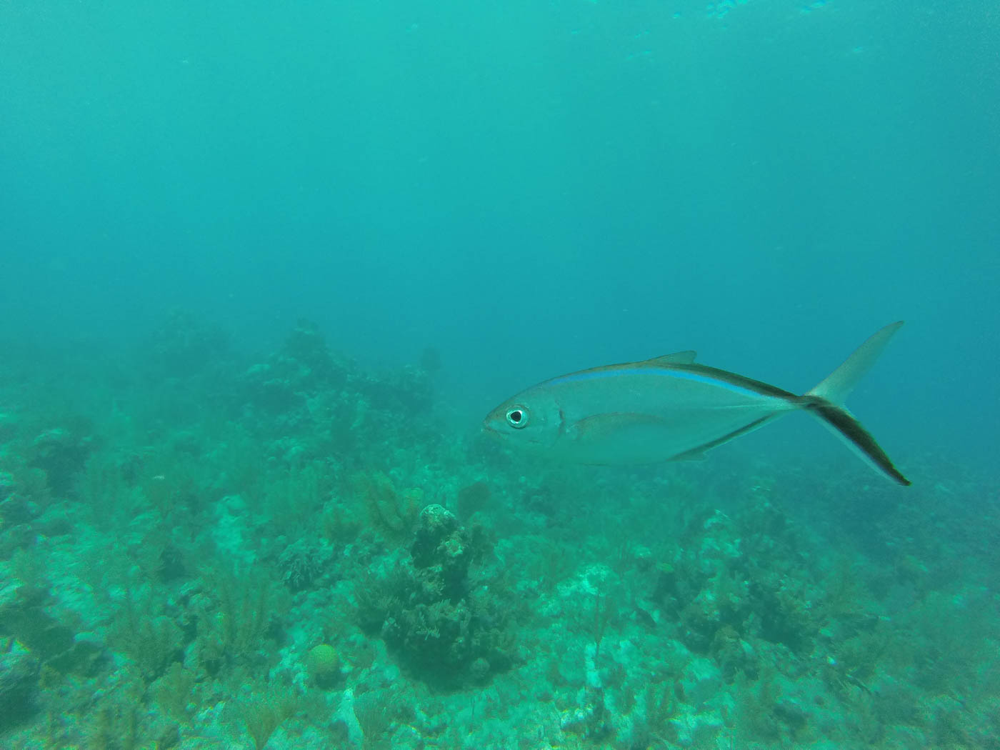
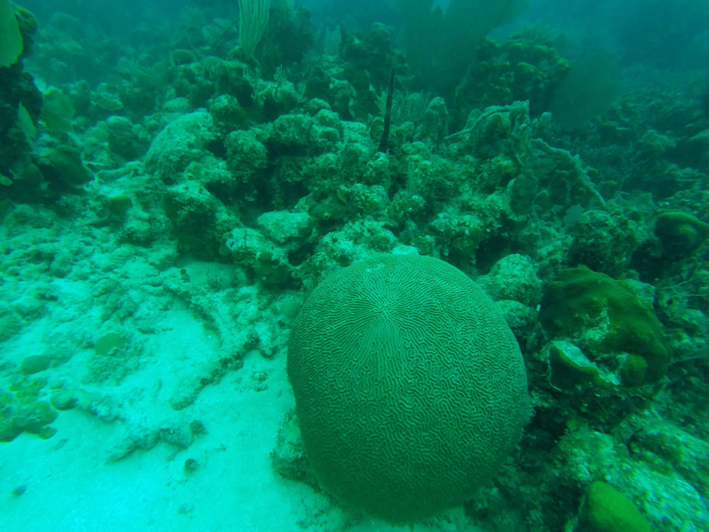

After 5 days of well worthwhile Spanish classes followed by hiking <a href="https://ayearlessordinary.com/acatenango/">Acatenango</a> we were ready to head off to our next destination. It was a tricky decision as we were originally going to see more of Guatemala and would have liked to, but the distances we would have to travel to go where we wanted to were much too long, so we made the split decision to head straight to Utila, the Bay Islands of Honduras for some diving. 

Heading to Honduras wasn't a decision we made lightly as we had heard and read all about the dangers of travelling in Honduras. We would be passing through and potentially staying in the 'Homicide capital of the world' - San Pedro Sula, which understandably made us a little cautious. After doing a lot of reading and research on other travellers taking the same path we decided to do it, with carefully planned routes and hotels planned.

It was another very early start for us to with a 4am shuttle leaving from Antigua that would arrive at the boarder of Honduras after 7 hours where we would change to a bus for another say.. 5 hours? All up I believe it was a 12-14hr day of travel to get to La Ceiba where we spent the night before catching the early ferry across to Utila. 

We were thankful to meet a couple of travellers also doing the same trip as us and stuck with them through our stopovers and also decided we should all stay at the same hostel together. We arrived in La Ceiba (safely!) at around 6pm and were packed into a taxi before heading to our hotel. I could instantly see the differences from Guatamala and I already felt uneasy about being in Honduras. Once we arrived at our hostel we were greeted by the owner and securely locked into the hostel. As most places in Honduaras and other countries in Central America have buildings have multiple locks on the door, high gated fences, some even with electic fences. While it's unfortunate that some cities need to take these measures, as a traveller it definitely made me feel safer. 

We stayed in that night as our only options for dinner were fast food joints a walking distance away, and I wasn't exactly keen to walk anywhere at night. The rain gods heard me and it started to POUR which meant we all decided to stay in with a beer and eat at the hostel.

We left early the following morning for the ferry to Utila, an island an hour from the mainland where we would be getting our open water PADI diving certification over the next 4 days.

Utila is an Island with a similar lifestyle to The Gili Islands in Indonesia, but was a lot more established with paved roads and houses all along the shore. 

Utila is very relaxed and quite different to mainland Honduras as it has Caymanian heritage rather than mainland Honduran influences. We felt very safe, and had a great experience learning to dive with Alton's dive school.

<figure>
	
	
</figure>

Every day we went diving we had to be out of the water between our two dives for at least 45 minutes. Before, between and after our dives we went out whale shark hunting. The dive boat captions look for where the water surface appears to be bubbling, as this is where the whale sharks are pushing the smaller fish they eat to the surface. Once they spot this area everyone gets ready at the back of the boat with fins & snorkel on and once they spot the whale shark, everyone on board has about 5 seconds to jump in and spot the whale shark before it swims away. 

We were lucky enough to be one of the only dive boats from one of the only dive shops on Utila to see a whale shark during our few days on the island. We were extremely lucky to even get a decent photo!

<figure>
	
	<figcaption>6m+ Whale Shark!</figcaption>
	
	<figcaption>Nuse Shark</figcaption>
	
</figure>

<figure class="half">
	
	
	
	
</figure>

After an awesome 4 days of diving, in very safe conditions we left the Island to make our way to Leon. This journey to Leon, Nicaragua involved a stopover for the night in San Pedro Sula (eek) but it was basically an in that night and out the next morning for another early and long bus trip to Leon. We were welcomed at the bus terminal by the owner of the Hostel who picked us up, drove us to the supermarket, took us to purchase bus tickets and then to the hotel. What a champion! After an early night to sleep in a much appreciated air conditioned room (always a pleasant score!) we were up and chauffeured to the bus terminal where we promptly got the hell out of Honduras to the beautiful, but EXTREMELY hot Nicaragua.

To conclude...
Honduras was more or less what we expected, but with careful arrangements for hotels and transportation it was a breeze and we saw no trouble at all. Don't hesitate in heading to The Bay Islands, it has excellent diving opportunities for very little cost compared to other destinations throughout the world. 