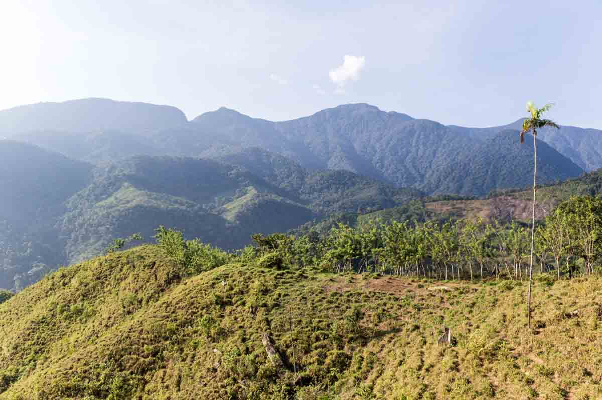
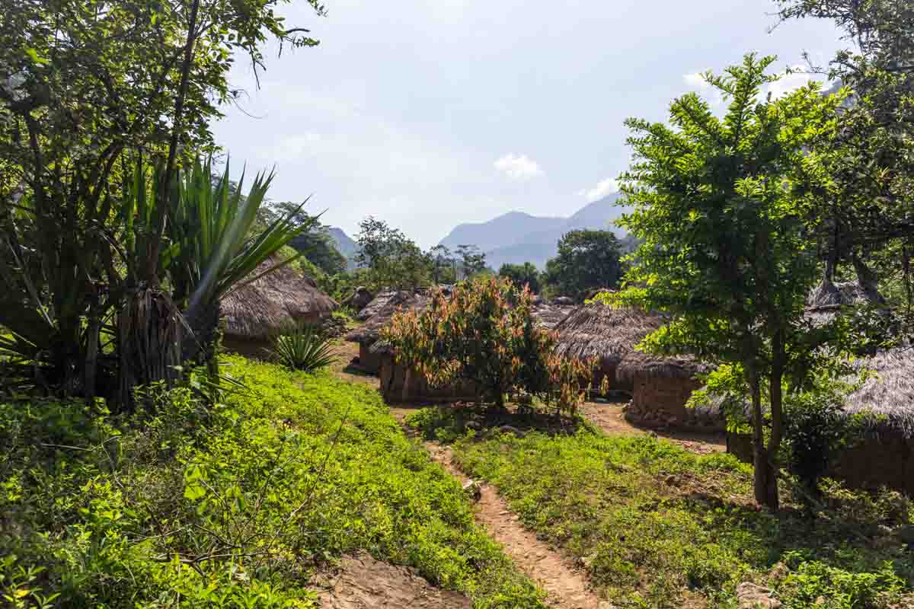
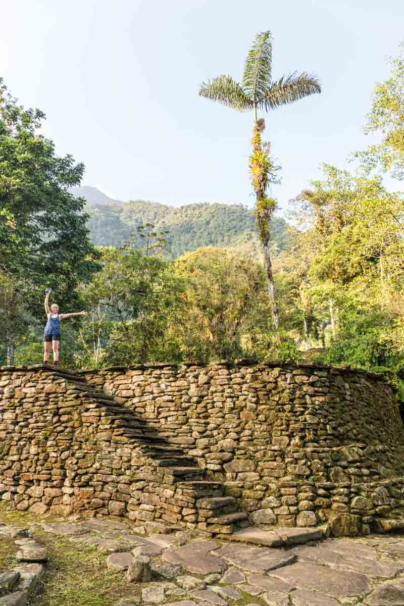
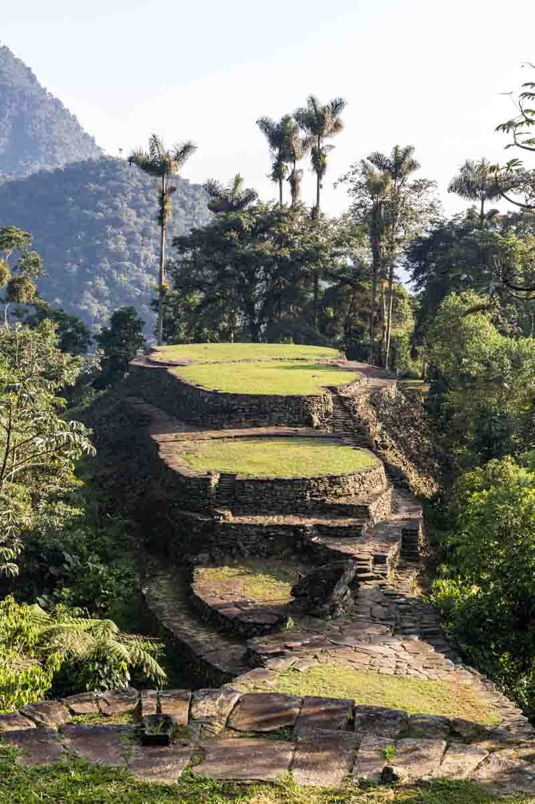
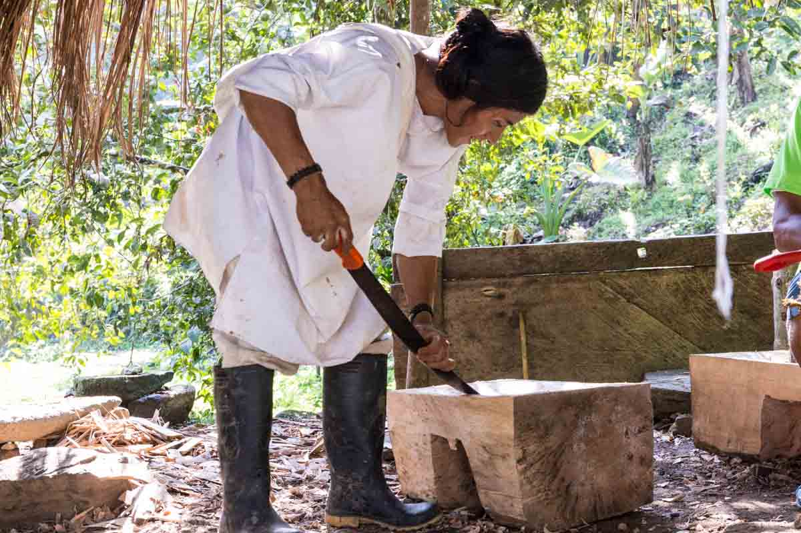

Ciudad Perdida (Spanish for "Lost City") is the archaeological site of an ancient city in Colombia's Sierra Nevada de Santa Marta. It is believed to have been founded about 800 AD, some 650 years earlier than Machu Picchu.

After selecting 1 of the 4 tour companies for the trek we arrived at the office of Turcol tour office, pleasantly surprised that it would only be us and a German fella Hassan on our 4 day trip. This was a relief as the other tour groups had up to 10 people, really slowing down the pace of the group and the time spent out walking in the extreme humid jungle heat.

The 4 day trek saw us wandering through dense forest, former cocaine plantations, sandy desert like hills and steep river valleys.

### Day 1

Day 1 begun with a 2 hour drive from Santa Marta to El Mamey where the trek begins & ends. Once we arrived we were fed a large meal of meat, rice & salad. The first of many large and plentiful meals.

After eating lunch we began walking with our guide Edwin Rey. He has been a guide to Ciudad Perdida for 25 years, with over 800 visits to the city. His father Francisco “El Viejo” Rey was the original guide to Ciudad Perdida.

The walking for day 1 primarily consisted of going UP. We walked up a hill of never ending switchbacks within a rain channel that had nearly become a small canyon itself that was 2m wide and nearly 2 deep. The walk itself wasn't very strenuous for us, it was the extreme blaring heat of the sun in the exposed channels that made this section of the trek the most challenging. 

<figure>
	
</figure>

After walking for about 4-5 hours we reached the first camp. The camp was situated down by a stream, which meant we had to descend a few hundred metres to get to the camp after all the climbing uphill! Frustrating really.

The camp consisted of several areas with undercover eating spaces and individual bunk beds for the 4 different tour companies to use. 

After taking the opportunity to have a cold shower and wash our clothes (luxury!) we still had a couple of hours to kill before dinner, so time was spent reading books & playing too many rounds of 'beanie' until dinner was served. As soon as dinner was finished you couldn't get us to bed any quicker, I think the sun had gone down already?

### Day 2

Day 2 began with a large breakfast of eggs, toast, fruit, hot sauce & coffee. Overnight our freshly washed clothes had, thanks to the humidity, gotten more damp than dry. It's always so nice putting on wet clothes in the morning.

The walk for day 2 would take us from the open fields into the jungle and out of the direct sun that had been very hot the day before.

<figure>
	
	<figcaption>In the sun before reaching the jungle</figcaption>
</figure>

Along the route we passed an Indigenous village where each family had a round adobe house, and a hospital built by the Colombian government to ensure the Indigenous were properly immunised.

<figure>
	
	<figcaption>Indigenous village</figcaption>
</figure>

At lunch we stopped at a camp which would be our sleeping place on night 3, we were once again overfed with soup of meat, plantain & rice. It was a bit of a drag having to stop each day for lunch, as we much prefer to get to our destination before stopping and relaxing. Needless to say, the food was always good and eaten.

As we progressed deeper into the jungle the humidity and rain increased. We knew we were nearly at the second night's camp when we reached a river crossing. There were two options for crossing - 1. Walk across the 20m stream or 2. sit in the cable car and pull yourself across. It was an obvious choice!

<figure>
	
	<figcaption>River crossing - the drier way</figcaption>
</figure>

After we crossed, the rain storm began. We had about 30 minutes of walking & scrambling remaining ahead of us to reach the camp. Once we arrived we were sufficiently drenched in sweat & rain... but again thankful for enough time in the afternoon to 'dry' our gear and shower. 

### Day 3

As our tour group was only 3 people, we were much faster than the other groups who occasionally had people who loved the slower, wandering in the jungle style of hiking. As a group we much preferred to power through the hikes & climbs, so we were adamant to be the first group to reach the Ciudad Perdida on day 3.

We quickly ate breakfast at around 5:30am and set off up the river towards the 1400 steps that took us up to the city.

<figure class="half">
	
	
</figure>

After a 20 minute walk and climb up all the never-ending stairs we reached the bottom of the city, and from there our hike was finally paying off. We spent the next few hours exploring the city and all the terraces and areas we could access.

<figure>
	
	<figcaption>Terraces</figcaption>
</figure>

<figure>
	
	
	
	<figcaption>Indigenous man carving out a seat for his father, the Shaman</figcaption>
	
	<figcaption>The surrounding jungle</figcaption>
</figure>

After returning to the camp we stayed at the previous night, we had lunch, packed our things and left for the final cabanas. We arrived several hours later just as the biggest rain storm we saw for the entire trip was beginning. The cooks and other tour groups were unluckily caught in the rain & arrived drenched and covered in mud from sliding off the side of the trails.

### Day 4

By the final day we were keen to get back to Santa Marta as soon as possible, 1: because we had seen what we had come to see, and 2: because the UEFA Champions League final was on at 2pm! We left camp eagerly around 5:30 in the morning and reached the first nights camp, for a break & fruit 2 hours later.

Finally, after another round of steep hills we reached El Mamey, the finish point where we enjoyed our final filling meal and headed back to Santa Marta (not soon enough!).

<figure>
	
</figure>

The Lost City trek was definitely worth it and a challenging trek in such humid and sweaty conditions. The distances travelled each day were easily achieved and we had a lot of done time each afternoon to relax at the cabanas. Staying in soft beds and having each meal prepared for us with fresh ingredients gave it a true 'luxury' feel. Something we weren't used to, but surely appreciated. When you visit Colombia (which I hope everyone does!!), Ciudad Perdida is a must. 