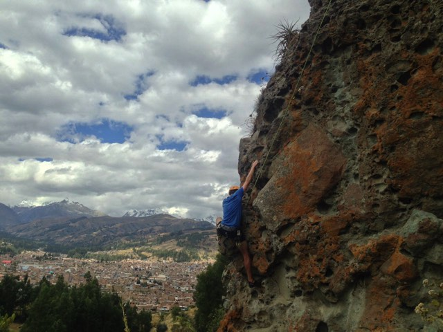
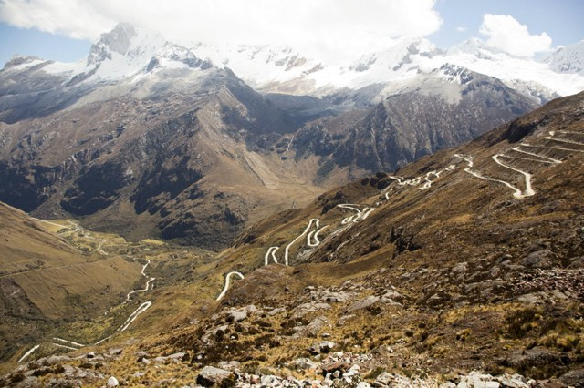
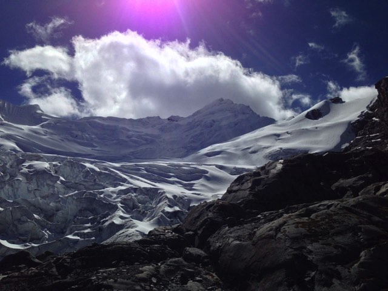
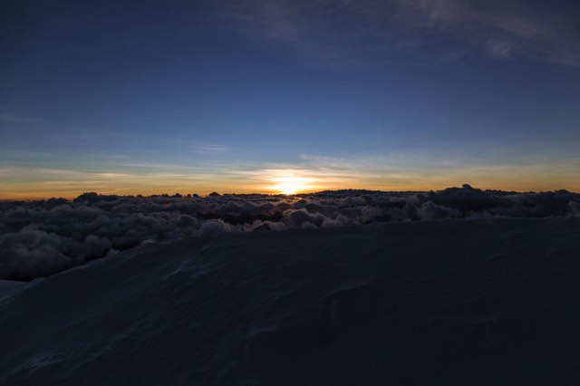
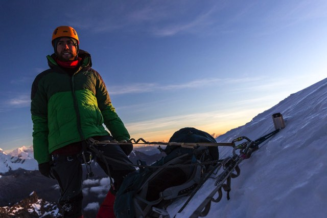
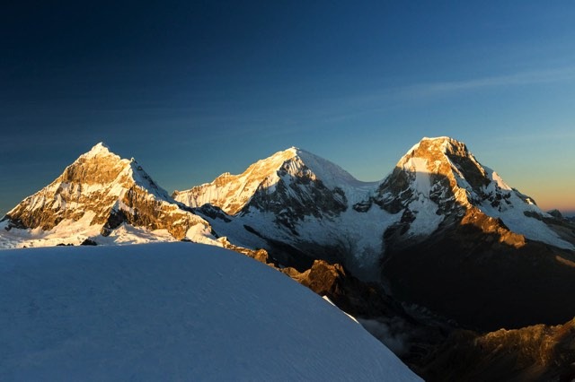
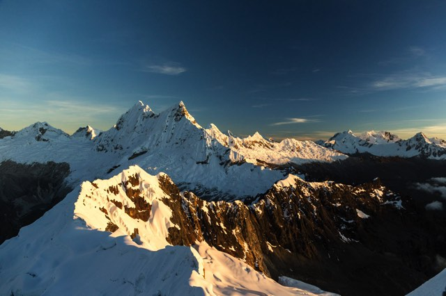
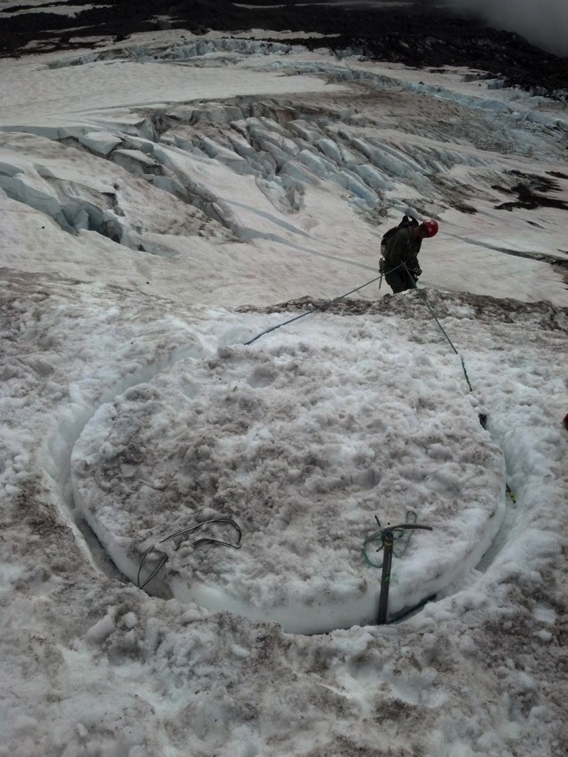
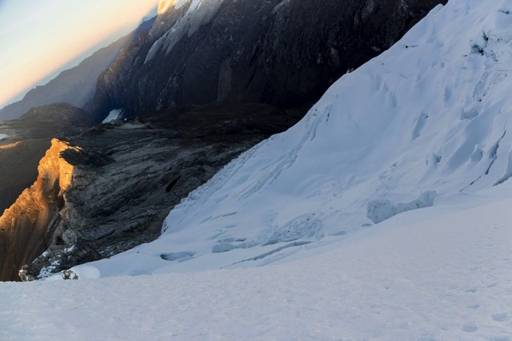
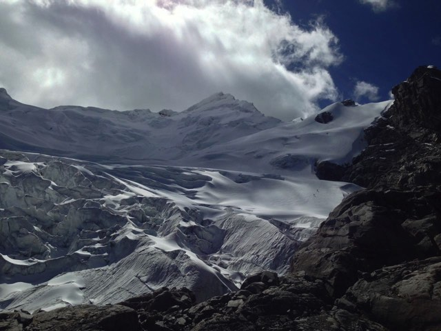

After our time on the [Santa Cruz trek](https://ayearlessordinary.com/santa-cruz/) we had spent a few days back in Hauraz rock climbing above the city, deciding what we wanted to do next.

<figure>
	
<figcaption>Climbing above Huaraz.</figcaption>
</figure>

Some of the options for ice climbing/mountaineering from Huaraz were [Yanapaccha](http://www.summitpost.org/yanapaccha/222587), [Pisco](http://www.summitpost.org/pisco-oeste-western-pisco/150282) or [Vallunaraju](http://www.summitpost.org/vallunaraju/150639). We settled on Yanapaccha as it was surrounded on all sides by mountains that were higher or more or less the same elevation and the climb involved a multi-pitch section towards the top. This means you're climbing between several anchor points on the same ice/rock face.

The night before we set off we had made a delicious dinner of pasta with tinned tuna, eggs & olives. Something in the dinner didn't agree with us and early the next morning as we were leaving for Yanapaccha Jacqui was feeling pretty ill. We pressed on though hoping it would pass on the four hour journey from Huaraz.

<figure>
	
<figcaption>Similar to the Santa Cruz trek, we once again went back up to the top of this crazy road to access the trail.</figcaption>
</figure>

After a long journey in the car up the never ending switchbacks we reached the last corner and were dropped off to begin our walk to the base camp, at a moraine camp a few kilometres away. Our packs, while only loaded with gear & food for one night were heavy, with mountaineering boots, crampons, 2 ice axes, helmet, gaiters, harnesses, miscellaneous climbing hardware, clothing, sleeping mats & bags. Similar, if not more weight than we carried on Santa Cruz. 

As we walked Jacqui was finally sick, we hoped this meant the nasty's were out of her system & she would be fine to climb but unfortunately this wasn't the case and she stayed a base camp the following morning to ensure I was able to climb to the top without having to turn back.

After an early start we set off around 1am from base camp across the moraine to the edge of the glacier. As soon as we reached the glacier it was time for harnesses, roping together, crampons and the walking ice axe. The ice to get up onto the glacier plateau was a short 50° slope. Once on the glacier it was easy walking on the ice for the first hour to reach the base of the ice faces.

<figure>
	
<figcaption>On the descent, two tiny dots in the middle of the image</figcaption>
</figure>

For the most part of the climb, my guide Guido climbed ahead up the slopes without top protection with me belaying from below in case of a crevasse fall. After reaching the end of the rope, he'd sink the snow stake and belay my climb from the top. The climate and the angles of most of the mountains means that mountains are covered in a powdery chandelier type ice that requires snow stakes (45cm long aluminium stage) as ice-screws simply have not enough ice to hold on to. 

On a few occasions hammering in the anchor into solid snow meant waiting for Guido as he hacked at the ice with his ice axe 60m above me, sending shards of ice tinkling down the ice face. These rimy chunks of ice shooting down the ice sounded like a thousand crystal champagne glasses clinking together as they rocketed past. And they hurt when they hit you!

As we progressed further and further up we crossed crevasses that were no more than a long 20cm slit across, to some others that were 1-2m wide and had ice bridges spanning the gap. Crossing these bridges was the most nerve racking part of the climb as you had a fantastic view down into the oblivion of the crevasse, while having no trust in the bridge.

The toughest part of the climb was nearing the top where we had the final multi-pitch section. Right in the middle of this was an anchor position that was an ice cave that we climbed into. After climbing inside I realised it wasn't a cave, it was a crevasse we were sitting in the top of. Just off to my side a few metres away was the opening.

<figure>
	
<figcaption>The top of Yanapaccha was just a sliver of snow that tumbled away steeply 1000m on the other side. </figcaption>

<figcaption>Anchored in at the top.</figcaption>
</figure>

<figure>
	
<figcaption>Huascarán, the highest mountain in Peru (6768m)</figcaption>

<figcaption>Chakrarahu and the surrounding mountains.</figcaption>
</figure>

Once the photos and summit celebrations (shivering and complaining about the cold) were over we began our descent via a different ridge. For the start of the descent Guido was repelling me down off the summit faces, which were impossible to see from above where the anchor was. As I was repelling backwards I saw what I believed was a crevasse that I had to cross. I yelled up at Guido telling him 'hey, big crevasse gap here. Should we go around?'. From his position he couldn't see it so he said yep go straight across it. This basically meant pulling down enough slack on the rope and jumping from one side to the other. As Guido followed me down he was shocked as he saw what I'd crossed. It wasn't a crevasse, it was a large overhanging cornice of snow & ice! Guido had no choice but to follow me over, luckily it was strong enough and held us both.

As we descended further down, the mountain was just as steep. To be able to place anchors and not have to climb back up to take them with us, Guido began digging snow bollards which are giant mushroom shaped channels the rope hooks into. Super time consuming to dig out with an ice tool, but much more affordable than lugging anchors to the summit just to leave them behind on the descent.

<figure>
	
<figcaption>Snow bollard anchor (source: <a href="http://jive-assanchors.com/2013/08/12/bollards-are-not-jive-ass/" target="_blank">jive ass anchors</a>?)</figcaption>
</figure>

After 5 or so snow bollard rappels down across the crevasse openings it was back to walking across the flat glacier and once again jumping over more crevasses. With the end in sight and a much slower descent than planned we made quick time across the flatter slopes and back to base camp.

<figure>

<figcaption>The view down from the top.</figcaption>
	
<figcaption>Walking down.</figcaption>
</figure>

Crevasses, seracs and cornices to dodge on the way up & down. Midnight wake up for a 1am start, 4 hours each way from base camp. Ice axes, crampons, harnesses all completely necessary for this tough but rewarding climb!

